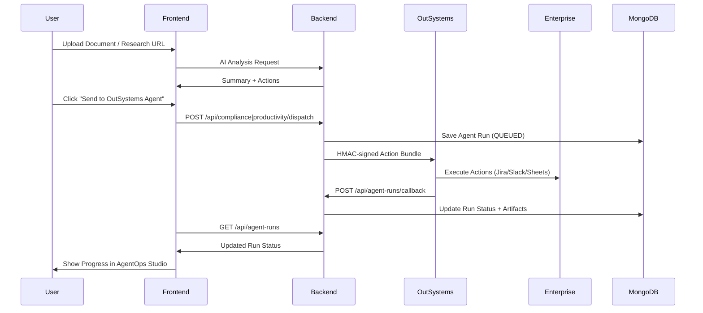
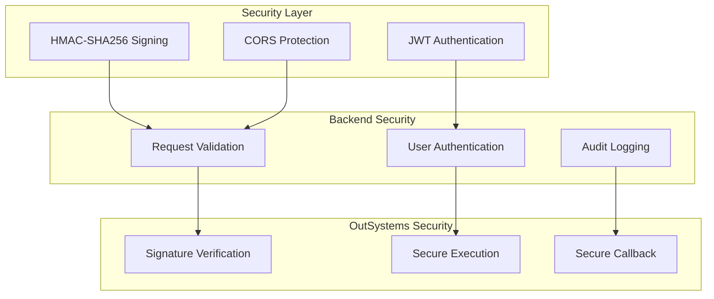

# 🏗️ AI Agent Bridge Platform - Architecture Diagram

## System Architecture

```mermaid
flowchart LR
  subgraph WLWAI["Workplace Learning with AI"]
    A1[Document Analyzer<br/>(PDF/Policy/ESG)]
    A2[Agentic RAG<br/>(URLs/Text)]
    A3[AgentOps Studio<br/>(Prompt Lab • Playbooks • Runs)]
  end

  subgraph Bridge["AI Agent Bridge Platform"]
    B1[Compliance Mapper<br/>(key_risks[])]
    B2[Productivity Mapper<br/>(next_actions[])]
    B3[Dispatch API<br/>(/api/compliance | /api/productivity)]
    B4[Agent Runs DB<br/>(MongoDB)]
  end

  subgraph Exec["Execution Layer"]
    E1[OutSystems Agents<br/>(compliance/productivity)]
    E2[n8n Workflow<br/>(optional)]
  end

  subgraph Dest["Enterprise Apps"]
    D1[Jira]
    D2[Slack]
    D3[Google Sheets]
    D4[Email]
  end

  %% Flow connections
  A1 --> A3
  A2 --> A3
  A3 -->|Send to Agent| Bridge
  
  Bridge -->|REST/HMAC| E1
  Bridge -->|Webhook| E2
  
  E1 --> D1 & D2 & D3 & D4
  E2 --> D1 & D2 & D3 & D4
  
  E1 -. callback .-> B4
  E2 -. callback .-> B4
  
  B4 --> A3
```

## Compliance Agent Flow

```mermaid
flowchart LR
  subgraph Entry["Module Entry"]
    DA[Document Analyzer<br/>(PDF/Policy/ESG)]
    SUM[AI Summary + Key Risks]
  end

  subgraph Mapper["Compliance Mapper"]
    KR[key_risks[]]
    BLD[Build ComplianceSpec<br/>(title, doc_url, summary_md,<br/>key_risks, Jira/Slack/Sheets)]
  end

  subgraph Bridge["AI Agent Bridge Platform (shared)"]
    DISPATCH[/POST /api/compliance/dispatch/]
    RUNS[(Agent Runs DB<br/>Mongo)]
  end

  subgraph Exec["Execution Layer"]
    OS[OutSystems Agent<br/>(compliance)]
    N8N[n8n (optional)]
  end

  subgraph Dest["Enterprise Apps"]
    J[Jira]
    S[Slack]
    G[Google Sheets]
    E[Email]
  end

  subgraph Ops["Ops Studio"]
    AOS[AgentOps Studio<br/>(Runs + Artifacts)]
  end

  %% Flow
  DA --> SUM --> KR --> BLD --> DISPATCH
  DISPATCH -->|REST + HMAC| OS
  DISPATCH -. webhook .-> N8N

  OS --> J & S & G & E
  N8N --> J & S & G & E

  OS -. callback .-> RUNS
  N8N -. callback .-> RUNS

  RUNS --> AOS
```

## Productivity Agent Flow

```mermaid
flowchart LR
  subgraph Entry["Module Entry"]
    RAG[Agentic RAG<br/>(URLs / Text)]
    SUM[AI Summary + Top 5 Next Actions]
  end

  subgraph Mapper["Productivity Mapper"]
    NA[next_actions[]<br/>(title, detail, assignee?)]
    BLD[Build ProductivitySpec<br/>(brief_title, primary_url,<br/>summary_md, next_actions,<br/>Jira/Slack/Sheets)]
  end

  subgraph Bridge["AI Agent Bridge Platform (shared)"]
    DISPATCH[/POST /api/productivity/dispatch/]
    RUNS[(Agent Runs DB<br/>Mongo)]
  end

  subgraph Exec["Execution Layer"]
    OS[OutSystems Agent<br/>(productivity)]
    N8N[n8n (optional)]
  end

  subgraph Dest["Enterprise Apps"]
    J[Jira (multi-issues)]
    S[Slack (digest)]
    G[Google Sheets (snapshot)]
    E[Email]
  end

  subgraph Ops["Ops Studio"]
    AOS[AgentOps Studio<br/>(Runs + Artifacts)]
  end

  %% Flow
  RAG --> SUM --> NA --> BLD --> DISPATCH
  DISPATCH -->|REST + HMAC| OS
  DISPATCH -. webhook .-> N8N

  OS --> J & S & G & E
  N8N --> J & S & G & E

  OS -. callback .-> RUNS
  N8N -. callback .-> RUNS

  RUNS --> AOS
```

## Data Flow Sequence



## Security Architecture



## Key Components

### Backend Components
- **`agent_runs.py`**: MongoDB data model and persistence
- **`agent_runs.py`**: Shared API endpoints (list + callback)
- **`compliance_agent.py`**: Compliance-specific dispatch logic
- **`productivity_agent.py`**: Productivity-specific dispatch logic

### Frontend Components
- **`ActionDispatchModal.tsx`**: Reusable modal for both agents
- **`AgentOpsRuns.tsx`**: Run status and artifact display
- **`complianceMapper.ts`**: Compliance data transformation
- **`productivityMapper.ts`**: Productivity data transformation

### Integration Points
- **Document Analyzer**: Compliance agent entry point
- **Agentic RAG**: Productivity agent entry point
- **AgentOps Studio**: Status monitoring and audit trail
- **OutSystems**: Enterprise execution engine
- **n8n**: Optional alternative execution engine
