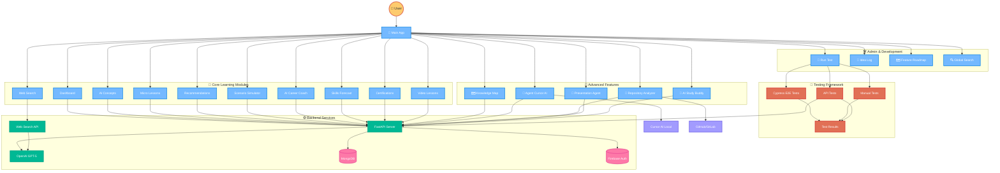

```mermaid
graph TB
  %% Main User Interface
  User((👤 User)) --> App[🎨 Main App]
  
  %% Core Learning Modules
  subgraph "🎯 Core Learning Modules"
    Dashboard[Dashboard]
    Concepts[AI Concepts]
    MicroLesson[Micro Lessons]
    Recommendation[Recommendations]
    Simulator[Scenario Simulator]
    WebSearch[Web Search]
    CareerCoach[AI Career Coach]
    SkillsForecast[Skills Forecast]
    Certifications[Certifications]
    VideoLesson[Video Lessons]
  end
  
  %% Advanced Features
  subgraph "🚀 Advanced Features"
    KnowledgeMap[🗺️ Knowledge Map]
    AgentCursorAI[🤖 Agent Cursor AI]
    RepoAnalyzer[📁 Repository Analyzer]
    PresentationAgent[🎤 Presentation Agent]
    AIStudyBuddy[🤝 AI Study Buddy]
  end
  
  %% Admin & Development
  subgraph "🛠️ Admin & Development"
    RunTest[🧪 Run Test]
    IdeaLog[📝 Idea Log]
    FeatureRoadmap[🗺️ Feature Roadmap]
    GlobalSearch[🔍 Global Search]
  end
  
  %% Testing Framework
  subgraph "🧪 Testing Framework"
    Cypress[Cypress E2E Tests]
    ManualTests[Manual Tests]
    APITests[API Tests]
    TestResults[Test Results]
  end
  
  %% Backend Services
  subgraph "⚙️ Backend Services"
    FastAPI[FastAPI Server]
    LLM[OpenAI GPT-5]
    MongoDB[(MongoDB)]
    Firebase[(Firebase Auth)]
    WebSearchAPI[Web Search API]
  end
  
  %% Data Flow
  App --> Dashboard
  App --> Concepts
  App --> MicroLesson
  App --> Recommendation
  App --> Simulator
  App --> WebSearch
  App --> CareerCoach
  App --> SkillsForecast
  App --> Certifications
  App --> VideoLesson
  App --> KnowledgeMap
  App --> AgentCursorAI
  App --> RepoAnalyzer
  App --> PresentationAgent
  App --> AIStudyBuddy
  App --> RunTest
  App --> IdeaLog
  App --> FeatureRoadmap
  App --> GlobalSearch
  
  %% Backend Connections
  Dashboard --> FastAPI
  Concepts --> FastAPI
  MicroLesson --> FastAPI
  Recommendation --> FastAPI
  Simulator --> FastAPI
  WebSearch --> WebSearchAPI
  CareerCoach --> FastAPI
  SkillsForecast --> FastAPI
  Certifications --> FastAPI
  VideoLesson --> FastAPI
  KnowledgeMap --> FastAPI
  AgentCursorAI --> FastAPI
  RepoAnalyzer --> FastAPI
  PresentationAgent --> FastAPI
  AIStudyBuddy --> FastAPI
  
  %% Testing Connections
  RunTest --> Cypress
  RunTest --> ManualTests
  RunTest --> APITests
  Cypress --> TestResults
  ManualTests --> TestResults
  APITests --> TestResults
  APITests --> FastAPI
  
  %% AI & Database
  FastAPI --> LLM
  FastAPI --> MongoDB
  FastAPI --> Firebase
  WebSearchAPI --> LLM
  
  %% External Services
  AgentCursorAI --> CursorAI[Cursor AI Local]
  RepoAnalyzer --> GitHub[GitHub/GitLab]
  
  %% Click Events for Navigation
  click Dashboard "#dashboard" "Go to Dashboard section"
  click Concepts "#ai-concepts" "Go to AI Concepts section"
  click MicroLesson "#micro-lessons" "Go to Micro Lessons section"
  click Recommendation "#recommendations" "Go to Recommendations section"
  click Simulator "#scenario-simulator" "Go to Scenario Simulator section"
  click WebSearch "#web-search" "Go to Web Search section"
  click CareerCoach "#ai-career-coach" "Go to AI Career Coach section"
  click SkillsForecast "#skills-forecast" "Go to Skills Forecast section"
  click Certifications "#certifications" "Go to Certifications section"
  click VideoLesson "#video-lessons" "Go to Video Lessons section"
  click KnowledgeMap "#knowledge-map" "Go to Knowledge Map section"
  click AgentCursorAI "#agent-cursor-ai" "Go to Agent Cursor AI section"
  click RepoAnalyzer "#repository-analyzer" "Go to Repository Analyzer section"
  click PresentationAgent "#presentation-agent" "Go to Presentation Agent section"
  click AIStudyBuddy "#ai-study-buddy" "Go to AI Study Buddy section"
  click RunTest "#run-test" "Go to Run Test section"
  click IdeaLog "#idea-log" "Go to Idea Log section"
  click FeatureRoadmap "#feature-roadmap" "Go to Feature Roadmap section"
  click GlobalSearch "#global-search" "Go to Global Search section"
  click Cypress "#cypress-tests" "Go to Cypress Tests section"
  click ManualTests "#manual-tests" "Go to Manual Tests section"
  click APITests "#api-tests" "Go to API Tests section"
  click TestResults "#test-results" "Go to Test Results section"
  click FastAPI "#fastapi-server" "Go to FastAPI Server section"
  click LLM "#openai-gpt5" "Go to OpenAI GPT-5 section"
  click MongoDB "#mongodb" "Go to MongoDB section"
  click Firebase "#firebase-auth" "Go to Firebase Auth section"
  click WebSearchAPI "#web-search-api" "Go to Web Search API section"
  
  %% Styling
  classDef user fill:#fdcb6e,stroke:#e17055,stroke-width:3px,color:#2d3436,font-size:16px;
  classDef frontend fill:#74b9ff,stroke:#0984e3,stroke-width:2px,color:#ffffff,font-size:14px;
  classDef backend fill:#00b894,stroke:#00a085,stroke-width:2px,color:#ffffff,font-size:14px;
  classDef external fill:#a29bfe,stroke:#6c5ce7,stroke-width:2px,color:#ffffff,font-size:14px;
  classDef database fill:#fd79a8,stroke:#e84393,stroke-width:2px,color:#ffffff,font-size:14px;
  classDef testing fill:#e17055,stroke:#d63031,stroke-width:2px,color:#ffffff,font-size:14px;
  
  class User user;
  class App,Dashboard,Concepts,MicroLesson,Recommendation,Simulator,WebSearch,CareerCoach,SkillsForecast,Certifications,VideoLesson,KnowledgeMap,AgentCursorAI,RepoAnalyzer,PresentationAgent,AIStudyBuddy,RunTest,IdeaLog,FeatureRoadmap,GlobalSearch frontend;
  class FastAPI,LLM,WebSearchAPI backend;
  class CursorAI,GitHub external;
  class MongoDB,Firebase database;
  class Cypress,ManualTests,APITests,TestResults testing;
```

# 🤖 AI-Powered Workplace Learning Platform

> **"I'm not just building a learning app — I'm creating a co-evolving AI learning assistant where users shape its growth."**