```mermaid
graph TB
  %% Main User Interface
  User((👤 User)) --> App[🎨 Main App]
  
  %% Core Learning Modules
  subgraph "🎯 Core Learning Modules"
    Dashboard[Dashboard]
    Concepts[AI Concepts]
    MicroLesson[Micro Lessons]
    Recommendation[Recommendations]
    Simulator[Scenario Simulator]
    WebSearch[Web Search]
    CareerCoach[AI Career Coach]
    SkillsForecast[Skills Forecast]
    Certifications[Certifications]
    VideoLesson[Video Lessons]
  end
  
  %% Advanced Features
  subgraph "🚀 Advanced Features"
    KnowledgeMap[🗺️ Knowledge Map]
    AgentCursorAI[🤖 Agent Cursor AI]
    RepoAnalyzer[📁 Repository Analyzer]
    PresentationAgent[🎤 Presentation Agent]
    AIStudyBuddy[🤝 AI Study Buddy]
  end
  
  %% Admin & Development
  subgraph "🛠️ Admin & Development"
    RunTest[🧪 Run Test]
    IdeaLog[📝 Idea Log]
    FeatureRoadmap[🗺️ Feature Roadmap]
    GlobalSearch[🔍 Global Search]
  end
  
  %% Testing Framework
  subgraph "🧪 Testing Framework"
    Cypress[Cypress E2E Tests]
    ManualTests[Manual Tests]
    APITests[API Tests]
    TestResults[Test Results]
  end
  
  %% Backend Services
  subgraph "⚙️ Backend Services"
    FastAPI[FastAPI Server]
    LLM[OpenAI GPT-5]
    MongoDB[(MongoDB)]
    Firebase[(Firebase Auth)]
    WebSearchAPI[Web Search API]
  end
  
  %% Data Flow
  App --> Dashboard
  App --> Concepts
  App --> MicroLesson
  App --> Recommendation
  App --> Simulator
  App --> WebSearch
  App --> CareerCoach
  App --> SkillsForecast
  App --> Certifications
  App --> VideoLesson
  App --> KnowledgeMap
  App --> AgentCursorAI
  App --> RepoAnalyzer
  App --> PresentationAgent
  App --> AIStudyBuddy
  App --> RunTest
  App --> IdeaLog
  App --> FeatureRoadmap
  App --> GlobalSearch
  
  %% Backend Connections
  Dashboard --> FastAPI
  Concepts --> FastAPI
  MicroLesson --> FastAPI
  Recommendation --> FastAPI
  Simulator --> FastAPI
  WebSearch --> WebSearchAPI
  CareerCoach --> FastAPI
  SkillsForecast --> FastAPI
  Certifications --> FastAPI
  VideoLesson --> FastAPI
  KnowledgeMap --> FastAPI
  AgentCursorAI --> FastAPI
  RepoAnalyzer --> FastAPI
  PresentationAgent --> FastAPI
  AIStudyBuddy --> FastAPI
  
  %% Testing Connections
  RunTest --> Cypress
  RunTest --> ManualTests
  RunTest --> APITests
  Cypress --> TestResults
  ManualTests --> TestResults
  APITests --> TestResults
  APITests --> FastAPI
  
  %% AI & Database
  FastAPI --> LLM
  FastAPI --> MongoDB
  FastAPI --> Firebase
  WebSearchAPI --> LLM
  
  %% External Services
  AgentCursorAI --> CursorAI[Cursor AI Local]
  RepoAnalyzer --> GitHub[GitHub/GitLab]
  
  %% Click Events for Navigation
  click Dashboard "#dashboard" "Go to Dashboard section"
  click Concepts "#ai-concepts" "Go to AI Concepts section"
  click MicroLesson "#micro-lessons" "Go to Micro Lessons section"
  click Recommendation "#recommendations" "Go to Recommendations section"
  click Simulator "#scenario-simulator" "Go to Scenario Simulator section"
  click WebSearch "#web-search" "Go to Web Search section"
  click CareerCoach "#ai-career-coach" "Go to AI Career Coach section"
  click SkillsForecast "#skills-forecast" "Go to Skills Forecast section"
  click Certifications "#certifications" "Go to Certifications section"
  click VideoLesson "#video-lessons" "Go to Video Lessons section"
  click KnowledgeMap "#knowledge-map" "Go to Knowledge Map section"
  click AgentCursorAI "#agent-cursor-ai" "Go to Agent Cursor AI section"
  click RepoAnalyzer "#repository-analyzer" "Go to Repository Analyzer section"
  click PresentationAgent "#presentation-agent" "Go to Presentation Agent section"
  click AIStudyBuddy "#ai-study-buddy" "Go to AI Study Buddy section"
  click RunTest "#run-test" "Go to Run Test section"
  click IdeaLog "#idea-log" "Go to Idea Log section"
  click FeatureRoadmap "#feature-roadmap" "Go to Feature Roadmap section"
  click GlobalSearch "#global-search" "Go to Global Search section"
  click Cypress "#cypress-tests" "Go to Cypress Tests section"
  click ManualTests "#manual-tests" "Go to Manual Tests section"
  click APITests "#api-tests" "Go to API Tests section"
  click TestResults "#test-results" "Go to Test Results section"
  click FastAPI "#fastapi-server" "Go to FastAPI Server section"
  click LLM "#openai-gpt5" "Go to OpenAI GPT-5 section"
  click MongoDB "#mongodb" "Go to MongoDB section"
  click Firebase "#firebase-auth" "Go to Firebase Auth section"
  click WebSearchAPI "#web-search-api" "Go to Web Search API section"
  
  %% Styling
  classDef user fill:#fdcb6e,stroke:#e17055,stroke-width:3px,color:#2d3436,font-size:16px;
  classDef frontend fill:#74b9ff,stroke:#0984e3,stroke-width:2px,color:#ffffff,font-size:14px;
  classDef backend fill:#00b894,stroke:#00a085,stroke-width:2px,color:#ffffff,font-size:14px;
  classDef external fill:#a29bfe,stroke:#6c5ce7,stroke-width:2px,color:#ffffff,font-size:14px;
  classDef database fill:#fd79a8,stroke:#e84393,stroke-width:2px,color:#ffffff,font-size:14px;
  classDef testing fill:#e17055,stroke:#d63031,stroke-width:2px,color:#ffffff,font-size:14px;
  
  class User user;
  class App,Dashboard,Concepts,MicroLesson,Recommendation,Simulator,WebSearch,CareerCoach,SkillsForecast,Certifications,VideoLesson,KnowledgeMap,AgentCursorAI,RepoAnalyzer,PresentationAgent,AIStudyBuddy,RunTest,IdeaLog,FeatureRoadmap,GlobalSearch frontend;
  class FastAPI,LLM,WebSearchAPI backend;
  class CursorAI,GitHub external;
  class MongoDB,Firebase database;
  class Cypress,ManualTests,APITests,TestResults testing;
```

# 🤖 AI-Powered Workplace Learning Platform

> **"I'm not just building a learning app — I'm creating a co-evolving AI learning assistant where users shape its growth."**

## 🧭 Quick Navigation

**💡 Tip:** Since GitHub doesn't support Mermaid click events, use these direct links to navigate to specific sections:

### 🎯 Core Learning Modules
- [Dashboard](#dashboard) - Progress tracking and analytics
- [AI Concepts](#ai-concepts) - AI-powered learning content
- [Micro Lessons](#micro-lessons) - Bite-sized learning modules
- [Recommendations](#recommendations) - Personalized suggestions
- [Scenario Simulator](#scenario-simulator) - Interactive simulations
- [Web Search](#web-search) - Real-time information retrieval
- [AI Career Coach](#ai-career-coach) - Personalized career guidance
- [Skills Forecast](#skills-forecast) - Future skill predictions
- [Certifications](#certifications) - Professional development
- [Video Lessons](#video-lessons) - Multimedia learning

### 🚀 Advanced Features
- [Knowledge Map](#knowledge-map) - Interactive learning visualization
- [Agent Cursor AI](#agent-cursor-ai) - Repository analysis and documentation
- [Repository Analyzer](#repository-analyzer) - Code analysis and learning modules
- [Presentation Agent](#presentation-agent) - AI-generated presentations
- [AI Study Buddy](#ai-study-buddy) - Conversational learning support

### 🛠️ Admin & Development
- [Run Test](#run-test) - Comprehensive testing suite
- [Idea Log](#idea-log) - Feature tracking and suggestions
- [Feature Roadmap](#feature-roadmap) - Development planning
- [Global Search](#global-search) - Cross-module search functionality

### ⚙️ Backend Services
- [FastAPI Server](#fastapi-server) - High-performance API server
- [OpenAI GPT-5](#openai-gpt5) - Advanced AI integration
- [MongoDB](#mongodb) - Flexible document storage
- [Firebase Auth](#firebase-auth) - Secure authentication
- [Web Search API](#web-search-api) - Real-time data retrieval

---

## 🏗️ System Architecture

*The diagram below shows the complete system architecture. For detailed information about each component, use the navigation links above.*

# 🤖 AI-Powered Workplace Learning Platform

> **"I'm not just building a learning app — I'm creating a co-evolving AI learning assistant where users shape its growth."**

## 🧭 Quick Navigation

**💡 Tip:** Since GitHub doesn't support Mermaid click events, use these direct links to navigate to specific sections:

### 🎯 Core Learning Modules
- [Dashboard](#dashboard) - Progress tracking and analytics
- [AI Concepts](#ai-concepts) - AI-powered learning content
- [Micro Lessons](#micro-lessons) - Bite-sized learning modules
- [Recommendations](#recommendations) - Personalized suggestions
- [Scenario Simulator](#scenario-simulator) - Interactive simulations
- [Web Search](#web-search) - Real-time information retrieval
- [AI Career Coach](#ai-career-coach) - Personalized career guidance
- [Skills Forecast](#skills-forecast) - Future skill predictions
- [Certifications](#certifications) - Professional development
- [Video Lessons](#video-lessons) - Multimedia learning

### 🚀 Advanced Features
- [Knowledge Map](#knowledge-map) - Interactive learning visualization
- [Agent Cursor AI](#agent-cursor-ai) - Repository analysis and documentation
- [Repository Analyzer](#repository-analyzer) - Code analysis and learning modules
- [Presentation Agent](#presentation-agent) - AI-generated presentations
- [AI Study Buddy](#ai-study-buddy) - Conversational learning support

### 🛠️ Admin & Development
- [Run Test](#run-test) - Comprehensive testing suite
- [Idea Log](#idea-log) - Feature tracking and suggestions
- [Feature Roadmap](#feature-roadmap) - Development planning
- [Global Search](#global-search) - Cross-module search functionality

### ⚙️ Backend Services
- [FastAPI Server](#fastapi-server) - High-performance API server
- [OpenAI GPT-5](#openai-gpt5) - Advanced AI integration
- [MongoDB](#mongodb) - Flexible document storage
- [Firebase Auth](#firebase-auth) - Secure authentication
- [Web Search API](#web-search-api) - Real-time data retrieval

---

## 🏗️ System Architecture

*The diagram below shows the complete system architecture. For detailed information about each component, use the navigation links above.*

## 🎯 Project Overview {#project-overview}

This is a comprehensive **AI-powered workplace learning platform** that combines cutting-edge artificial intelligence with modern web technologies to create an intelligent, adaptive learning experience. Built with React.js frontend and FastAPI backend, it features advanced AI capabilities including personalized recommendations, interactive simulations, and a sophisticated knowledge mapping system.

## 🏗️ Philosophy & Approach: Building with AI, Not Just Code {#philosophy-approach}

In this project, we intentionally chose a documentation-driven, AI-first approach to software development. Our goal was to demonstrate that, with the right architectural blueprints and explicit instructions, a modern AI system—such as Cursor AI—can build a complex, full-stack application from scratch, even in environments where pre-existing code is not allowed.

## 🎯 Core Learning Modules {#core-learning-modules}

### Dashboard {#dashboard}
- **Progress Tracking**: Monitor learning progress with detailed analytics
- **Real-time Updates**: Live mastery scores and progress tracking
- **Interactive Charts**: Visual representation of learning journey

### AI Concepts {#ai-concepts}
- **AI-Powered Learning**: Generate personalized learning content
- **Dynamic Content**: Real-time AI generation of concepts
- **Interactive Learning**: Engaging and adaptive content

### Micro Lessons {#micro-lessons}
- **Bite-sized Learning**: Short, focused learning modules
- **AI Generation**: Automatically generated from user input
- **Progress Tracking**: Monitor completion and understanding

### Recommendations {#recommendations}
- **Personalized Suggestions**: AI-driven recommendations
- **Skill-based Learning**: Targeted skill development
- **Adaptive Content**: Content that evolves with user progress

### Scenario Simulator {#scenario-simulator}
- **Interactive Simulations**: Real-world scenario practice
- **AI-Powered Scenarios**: Dynamic scenario generation
- **Learning by Doing**: Hands-on experience

### Web Search {#web-search}
- **Real-time Information**: Current and up-to-date content
- **AI Integration**: Enhanced search with AI analysis
- **Comprehensive Results**: Multi-source information gathering

### AI Career Coach {#ai-career-coach}
- **Personalized Guidance**: Tailored career advice
- **Goal Setting**: Help with career planning
- **Skill Development**: Focused skill improvement

### Skills Forecast {#skills-forecast}
- **Future Planning**: Predict upcoming skill needs
- **Trend Analysis**: Industry trend identification
- **Learning Paths**: Recommended skill development

### Certifications {#certifications}
- **Professional Development**: Industry-recognized certifications
- **AI Recommendations**: Personalized certification suggestions
- **Progress Tracking**: Monitor certification progress

### Video Lessons {#video-lessons}
- **Multimedia Learning**: Video-based instruction
- **AI-Generated Quizzes**: Interactive assessments
- **Progress Tracking**: Monitor video completion

## 🚀 Advanced Features {#advanced-features}

### Knowledge Map {#knowledge-map}
- **Interactive Visualization**: D3.js-powered learning map
- **Vector-based Recommendations**: AI-powered learning suggestions
- **Mastery Tracking**: Real-time progress monitoring

### Agent Cursor AI {#agent-cursor-ai}
- **Repository Analysis**: Direct integration with Cursor AI
- **Documentation Generation**: Professional README creation
- **Local Integration**: Seamless local development workflow

### Repository Analyzer {#repository-analyzer}
- **Code Analysis**: Comprehensive repository understanding
- **Documentation Generation**: Automatic documentation creation
- **Learning Modules**: Convert code to learning content

### Presentation Agent {#presentation-agent}
- **AI-Generated Scripts**: Professional presentation content
- **Interactive Q&A**: Dynamic question handling
- **Voice Integration**: Natural speech synthesis

### AI Study Buddy {#ai-study-buddy}
- **Conversational Learning**: Natural language interaction
- **Contextual Help**: Situation-specific assistance
- **Learning Support**: Comprehensive study aid

## 🛠️ Admin & Development {#admin-development}

### Run Test {#run-test}
- **Comprehensive Testing**: Full test suite execution
- **Automated Verification**: Automated quality assurance
- **Test Results**: Detailed testing reports

### Idea Log {#idea-log}
- **Feature Tracking**: User suggestion management
- **Voting System**: Community-driven feature development
- **Progress Monitoring**: Track idea implementation

### Feature Roadmap {#feature-roadmap}
- **Development Planning**: Strategic feature planning
- **AI Code Generation**: Automated code scaffolding
- **Progress Tracking**: Monitor development progress

### Global Search {#global-search}
- **Cross-module Search**: Search across all features
- **Keyboard Shortcuts**: Quick access navigation
- **Smart Filtering**: Intelligent search results

## 🧪 Testing Framework {#testing-framework}

### Cypress E2E Tests {#cypress-tests}
- **End-to-End Testing**: Complete user journey testing
- **Automated Verification**: Automated quality assurance
- **Visual Testing**: Screenshot-based verification

### Manual Tests {#manual-tests}
- **Human Verification**: Manual quality checks
- **User Experience Testing**: Real user interaction testing
- **Edge Case Testing**: Complex scenario validation

### API Tests {#api-tests}
- **Backend Verification**: API endpoint testing
- **Integration Testing**: Service integration validation
- **Performance Testing**: API performance monitoring

### Test Results {#test-results}
- **Comprehensive Reports**: Detailed test summaries
- **Performance Metrics**: Execution time and success rates
- **Issue Tracking**: Problem identification and resolution

## ⚙️ Backend Services {#backend-services}

### FastAPI Server {#fastapi-server}
- **High Performance**: Fast and efficient API server
- **Modern Python**: Latest Python features and best practices
- **Comprehensive API**: Complete backend functionality
- **Async Support**: Non-blocking I/O operations
- **Auto Documentation**: Automatic API documentation generation

### OpenAI GPT-5 {#openai-gpt5}
- **Advanced AI**: Latest AI model integration
- **Smart Responses**: Intelligent and contextual responses
- **Multi-modal Support**: Text and code understanding
- **Task Optimization**: Specialized parameters for different tasks
- **Streaming Support**: Real-time response streaming

### MongoDB {#mongodb}
- **Flexible Storage**: Document-based data storage
- **Scalable Architecture**: Handles growing data needs
- **User-specific Data**: Personalized data management
- **Real-time Updates**: Live data synchronization
- **Advanced Queries**: Complex data retrieval capabilities

### Firebase Auth {#firebase-auth}
- **Secure Authentication**: Google Sign-In integration
- **User Management**: Comprehensive user handling
- **Token Verification**: Secure API access control
- **Real-time Security**: Live security updates
- **Multi-platform Support**: Cross-platform authentication

### Web Search API {#web-search-api}
- **Real-time Data**: Current information retrieval
- **AI Enhancement**: AI-powered search results
- **Multi-source Integration**: Comprehensive data gathering
- **Intelligent Filtering**: Smart result filtering
- **Caching System**: Optimized performance with caching