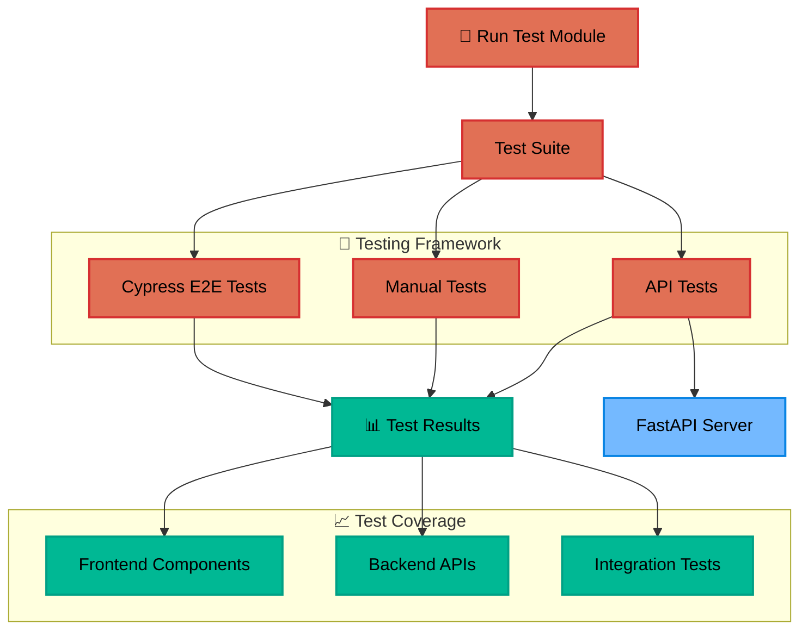
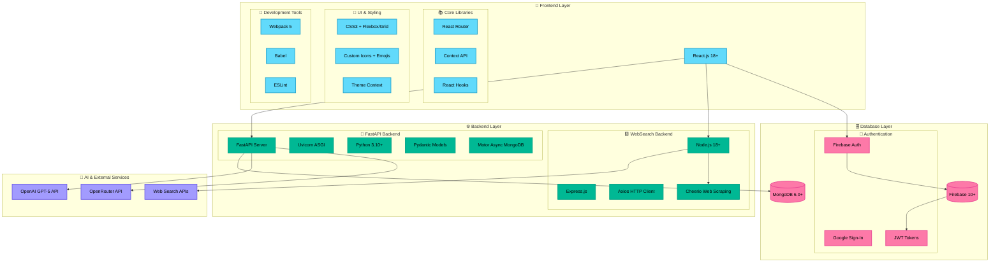
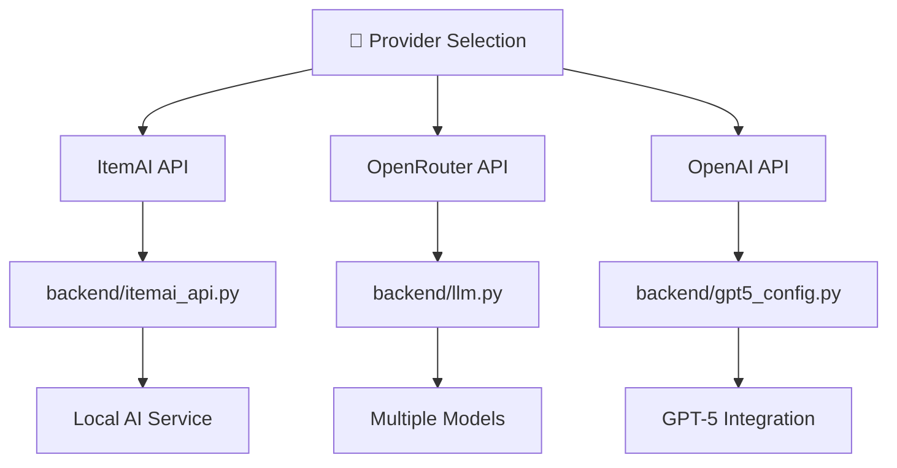
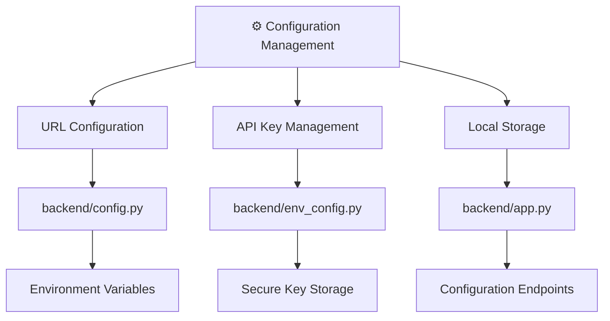
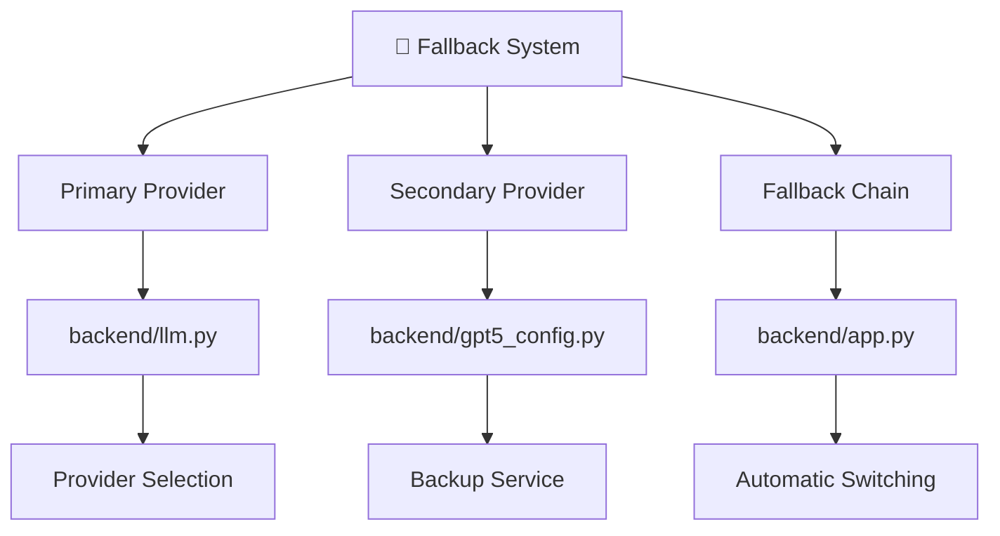
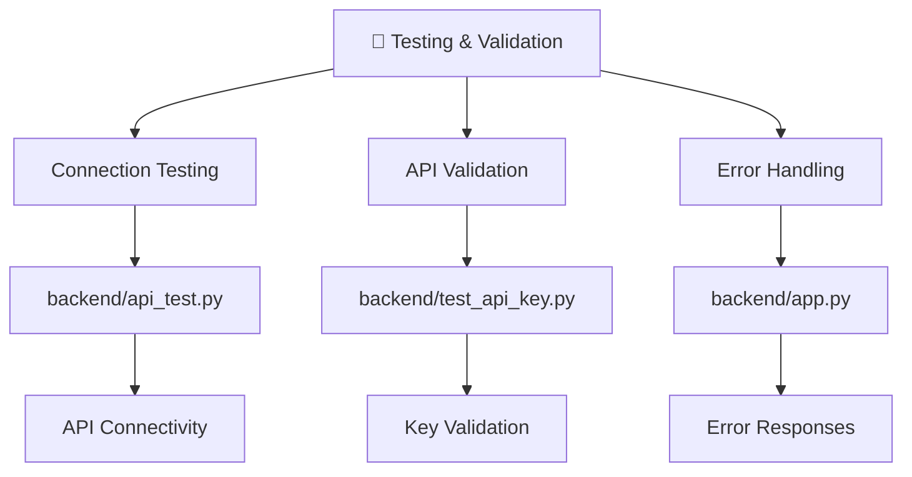

# 🤖 AI-Powered Workplace Learning Platform

> **"I'm not just building a learning app — I'm creating a co-evolving AI learning assistant where users shape its growth."**

## 🧭 Quick Navigation

**💡 Tip:** Click on any link below to navigate directly to that section within this document:

### 🎯 Core Learning Modules
- [Dashboard](#dashboard) - Progress tracking and analytics
- [AI Concepts](#ai-concepts) - AI-powered learning content
- [Micro Lessons](#micro-lessons) - Bite-sized learning modules
- [Recommendations](#recommendations) - Personalized suggestions
- [Scenario Simulator](#scenario-simulator) - Interactive simulations
- [Web Search](#web-search) - Real-time information retrieval
- [AI Career Coach](#ai-career-coach) - Personalized career guidance
- [Skills Forecast](#skills-forecast) - Future skill predictions
- [Certifications](#certifications) - Professional development
- [Video Lessons](#video-lessons) - Multimedia learning
- [📚 Babel Library](#babel-library) - Centralized knowledge repository

### 🚀 Advanced Features
- [Knowledge Map](#knowledge-map) - Interactive learning visualization
- [Agent Cursor AI](#agent-cursor-ai) - Repository analysis and documentation
- [Repository Analyzer](#repository-analyzer) - Code analysis and learning modules
- [Presentation Agent](#presentation-agent) - AI-generated presentations
- [AI Study Buddy](#ai-study-buddy) - Conversational learning support

### 🏢 Enterprise Architecture (NEW!)
- [EA Dashboard](#enterprise-architecture) - Enterprise architecture overview and navigation
- [Process Designer](#process-designer) - Visual process modeling with React Flow
- [Catalog Manager](#catalog-manager) - Enterprise catalog management (CRUD)
- [Heatmap View](#heatmap-view) - Risk and maturity visualization with Chart.js
- [Impact Analysis](#impact-analysis) - Dependency analysis with BFS algorithm

### 🛠️ Admin & Development
- [API Config](#api-config) - ItemAI API, OpenAI, and OpenRouter API configuration
- [Run Test](#run-test) - Comprehensive testing suite
- [Idea Log](#idea-log) - Feature tracking and suggestions
- [Feature Roadmap](#feature-roadmap) - Development planning
- [Global Search](#global-search) - Cross-module search functionality

### ⚙️ Backend Services
- [FastAPI Server](#fastapi-server) - High-performance API server
- [AI Integration](#ai-integration) - ItemAI API (local), OpenAI GPT-5, and OpenRouter integration
- [MongoDB](#mongodb) - Flexible document storage
- [Firebase Auth](#firebase-auth) - Secure authentication
- [Web Search API](#web-search-api) - Real-time data retrieval

---

## 🎯 Project Overview {#project-overview}

This is a comprehensive **AI-powered workplace learning platform** that combines cutting-edge artificial intelligence with modern web technologies to create an intelligent, adaptive learning experience. Built with React.js frontend and FastAPI backend, it features advanced AI capabilities including personalized recommendations, interactive simulations, and a sophisticated knowledge mapping system.

## 🏗️ Philosophy & Approach: Building with AI, Not Just Code {#philosophy-approach}

In this project, we intentionally chose a documentation-driven, AI-first approach to software development. Our goal was to demonstrate that, with the right architectural blueprints and explicit instructions, a modern AI system—such as Cursor AI—can build a complex, full-stack application from scratch, even in environments where pre-existing code is not allowed.

### 🎯 Why This Revolutionary Approach?

#### 🔧 **Adaptability to Constraints**
Many hackathons and enterprise environments restrict the use of pre-written code or external repositories. By relying on comprehensive, step-by-step documentation, we ensure that the project can be built from the ground up, regardless of these constraints.

#### 🤝 **AI as a True Engineering Partner**
We believe that the future of software engineering is not just about writing code, but about designing processes and systems that AI can understand and execute. Our documents are written to be both **human- and machine-readable**, enabling seamless collaboration between developers and AI agents.

#### 🔍 **Transparency and Reproducibility**
Every architectural decision, configuration, and troubleshooting step is documented. This makes the build process transparent, auditable, and easy to reproduce—whether by a human team or an automated system.

#### 🚀 **Demonstrating the Power of Modern AI**
By challenging ourselves to build solely from documentation, we showcase how far AI tools like Cursor have come. This approach highlights the practical capabilities of AI in real-world, zero-code-start scenarios.

#### 📚 **Onboarding and Knowledge Transfer**
This methodology is not only valuable for hackathons, but also for onboarding new team members, scaling projects, and ensuring long-term maintainability. Anyone—human or AI—can pick up these documents and recreate the application with confidence.

### 🎉 **The Result**
This project is a **proof of concept for the next generation of software development**, where clear documentation and AI collaboration can achieve results previously possible only with direct code access. We invite you to explore, build, and extend this application—using only the instructions provided—as a testament to what's possible with today's AI.

---

## 🏗️ System Architecture {#system-architecture}

*The diagram below shows the complete system architecture. For detailed information about each component, use the navigation links above.*

## 🏗️ System Architecture {#system-architecture}

*The diagrams below show the system architecture divided into two clear sections for better readability.*

### 📱 Application Architecture

```mermaid
graph TB
  %% Main User Interface
  User((👤 User)) --> App[🎨 Main App]
  
  %% Core Learning Modules
  subgraph "🎯 Core Learning Modules"
    Dashboard[Dashboard]
    Concepts[AI Concepts]
    MicroLesson[Micro Lessons]
    BabelLibrary[Babel Library]
    Recommendation[Recommendations]
    Simulator[Scenario Simulator]
    WebSearch[Web Search]
    CareerCoach[AI Career Coach]
    SkillsForecast[Skills Forecast]
    Certifications[Certifications]
    VideoLesson[Video Lessons]
  end
  
  %% Advanced Features
  subgraph "🚀 Advanced Features"
    KnowledgeMap[🗺️ Knowledge Map]
    AgentCursorAI[🤖 Agent Cursor AI]
    RepoAnalyzer[📁 Repository Analyzer]
    PresentationAgent[🎤 Presentation Agent]
    AIStudyBuddy[🤝 AI Study Buddy]
  end
  
  %% Enterprise Architecture
  subgraph "🏢 Enterprise Architecture"
    EAHome[EA Dashboard]
    ProcessDesigner[Process Designer]
    CatalogManager[Catalog Manager]
    HeatmapView[Heatmap View]
    ImpactAnalysis[Impact Analysis]
  end
  
  %% Admin & Development
  subgraph "🛠️ Admin & Development"
    APIConfig[⚙️ API Config]
    RunTest[🧪 Run Test]
    IdeaLog[📝 Idea Log]
    FeatureRoadmap[🗺️ Feature Roadmap]
    GlobalSearch[🔍 Global Search]
  end
  
  %% Backend Services
  subgraph "⚙️ Backend Services"
    FastAPI[FastAPI Server]
    LLM[OpenAI GPT-5]
    MongoDB[(MongoDB)]
    Firebase[(Firebase Auth)]
    WebSearchAPI[Web Search API]
  end
  
  %% Data Flow
  App --> Dashboard
  App --> Concepts
  App --> MicroLesson
  App --> Recommendation
  App --> Simulator
  App --> WebSearch
  App --> CareerCoach
  App --> SkillsForecast
  App --> Certifications
  App --> VideoLesson
  App --> KnowledgeMap
  App --> AgentCursorAI
  App --> RepoAnalyzer
  App --> PresentationAgent
  App --> AIStudyBuddy
  App --> EAHome
  App --> ProcessDesigner
  App --> CatalogManager
  App --> HeatmapView
  App --> ImpactAnalysis
  App --> APIConfig
  App --> RunTest
  App --> IdeaLog
  App --> FeatureRoadmap
  App --> GlobalSearch
  
  %% Backend Connections
  Dashboard --> FastAPI
  Concepts --> FastAPI
  MicroLesson --> FastAPI
  Recommendation --> FastAPI
  Simulator --> FastAPI
  WebSearch --> WebSearchAPI
  CareerCoach --> FastAPI
  SkillsForecast --> FastAPI
  Certifications --> FastAPI
  VideoLesson --> FastAPI
  BabelLibrary --> FastAPI
  
  %% Babel Library Integration
  MicroLesson --> BabelLibrary
  WebSearch --> BabelLibrary
  SkillsForecast --> BabelLibrary
  Certifications --> BabelLibrary
  VideoLesson --> BabelLibrary
  KnowledgeMap --> FastAPI
  AgentCursorAI --> FastAPI
  RepoAnalyzer --> FastAPI
  PresentationAgent --> FastAPI
  AIStudyBuddy --> FastAPI
  EAHome --> FastAPI
  ProcessDesigner --> FastAPI
  CatalogManager --> FastAPI
  HeatmapView --> FastAPI
  ImpactAnalysis --> FastAPI
  APIConfig --> FastAPI
  
  %% AI & Database
  FastAPI --> LLM
  FastAPI --> MongoDB
  FastAPI --> Firebase
  WebSearchAPI --> LLM
  
  %% External Services
  AgentCursorAI --> CursorAI[Cursor AI Local]
  RepoAnalyzer --> GitHub[GitHub/GitLab]
  
  %% Styling
  classDef user fill:#fdcb6e,stroke:#e17055,stroke-width:3px,color:#000000,font-size:18px;
  classDef frontend fill:#74b9ff,stroke:#0984e3,stroke-width:2px,color:#000000,font-size:16px;
  classDef backend fill:#00b894,stroke:#00a085,stroke-width:2px,color:#000000,font-size:16px;
  classDef external fill:#a29bfe,stroke:#6c5ce7,stroke-width:2px,color:#000000,font-size:16px;
  classDef database fill:#fd79a8,stroke:#e84393,stroke-width:2px,color:#000000,font-size:16px;
  
  class User user;
  class App,Dashboard,Concepts,MicroLesson,BabelLibrary,Recommendation,Simulator,WebSearch,CareerCoach,SkillsForecast,Certifications,VideoLesson,KnowledgeMap,AgentCursorAI,RepoAnalyzer,PresentationAgent,AIStudyBuddy,EAHome,ProcessDesigner,CatalogManager,HeatmapView,ImpactAnalysis,APIConfig,RunTest,IdeaLog,FeatureRoadmap,GlobalSearch frontend;
  class FastAPI,LLM,WebSearchAPI backend;
  class CursorAI,GitHub external;
  class MongoDB,Firebase database;
```



### 🧪 Testing Architecture



### 🏗️ Technical Stack Architecture




---

## 🔧 API Configuration Architecture

### System Overview
The API Configuration module provides a flexible interface to manage multiple AI service providers with intelligent fallback capabilities.

### 1. Provider Selection Architecture



### 2. Configuration Management Architecture



### 3. Fallback System Architecture



### 4. Testing & Validation Architecture



### Key Features
- **Multi-provider support** with intelligent fallback
- **Secure API key management** and storage
- **Real-time connection testing** and validation
- **Automatic provider switching** on failures
- **Local configuration persistence**
- **API testing utilities** for validation
- **Environment variable management** for secure configuration

### File Structure
```
frontend/src/components/
├── APIConfig.jsx          # Main configuration interface

backend/
├── app.py                # API configuration endpoints
├── config.py             # General configuration management
├── env_config.py         # Environment variable management
├── itemai_api.py         # ItemAI API integration
├── api_test.py           # API testing utilities
└── test_api_key.py       # API key validation
```

---

## 🚀 Quick Start Guide

### 🟢 First Run Checklist
- MongoDB is running and accessible on localhost:27017
- Backend .env is configured with all required variables (see below)
- Frontend .env is configured with all required variables (see below)
- Firebase service account file is present in backend/
- All dependencies installed (npm install in frontend, pip install -r requirements.txt in backend)
- Both frontend and backend servers are running (see start commands below)
- Cypress tests pass (npm run test:comprehensive in frontend)

### 🔑 Environment Variables (REQUIRED)

**Backend .env (place in backend/)**
```
OPENAI_API_KEY=your_openai_api_key_here
MONGO_URI=mongodb://localhost:27017
FIREBASE_CREDENTIALS=serviceAccountKey.json
```

**Frontend .env (place in frontend/)**
```
REACT_APP_API_BASE_URL=http://localhost:8000
REACT_APP_FIREBASE_API_KEY=your_firebase_api_key
REACT_APP_FIREBASE_AUTH_DOMAIN=your_project.firebaseapp.com
REACT_APP_FIREBASE_PROJECT_ID=your_project_id
REACT_APP_FIREBASE_STORAGE_BUCKET=your_project.appspot.com
REACT_APP_FIREBASE_MESSAGING_SENDER_ID=your_sender_id
REACT_APP_FIREBASE_APP_ID=your_app_id
```

### ⚠️ Common Pitfalls & Troubleshooting

- **npm start fails with 'Missing script: start'**: Ensure you are in the frontend directory and package.json contains a "start" script.
- **uvicorn app:app --reload fails**: This command is INCORRECT. Always run from the root directory with `uvicorn backend.app:app --reload`
- **MongoDB connection errors**: Ensure MongoDB is running and accessible at the URI in your .env.
- **Firebase errors**: Ensure Google Sign-In is enabled, the web app is registered, and the service account key is present in backend/.
- **Cypress tests hang**: Ensure both frontend and backend servers are running. Check for port conflicts.
- **Port already in use**: Kill the process using the port or change the port in your start script.
- **Node/Python version issues**: Use Node.js 18+ and Python 3.10+ for best compatibility.
- **Component/file naming**: All references must match exactly (e.g., Certifications.jsx, not Certification.jsx).
- **CORS errors**: Ensure CORS is enabled in FastAPI and frontend is using the correct API base URL.
- **Cannot find module**: Ensure all dependencies are installed and paths are correct.

### 🧠 AI-Specific Guidance

- Always check for missing or misnamed files/components.
- Always check for missing or misconfigured environment variables.
- Always check for port conflicts before starting servers.
- Always check for dependency installation before running any scripts.
- Always check for correct casing in file and directory names (case-sensitive on Unix).
- Always check for correct API base URLs in both frontend and backend.
- Always check for correct Firebase configuration and credentials.
- Always check for CORS settings in backend.
- Always check for MongoDB running and accessible.
- Always check for Node.js and Python versions.

### 🚀 Start Commands

**Backend (FastAPI)**
```bash
cd backend
uvicorn app:app --reload
```

**Frontend (React)**
```bash
cd frontend
npm start
```

**Web Search Backend (Node.js)**
```bash
cd websearch-backend
node index.js
```

**Cypress Tests**
```bash
cd frontend
npm run test:comprehensive
```

---

## 🛠️ Tech Stack & Architecture

### Backend Services
- **FastAPI**: High-performance Python web framework
- **AI Integration**: Multi-provider AI system with ItemAI API (local), OpenAI GPT-5, and OpenRouter
- **MongoDB**: Flexible document storage for user-specific data
- **Firebase Auth**: Secure Google Sign-In authentication
- **Node.js Express**: Web search backend for real-time information

### Frontend Technologies
- **React.js**: Modern JavaScript library for building user interfaces
- **Shoelace Web Components**: Professional UI components and styling
- **D3.js**: Interactive data visualization for knowledge mapping
- **React Flow**: Professional node-based editor for process modeling
- **Chart.js**: Flexible JavaScript charting library for data visualization
- **React-Chartjs-2**: React wrapper for Chart.js integration
- **Cypress**: End-to-end testing framework

### Key Features
- **AI-Powered Learning**: Personalized content generation and recommendations
- **Multi-Provider AI**: Choose between local AI (ItemAI), cloud AI (OpenAI), or cost-effective alternatives (OpenRouter)
- **Intelligent Fallback**: Automatic fallback system for maximum reliability and cost optimization
- **Real-time Streaming**: ChatGPT-like streaming responses
- **User Authentication**: Secure Firebase-based user management
- **Responsive Design**: Works on all devices and screen sizes
- **Theme Support**: Light/dark mode with automatic adaptation
- **Enterprise Architecture**: Professional process modeling, catalog management, and impact analysis
- **Advanced Visualizations**: Interactive charts, heatmaps, and process diagrams
- **Comprehensive Analytics**: Risk assessment, maturity tracking, and dependency mapping

---

## 📁 Project Structure

```
AI Learning with AI/
├── backend/
│   ├── app.py                 # Main FastAPI application with all endpoints
│   ├── llm.py                 # Multi-provider AI integration (ItemAI, OpenAI, OpenRouter) and streaming
│   ├── itemai_api.py          # ItemAI API integration for local LM Studio
│   ├── gpt5_config.py         # GPT-5 model configuration
│   ├── cursor_agent_routes.py # Agent Cursor AI integration
│   ├── prompts.py             # AI prompt templates and configurations
│   ├── vector_store.py        # Vector database for knowledge mapping
│   ├── enhanced_analysis.py   # Repository analysis and documentation
│   ├── ea_models.py           # Enterprise Architecture data models
│   ├── ea_processes.py        # EA process management endpoints
│   ├── ea_catalog.py          # EA catalog management endpoints
│   ├── requirements.txt       # Python dependencies
│   └── .env                   # Environment variables
├── frontend/
│   ├── src/
│   │   ├── App.jsx            # Main application component with routing
│   │   ├── components/        # Feature components
│   │   ├── api.js             # API integration and streaming
│   │   ├── ThemeContext.jsx   # Theme management (light/dark)
│   │   ├── hooks/
│   │   │   └── useStreaming.js # Streaming LLM responses hook
│   │   ├── Dashboard.jsx      # Learning progress and analytics
│   │   ├── Concepts.jsx       # AI-powered learning concepts
│   │   ├── MicroLesson.jsx    # Bite-sized learning modules
│   │   ├── Recommendation.jsx # Personalized learning suggestions
│   │   ├── Simulator.jsx      # Interactive workplace scenarios
│   │   ├── WebSearch.jsx      # Real-time web search with AI
│   │   ├── CareerCoach.jsx    # AI career guidance and coaching
│   │   ├── SkillsForecast.jsx # Future skills prediction
│   │   ├── Certifications.jsx # Professional certification planning
│   │   ├── VideoLesson.jsx    # Video-based learning with AI quizzes
│   │   ├── KnowledgeMap.jsx   # Interactive learning visualization
│   │   ├── TeamDynamics.jsx   # Team collaboration analysis
│   │   ├── IdeaLog.jsx        # Feature tracking and suggestions
│   │   ├── FeatureRoadmap.jsx # Development planning and AI code generation
│   │   ├── PresentationAgent.jsx # AI-powered presentations and voice cloning
│   │   ├── AIStudyBuddy.jsx   # Conversational learning support
│   │   ├── RunTest.jsx        # Comprehensive testing suite
│   │   ├── GlobalSearch.jsx   # Cross-module search functionality
│   │   ├── CommandBar.jsx     # Zero-UI natural language interface
│   │   ├── AdvancedMasteryPanel.jsx # Learning analytics dashboard
│   │   ├── AdvancedRecommendations.jsx # AI-powered learning suggestions
│   │   ├── AdvancedTooltip.jsx # Rich hover information system
│   │   ├── ClusterLegend.jsx  # Knowledge cluster filtering
│   │   ├── MasteryTimeline.jsx # Learning progress timeline
│   │   ├── StreamingProgress.jsx # Real-time progress indicators
│   │   ├── StreamingText.jsx   # Streaming text display
│   │   ├── Sidebar.jsx        # Navigation and module selection
│   │   └── ea/                # Enterprise Architecture module
│   │       ├── EAHome.jsx     # EA main dashboard and navigation
│   │       ├── EAHome.css     # EA dashboard styling
│   │       ├── ProcessDesigner.jsx # Visual process modeling with React Flow
│   │       ├── ProcessDesigner.css # Process designer styling
│   │       ├── CatalogManager.jsx # Enterprise catalog management (CRUD)
│   │       ├── CatalogManager.css # Catalog manager styling
│   │       ├── HeatmapView.jsx # Risk and maturity visualization with Chart.js
│   │       ├── HeatmapView.css # Heatmap view styling
│   │       ├── ImpactAnalysis.jsx # Dependency analysis with BFS algorithm
│   │       └── ImpactAnalysis.css # Impact analysis styling
│   ├── cypress/               # End-to-end testing framework
│   │   ├── e2e/               # Test specifications
│   │   ├── fixtures/          # Test data
│   │   └── support/           # Test utilities and commands
│   ├── package.json           # Node.js dependencies
│   └── .env                   # Frontend environment variables
├── websearch-backend/
│   ├── index.js               # Web search Node.js server
│   └── package.json           # Web search dependencies
├── deployment/                 # Deployment configurations
│   ├── cloudrun.yaml          # Google Cloud Run configuration
│   └── Dockerfile             # Docker container setup
├── docs/                      # Additional documentation
├── install-voice-cloning.sh   # Voice cloning setup script
└── README.md                  # This comprehensive documentation
```

### Detailed Project Structure

```
AI Learning with AI/
├── backend/
│   ├── app.py                 # Main FastAPI application with all endpoints
│   ├── llm.py                 # OpenAI GPT-5 integration and streaming
│   ├── gpt5_config.py         # GPT-5 model configuration
│   ├── cursor_agent_routes.py # Agent Cursor AI integration
│   ├── prompts.py             # AI prompt templates and configurations
│   ├── vector_store.py        # Vector database for knowledge mapping
│   ├── enhanced_analysis.py   # Repository analysis and documentation
│   ├── ea_models.py           # Enterprise Architecture data models
│   ├── ea_processes.py        # EA process management endpoints
│   ├── ea_catalog.py          # EA catalog management endpoints
│   ├── db.py                  # Database models and connections
│   ├── static/
│   │   └── favicon.ico
│   ├── tests/
│   │   └── test_app.py
│   ├── requirements.txt       # Python dependencies
│   └── .env                   # Environment variables
├── deployment/
│   ├── cloudrun.yaml          # Google Cloud Run configuration
│   └── Dockerfile             # Docker container setup
├── docs/                      # Additional documentation
├── frontend/
│   ├── cypress/               # End-to-end testing framework
│   │   ├── cypress.config.js
│   │   ├── e2e/
│   │   │   ├── app.cy.js
│   │   │   ├── appOption.cy.js
│   │   │   ├── clearButtons.cy.js
│   │   │   ├── savedMicro-lessons.cy.js
│   │   │   ├── scenarioSimulator.cy.js
│   │   │   └── webSearch.cy.js
│   │   ├── fixtures/
│   │   │   └── example.json
│   │   └── support/
│   │       ├── commands.js
│   │       └── e2e.js
│   ├── cypress.config.js
│   ├── package.json
│   ├── public/
│   │   ├── favicon.ico
│   │   ├── index.html
│   │   ├── logo192.png
│   │   ├── logo512.png
│   │   ├── manifest.json
│   │   └── robots.txt
│   ├── README.md
│   └── src/
│       ├── _tests_/
│       │   └── Concepts.test.jsx
│       ├── api.js             # API integration and streaming
│       ├── App.css
│       ├── App.jsx            # Main application component with routing
│       ├── App.test.js
│       ├── Auth.jsx           # Firebase authentication
│       ├── CareerCoach.jsx    # AI career guidance and coaching
│       ├── Certifications.jsx # Professional certification planning
│       ├── Concepts.jsx       # AI-powered learning concepts
│       ├── Dashboard.jsx      # Learning progress and analytics
│       ├── GlobalSearch.jsx   # Cross-module search functionality
│       ├── index.css
│       ├── index.js
│       ├── LessonList.jsx     # Saved micro-lessons management
│       ├── logo.svg
│       ├── MicroLesson.jsx    # Bite-sized learning modules
│       ├── Recommendation.jsx # Personalized learning suggestions
│       ├── reportWebVitals.js
│       ├── setupTests.js
│       ├── Simulator.jsx      # Interactive workplace scenarios
│       ├── SkillsForecast.jsx # Future skills prediction
│       ├── TeamDynamics.jsx   # Team collaboration analysis
│       ├── ThemeContext.jsx   # Theme management (light/dark)
│       ├── WebSearch.jsx      # Real-time web search with AI
│       ├── KnowledgeMap.jsx   # Interactive learning visualization
│       ├── AdvancedMasteryPanel.jsx # Learning analytics dashboard
│       ├── AdvancedRecommendations.jsx # AI-powered learning suggestions
│       ├── AdvancedTooltip.jsx # Rich hover information system
│       ├── ClusterLegend.jsx  # Knowledge cluster filtering
│       ├── MasteryTimeline.jsx # Learning progress timeline
│       ├── hooks/
│       │   └── useStreaming.js # Streaming LLM responses hook
│       ├── StreamingProgress.jsx # Real-time progress indicators
│       ├── StreamingText.jsx   # Streaming text display
│       ├── Sidebar.jsx        # Navigation and module selection
│       ├── CommandBar.jsx     # Zero-UI natural language interface
│       ├── IdeaLog.jsx        # Feature tracking and suggestions
│       ├── FeatureRoadmap.jsx # Development planning and AI code generation
│       ├── PresentationAgent.jsx # AI-powered presentations and voice cloning
│       ├── AIStudyBuddy.jsx   # Conversational learning support
│       ├── RunTest.jsx        # Comprehensive testing suite
│       └── VideoLesson.jsx    # Video-based learning with AI quizzes
├── package.json
├── README.md
├── serviceAccountKey.json     # Firebase service account (ignored, not in repo)
├── websearch-backend/
│   ├── index.js               # Web search Node.js server
│   └── package.json           # Web search dependencies
└── install-voice-cloning.sh   # Voice cloning setup script
```

---

## 🔧 Installation & Setup

> **⚠️ IMPORTANT BACKEND STARTUP NOTE:**
> 
> The Python FastAPI backend **MUST be started from the root directory** (not from inside the `backend/` folder) using:
> ```bash
> uvicorn backend.app:app --reload
> ```
> 
> This is because the backend code uses relative imports that expect to be run from the project root. Starting from inside `backend/` will cause import errors.

### Prerequisites
- **Node.js 18+** and **npm**
- **Python 3.10+** and **pip**
- **MongoDB** running locally or accessible
- **Firebase project** with authentication enabled
- **OpenAI API key** with GPT-5 access

### Step-by-Step Setup

1. **Clone the Repository**
   ```bash
   git clone <repository-url>
   cd AI-Learning-with-AI
   ```

2. **Backend Setup**
   ```bash
   cd backend
   pip install -r requirements.txt
   cp .env.example .env
   # Edit .env with your API keys and configuration
   ```

3. **Frontend Setup**
   ```bash
   cd frontend
   npm install
   cp .env.example .env
   # Edit .env with your Firebase configuration
   ```

4. **Web Search Backend Setup**
   ```bash
   cd websearch-backend
   npm install
   ```

5. **Start All Services**
   ```bash
   # Terminal 1: Backend (IMPORTANT: Run from root directory)
   uvicorn backend.app:app --reload
   
   # Terminal 2: Frontend
   cd frontend && npm start
   
   # Terminal 3: Web Search
   cd websearch-backend && node index.js
   ```

6. **Run Tests**
   ```bash
   cd frontend
   npm run test:comprehensive
   ```

### Setup Instructions (Detailed)

#### 1. Backend Dependencies
```bash
pip install fastapi uvicorn openai python-dotenv
```

#### 2. Frontend Dependencies
```bash
cd frontend
npm install
```

#### 3. Web Search Backend Dependencies
```bash
cd websearch-backend
npm install
```

---

## 🚀 Features

### Backend (FastAPI + Node.js)

Modular API endpoints for:
- **AI Concepts generation**
- **Micro-Lesson generation** (with dynamic user input)
- **Scenario Simulation**
- **AI Recommendation/Analysis**
- **Web Search** (GPT-4.1 + tools, Node.js backend) for up-to-date answers
- **Saved Micro-lessons**: All generated micro-lessons are stored in a MongoDB database for later review, with endpoints for listing, editing, and deleting lessons
- **AI Career Coach**: An intelligent mentor that guides users through soft skills, leadership scenarios, and career goals via a /career-coach endpoint. Supports multi-turn conversations by accepting and responding to conversation history.
- **Dynamic Skills Forecasting**: Predicts future skill needs based on user learning history and transcript keywords via a /skills-forecast endpoint.
- **AI-Powered Certifications**: Get personalized certification recommendations and study plans via /certifications endpoints with user-specific data persistence.
- **Map of Knowledge**: Advanced learning visualization system with vector-based recommendations, mastery tracking, and interactive clustering via /knowledge-map endpoints.
- **Repository Documentation Generator**: AI-powered repository analysis and documentation generation with quiz creation via /api/analyze-repo and /api/generate-documentation endpoints.
- **Team Dynamics Analyzer**: Comprehensive team management and analytics with AI-powered insights via /teams endpoints.
- **Enterprise Architecture (EA) Module**: Comprehensive enterprise-grade solution with process modeling, catalog management, heatmap visualizations, and impact analysis via /api/ea endpoints.
- **Firebase Authentication**: Secure user authentication with Google Sign-In
- **User-Specific Data**: All data (lessons, career sessions, forecasts, certifications, knowledge map data, EA data) is saved per user
- **Dynamic prompt handling** with user input (e.g., custom micro-lesson topics)
- **Mocked AI responses** if OpenAI API key is missing or invalid
- **CORS enabled** for frontend-backend communication
- **MongoDB integration** for persistent storage of user-specific data

### Frontend (React + Shoelace)

- **Google Sign-In via Firebase Authentication** for secure, personalized access
- **Global Search Functionality** (GlobalSearch.jsx):
  - 🔍 **Search Button**: Located in the header next to the theme toggle
  - ⌨️ **Keyboard Shortcuts**: Press Ctrl+K (or Cmd+K on Mac) to open search
  - 📱 **Modal Interface**: Clean, modern search overlay with real-time filtering
  - 🎯 **Comprehensive Coverage**: Search across all 12 sections (Dashboard, AI Concepts, Micro-lessons, Map of Knowledge, etc.)
  - ⚡ **Smart Search**: Searches titles, descriptions, and keywords for instant results
  - 🎨 **Theme Aware**: Adapts to light/dark mode automatically
  - ⌨️ **Keyboard Navigation**: Use arrow keys to navigate results, Enter to select, Escape to close

**Modular, professional UI with each feature in its own card:**
- **Concepts** (Concepts.jsx)
- **Micro-lesson** (MicroLesson.jsx)
- **Recommendation** (Recommendation.jsx)
- **Scenario Simulator** (Simulator.jsx)
- **Web Search** (WebSearch.jsx)
- **Map of Knowledge** (KnowledgeMap.jsx):
  - 🗺️ **Interactive Learning Visualization**: D3.js-powered map with 13 knowledge topics
  - 🎯 **Advanced Vectorial Recommendations**: AI-powered learning suggestions based on vector proximity
  - 📊 **Advanced Mastery Panel**: Real-time analytics with timeline visualization and KPIs
  - 🔍 **Search & Filter System**: Real-time filtering by topic, category, and mastery level
  - 🎮 **Interactive Controls**: Zoom, pan, and hover effects for enhanced user experience
- **Repository Analyzer** (RepoAnalyzer.jsx):
  - 🔍 **Repository Analysis**: Clone and analyze GitHub/GitLab/Bitbucket repositories
  - 📝 **AI Documentation Generation**: Automatically generate comprehensive documentation from code analysis
  - 🧠 **Quiz Generation**: Create interactive quizzes from generated documentation
  - 📄 **PDF Export**: Download documentation in PDF format
  - 🎯 **Template Support**: Quick access to common repository templates
- **Saved Micro-lessons** (LessonList.jsx):
  - View all previously generated micro-lessons at the bottom of the app
  - Filter lessons by topic in real time
  - Expand/Compress each lesson to show only the topic or the full content
  - Edit lesson topic and content inline
  - Delete lessons with a single click

**AI Career Coach** (CareerCoach.jsx):
- Start a conversation with an AI mentor for career guidance, goal setting, and soft skills development
- Multi-turn chat interface: Continue the conversation by sending and receiving messages in a chat-like UI
- End Session button to reset the conversation and start over
- Sessions are automatically saved per user

**Skills Forecasting** (SkillsForecast.jsx):
- Enter your learning history and transcript keywords
- Get AI-powered predictions for the next skills you should develop, with explanations
- Forecasts are saved per user for future reference

**Certifications** (Certifications.jsx):
- **AI-Powered Recommendations**: Get personalized certification suggestions based on your role, skills, and goals
- **Smart Skills Management**:
  - Individual Skill Tags: Skills display as removable blue tags instead of plain text
  - Comma-Separated Input: Type multiple skills separated by commas (e.g., "Jira, Confluence, Slack")
  - Quick Add Button: 🧪 Quick Add button to instantly add typed skills
  - Paste Support: Paste multiple skills and they'll be automatically split
  - Auto-Sync: Skills automatically sync between "Get Recommendations" and "Study Plan" tabs
  - Visual Feedback: Clear indication when skills are auto-filled from saved profile
- **Study Plan Generation**: Create personalized weekly study plans for selected certifications
- **Practice Tests**: Interactive certification interview simulations
- **History Tracking**: View previous study plans and recommendations
- **Profile Persistence**: Your role, skills, and goals are automatically saved and restored

**🧪 Run Test** (RunTest.jsx):
- **Comprehensive Testing Suite**: Built-in testing functionality accessible from the sidebar
- **Manual Testing**: Quick verification that all panels load correctly
- **Automated Testing**: Cypress-powered tests for all sidebar options and features
- **Visual Results**: Real-time test results with pass/fail status and execution times
- **Screenshot Capture**: Automatic screenshots for visual verification of each panel
- **Test Coverage**: Tests all 11 sidebar options, global search, theme toggle, and responsive design
- **Easy Access**: Click the test tube icon (🧪) in the sidebar to run tests

**⚙️ API Config** (APIConfig.jsx):
- **Triple API Support**: Configure and switch between ItemAI API (local), OpenAI, and OpenRouter APIs
- **ItemAI API Integration**: Local AI powered by LM Studio - 100% free, 100% private, runs on your own computer
- **API Key Management**: Secure storage of API keys and local URLs in browser localStorage
- **Connection Testing**: Built-in API connection testing for all three providers
- **Intelligent Fallback System**: Seamless fallback chain: ItemAI API → OpenRouter → OpenAI → Mock Response
- **Cost Optimization**: Access to multiple AI providers through OpenRouter for better pricing
- **Privacy Options**: Choose between local AI (ItemAI), cloud AI (OpenAI/OpenRouter), or hybrid approach
- **Provider Selection**: Easy switching between API providers with visual indicators and dynamic descriptions
- **Security**: API keys are stored locally and never sent to external servers
- **Easy Access**: Click the gear icon (⚙️) in the sidebar under Developer section

**Shoelace-based UI:**
- Uses Shoelace Web Components for cards, buttons, and layout in all main features (Career Coach, Skills Forecasting, Saved Micro-lessons)
- Consistent, modern design with accessible, themeable components
- Easy to extend with more Shoelace elements (dialogs, alerts, etc.)
- Tooltips/hints on all main options and inputs for user guidance
- Responsive, modern design with color-coded buttons
- Per-section Clear buttons for Concepts, Micro-lesson, and Recommendation to reset results and inputs
- Robust progress tracking and personalized dashboard
- Displays API results in a styled, readable format with proper text wrapping
- Ready for further expansion (user input for other endpoints, authentication, etc.)

---

## 🔄 Recent Improvements: Enhanced Certifications Module

### 🎯 Smart Skills Management System

The Certifications module has been significantly enhanced with a sophisticated skills management system:

**Individual Skill Tags**
- **Visual Display**: Skills now appear as individual blue tags with remove buttons (×)
- **Easy Removal**: Click the × on any skill tag to remove it instantly
- **Professional Look**: Clean, modern tag-based interface instead of plain text

**Advanced Input Methods**
- **Comma-Separated Input**: Type multiple skills at once (e.g., "Jira, Confluence, Slack")
- **Semicolon Support**: Also supports semicolon separation (e.g., "Jira; Confluence; Slack")
- **Paste Functionality**: Paste a list of skills and they'll be automatically parsed
- **Quick Add Button**: 🧪 Quick Add button to instantly add whatever you've typed

**Auto-Sync Between Tabs**
- **Seamless Integration**: Skills automatically sync between "Get Recommendations" and "Study Plan" tabs
- **Visual Feedback**: Clear status messages when skills are auto-filled from your saved profile
- **Persistent Storage**: Your skills are saved and restored automatically

**Enhanced User Experience**
- **Input Tracking**: The input field tracks what you type for the Quick Add button
- **Smart Parsing**: Automatically splits comma/semicolon-separated skills into individual tags
- **Duplicate Prevention**: Prevents adding the same skill multiple times
- **Real-time Updates**: Skills update immediately as you add or remove them

### 🔧 Technical Improvements

**Fixed Compilation Issues**
- **State Management**: Added missing state variables (studyPlanResult, simulation)
- **Function References**: Fixed incorrect field references in study plan generation
- **Error Handling**: Improved error handling and validation

**Enhanced Testing**
- **Cypress Integration**: Comprehensive end-to-end testing for all sidebar options
- **Visual Verification**: Automatic screenshots for each panel test
- **Reliable Tests**: Fixed hanging issues and improved test stability
- **Timeout Management**: Proper timeouts to prevent test failures

### 📋 Usage Examples

**Adding Skills**
- **Type**: "Jira, Confluence, Slack" in the skills input
- **Click**: 🧪 Quick Add button
- **Result**: Three separate blue tags appear: "Jira", "Confluence", "Slack"

**Pasting Skills**
- **Copy**: "Selenium; Cypress; Test Automation" from another source
- **Paste**: Into the skills input field
- **Result**: Three skills automatically split and added as tags

**Switching Between Tabs**
- **Add skills** in "Get Recommendations" tab
- **Switch** to "Study Plan" tab
- **See**: Skills automatically appear in the "Current Skills" section

**Profile Persistence**
- **Fill out** your role, skills, and goals
- **Click**: "Get Recommendations" to save your profile
- **Refresh** the page or return later
- **See**: All your data is automatically restored

### 🎨 Visual Improvements

- **Modern Tag Design**: Professional blue tags with hover effects
- **Clear Visual Hierarchy**: Better spacing and typography
- **Responsive Layout**: Works perfectly on all screen sizes
- **Theme Integration**: Adapts to light/dark mode automatically

---

## 📚 Prompt Evolution: Improving with prompts.chat

To ensure our AI responses are always high quality and up-to-date with the latest best practices, this project leverages the prompts.chat directory and its open-source community.

- We regularly review and incorporate new prompt patterns and techniques from prompts.chat and its GitHub repository.
- This allows our application to continuously evolve, using the most effective prompt engineering strategies for better, more consistent AI results.
- In the future, we plan to automate prompt updates and allow user/admin feedback to help select and refine the best prompts for each feature.

Learn more or contribute your own prompts at [prompts.chat](https://prompts.chat)!

---

## 🔐 Authentication: Google Sign-In with Firebase

The app supports secure, personalized access using Google Sign-In via Firebase Authentication.

- **Users can sign in** with their Google account to access all features.
- **User-specific data**: All saved lessons, career coach sessions, and skills forecasts are linked to the user's Google account.
- **Privacy and security**: Users can only access and modify their own data.
- **Sign-in and sign-out** are handled with Shoelace-styled buttons for a seamless UI.
- **Backend protection**: All API endpoints require valid Firebase authentication tokens.

---

## 🗄️ Database Architecture: Two Databases for Different Purposes

This project uses two separate databases for different purposes:

### 1. Firebase Authentication Database
- **Purpose**: User identity and authentication
- **Stores**: User credentials, email, UID, profile information
- **What you get**: Secure way to know "who is this user?"
- **Access**: Managed by Firebase (no direct database access needed)

### 2. MongoDB (Application Database)
- **Purpose**: Store your app's business data
- **Stores**:
  - Micro-lessons with user associations
  - Career coach sessions per user
  - Skills forecasts per user
  - User progress and activity
- **What you get**: Your app's data with user associations
- **Collections**:
  - `lessons`: User-specific micro-lessons
  - `career_coach_sessions`: User's career coaching history
  - `skills_forecasts`: User's skills predictions
  - `teams`: User-created teams with metadata
  - `team_members`: Team member details and roles
  - `team_analytics`: AI-generated team analysis and insights
  - `users`: (Future) Additional user profile data

### Why Use Both?
- **Separation of Concerns**: Authentication vs. business data
- **Firebase Auth is NOT a Database**: It only handles user identity, not app data
- **Scalability**: Each database optimized for its specific purpose
- **Security**: User data is properly isolated and protected

### Data Structure Example:

```javascript
// MongoDB lesson document
{
  "_id": "ObjectId(...)",
  "topic": "Agile sprint planning",
  "lesson": "Lesson content...",
  "user_id": "firebase_uid_here",
  "user_email": "user@example.com",
  "created_at": "2024-01-15T10:30:00Z"
}
```

---

## 👤 User-Specific Features

### Personalized Data Storage
- **Micro-lessons**: Each user sees only their own saved lessons
- **Career coach sessions**: Conversations are saved per user
- **Skills forecasts**: Predictions are stored per user
- **Security**: Users can only access and modify their own data

### New User-Specific Endpoints
- `GET /user/career-sessions`: Retrieve user's career coaching history
- `GET /user/skills-forecasts`: Retrieve user's skills predictions
- All existing endpoints now filter by user ID

### Frontend Integration
- All API calls include Firebase authentication tokens
- User-specific data is automatically loaded
- Seamless personalization without additional user setup

---

## 🎨 UI Styling: Shoelace Web Components

The app uses Shoelace for a modern, accessible, and consistent UI. Shoelace provides:

- **Cards** (`<sl-card>`) for feature panels
- **Buttons** (`<sl-button>`) for all actions (primary, secondary, danger, etc.)
- **Utility classes** and layout for spacing and alignment
- **Theme support** for easy customization

### How to customize or extend:

- Add more Shoelace components (dialogs, alerts, inputs) as needed
- Change themes or use Shoelace's utility classes for layout tweaks
- See [Shoelace documentation](https://shoelace.style/) for more options

---

## 📚 Saved Micro-lessons

All micro-lessons generated by the user are automatically saved to the MongoDB database with user-specific associations. You can view your entire history of generated micro-lessons in the Saved Micro-lessons section at the bottom of the app. This allows you to revisit, review, and reuse any lesson at any time.

### Features of the Saved Micro-lessons section:

- **User-specific**: Only shows lessons created by the logged-in user
- **Filter**: Instantly filter lessons by topic as you type.
- **Expand/Compress**: Toggle each lesson to show only the topic or the full lesson content.
- **Edit**: Edit the topic and content of any lesson inline and save changes to the database.
- **Delete**: Remove any lesson from your history with a single click.
- **Secure**: Users can only access and modify their own lessons.
- **Lessons are stored** with their topic, full content, user ID, and creation timestamp.
- **The list is always up to date** and loads automatically.

This feature demonstrates persistent storage, retrieval, and management in a real-world AI learning app.

---

## 🤖 AI Career Coach

The AI Career Coach is an intelligent mentor module that guides users through soft skills, leadership scenarios, and career planning. It simulates manager-employee dialogues, helps set learning goals, and offers personalized feedback in real time.

### How it works:
- The backend exposes a `/career-coach` endpoint powered by a dedicated prompt and the LLM.
- The frontend provides a `CareerCoach.jsx` component with a chat-like interface.
- Users can start a session, send messages, and receive contextual responses from the AI coach.
- The conversation can be reset at any time using the End Session button.
- **User-specific sessions**: All conversations are saved per user for future reference.

### Planned enhancements:
- Allow users to input their role and learning focus
- Multi-turn conversations with state/history
- Progress tracking and suggested resources
- Save coaching sessions to the database

### How to use:
1. Scroll to the "AI Career Coach" section in the app
2. Click "Start Coaching" to begin a session
3. Type your answers and click Send to continue the conversation
4. Click End Session to reset and start over

---

## 🔮 Dynamic Skills Forecasting

The Dynamic Skills Forecasting module analyzes your learning history and transcript keywords to predict which skills you should develop next. This helps you stay ahead in your career by proactively identifying emerging skill needs.

### Current Features:
✅ Real-time streaming with progress indicators and status messages
✅ Sample inputs for quick testing (3 predefined examples)
✅ AI-powered analysis with detailed skill recommendations
✅ Professional UI with consistent styling and animations
✅ User-specific forecasts: All predictions are saved per user for tracking over time
✅ Saved Forecasts Management: View, organize, and delete saved forecasts with timestamps
✅ Learning Resources Generation: AI-powered recommendations for courses, books, projects, and communities
✅ Review Scheduling: Set up follow-up reminders with date picker and localStorage persistence

### Action Buttons (Fully Implemented):
✅ 📋 Save Forecast - Saves the forecast to user profile with timestamp and persistence
✅ 📚 Find Learning Resources - Generates AI-powered learning resources based on the forecast
✅ 📅 Schedule Review - Sets up follow-up reminders with date picker and notifications

### How it works:
- The backend exposes a `/skills-forecast` endpoint powered by a dedicated prompt and the LLM.
- The frontend provides a `SkillsForecast.jsx` component with streaming UI.
- The AI analyzes patterns and predicts which skills will be most valuable for your career development.
- Results include specific skill recommendations, learning timelines, and resource suggestions.

### Planned enhancements:
- Automatically extract history and keywords from user activity and meeting transcripts
- Visualize skill trends over time
- Export forecasts to PDF or other formats
- Integration with calendar apps for scheduled reviews

### How to use:
1. Navigate to the "Skills Forecast" section in the app
2. Enter your current skills and career goals (or use sample inputs)
3. Click 🔮 Get Forecast to receive personalized predictions
4. Review the AI-generated skill development roadmap with streaming text

---

## 👥 Team Dynamics Analyzer

The Team Dynamics Analyzer is a comprehensive team management and analytics module that helps users create teams, manage members, and generate AI-powered insights for team collaboration and performance.

### Core Features:
**Team Creation & Management**
- Create Teams: Set up teams with name, description, and detailed member information
- Member Management: Add team members with roles, skills, and performance metrics
- Team Analytics: Generate AI-powered analysis of team dynamics, collaboration patterns, and performance insights
- User-Specific Teams: All teams are created and managed by authenticated users

**AI-Powered Analytics**
- Collaboration Analysis: AI analyzes team member interactions and collaboration patterns
- Productivity Insights: Identify team productivity trends and bottlenecks
- Communication Assessment: Evaluate team communication effectiveness
- Leadership Development: Provide insights on leadership opportunities and skill gaps
- Personalized Recommendations: Get AI-generated suggestions for team improvement

### Backend API Endpoints
- `POST /teams` - Create a new team with members
- `GET /teams` - Get all teams for the authenticated user
- `GET /teams/{team_id}` - Get specific team details with members
- `PUT /teams/{team_id}` - Update team details
- `DELETE /teams/{team_id}` - Delete a team and all its members
- `POST /teams/{team_id}/members` - Add a new member to a team
- `PUT /teams/{team_id}/members/{member_id}` - Update a team member's details
- `DELETE /teams/{team_id}/members/{member_id}` - Remove a member from a team
- `POST /teams/{team_id}/analytics` - Generate AI-powered team analytics
- `GET /teams/{team_id}/analytics` - Get historical analytics for a team

### Database Collections
- `teams` - Stores team information (name, description, creator, timestamps)
- `team_members` - Stores team member details (name, role, email, skills, performance)
- `team_analytics` - Stores AI-generated team analysis and insights

### Frontend Features
- Interactive Team Creation: Form-based team setup with member management
- Real-time Analytics: Generate and view AI-powered team insights
- Member Management: Add, edit, and remove team members with detailed information
- Tooltips: Helpful information on hover for all major features
- Theme Support: Consistent styling with light/dark theme compatibility

### How to use:
1. Navigate to the "Team Dynamics" section in the sidebar
2. Click "Create New Team" to set up a new team with members
3. Add team members with their roles, skills, and contact information
4. Click "Generate Analytics" on any team to get AI-powered insights
5. View detailed analysis covering collaboration, productivity, communication, and leadership
6. Use "Start Team Simulation" for interactive team scenarios (planned feature)
7. Access "View Team Analytics" for historical performance tracking

### AI Analytics Features
- **Overall Team Assessment**: Comprehensive evaluation of team dynamics
- **Individual Member Analysis**: Detailed insights on each team member's contributions
- **Recommendations for Improvement**: AI-generated suggestions for team enhancement
- **Collaboration Insights**: Analysis of team interaction patterns and effectiveness

---

## 🗺️ Map of Knowledge - Advanced Learning Visualization

The Map of Knowledge is a sophisticated learning visualization system that provides an interactive, AI-powered view of your learning journey across different knowledge domains. It combines vector-based recommendations, mastery tracking, and intelligent clustering to create a comprehensive learning experience.

### Core Features:

#### 🎯 Advanced Vectorial Recommendations
- **Vector Proximity Analysis**: Uses cosine similarity to find topics closely related to your current learning vector
- **Intelligent Prioritization**: AI-powered scoring system that considers mastery gaps, learning continuity, and cluster proximity
- **Learning Paths**: Generates personalized learning sequences with optimal progression paths
- **Deduction Logic**: Identifies knowledge gaps and suggests logical next steps in your learning journey

#### 🎨 Advanced Visual UX
- **Interactive SVG Map**: D3.js-powered visualization with zoom, pan, and hover effects
- **Knowledge Clusters**: Color-coded clusters (AI Fundamentals, Leadership, Business Applications, Communication)
- **Node Visualization**: Topics displayed as interactive nodes with size indicating mastery level
- **Tooltips & Animations**: Rich hover information and smooth animations for recommended topics
- **Responsive Design**: Adapts to all screen sizes with touch support

#### 📊 Advanced Mastery Panel
- **Real-time Analytics**: Live mastery scores and progress tracking across all 13 topics
- **Timeline Visualization**: Interactive charts showing learning progression over time
- **KPI Dashboard**: Key performance indicators including average mastery, topics completed, and learning velocity
- **Cluster Analysis**: Detailed breakdown of mastery by knowledge cluster
- **Recommendation Engine**: AI-powered suggestions based on current progress and goals

### Technical Architecture:

#### Frontend Components
- **KnowledgeMap.jsx**: Main visualization component with D3.js integration
- **AdvancedMasteryPanel.jsx**: Analytics dashboard with charts and KPIs
- **AdvancedRecommendations.jsx**: AI-powered recommendation display
- **AdvancedTooltip.jsx**: Rich hover information system
- **ClusterLegend.jsx**: Interactive cluster filtering and legend
- **MasteryTimeline.jsx**: Timeline visualization component

#### Backend API Endpoints
- **GET /api/knowledge-map/topics**: Retrieves all 13 learning topics with embeddings
- **GET /api/knowledge-map/clusters**: Returns knowledge cluster definitions
- **GET /api/knowledge-map/user/{user_id}**: User-specific mastery data and progress
- **GET /api/knowledge-map/recommendations/{user_id}**: Advanced vectorial recommendations
- **POST /api/analyze-repo**: Analyze repository and generate file summaries
- **POST /api/generate-documentation**: Generate markdown and PDF documentation
- **POST /api/generate-quiz**: Create quizzes from documentation content
- **GET /api/repo-templates**: Get common repository templates

#### Database Collections
- **topics**: Learning topics with embeddings and metadata
- **clusters**: Knowledge cluster definitions and topic associations
- **user_mastery**: User-specific mastery scores and progress tracking
- **learning_paths**: Generated learning sequences and recommendations

### Advanced Features:

#### 🔍 Search & Filter System
- **Real-time Search**: Instant filtering of topics by name or description
- **Category Filtering**: Filter by knowledge cluster (AI Fundamentals, Leadership, etc.)
- **Mastery Level Filtering**: Filter by current mastery level (Low, Medium, High)
- **Results Counter**: Shows filtered vs. total topics count

#### 🎮 Interactive Controls
- **Advanced Zoom Controls**: 
  - **+ Button**: Zoom in with smooth transitions (20% increase per click)
  - **− Button**: Zoom out with smooth transitions (50% decrease per click)
  - **🏠 Button**: Reset zoom to 100% and center the map
  - **🎯 Button**: Center the map on currently visible nodes
  - **🔒/🔓 Button**: Toggle between zoom mode and selection mode
- **Zoom Level Indicator**: Real-time display of current zoom percentage
- **Mouse Wheel Zoom**: Natural zoom in/out with mouse wheel
- **Double-Click Reset**: Double-click anywhere on the map to reset zoom
- **Pan Navigation**: Click and drag to move around the map with visual feedback
- **Node Selection**: Click nodes to view detailed topic information
- **Visual Feedback**: Cursor changes and subtle brightness effects during zoom/pan operations

#### 🎯 Advanced Zoom & Navigation System
- **Professional Zoom Controls**: 
  - **Zoom Range**: 50% (minimum) to 300% (maximum) zoom levels
  - **Smooth Transitions**: 300ms animations for all zoom operations
  - **Smart Centering**: Automatic centering on filtered/visible nodes
  - **Mode Toggle**: Switch between zoom mode and selection mode
- **Enhanced User Experience**:
  - **Tooltips**: Helpful information on hover for all zoom controls
  - **Visual Indicators**: Cursor changes and brightness effects during operations
  - **Responsive Design**: Works perfectly on all screen sizes and devices
  - **Accessibility**: Full keyboard and mouse support

#### 📈 Data Synchronization
- **Real-time Updates**: Mastery scores update automatically as you learn
- **Cross-module Integration**: Connects with Micro-lessons, Certifications, and other modules
- **Progress Tracking**: Automatic tracking of learning activities and achievements
- **Recommendation Updates**: AI recommendations adapt to your changing progress

### How to Use:

1. **Navigate to Map of Knowledge**
   - Click "🗺️ Map of Knowledge" in the sidebar
   - View your learning landscape with 13 interactive topic nodes

2. **Explore Your Knowledge**
   - Hover over nodes to see topic details and mastery levels
   - Use zoom controls to focus on specific areas
   - Click nodes to view detailed topic information

3. **Use Advanced Filters**
   - Search for specific topics using the search bar
   - Filter by category or mastery level
   - Clear filters to see all topics

4. **Review Analytics**
   - Check the Advanced Mastery Panel for detailed analytics
   - View your learning timeline and progress trends
   - Review AI-powered recommendations

5. **Follow Learning Paths**
   - Review recommended learning sequences
   - Focus on topics with the highest recommendation scores
   - Track your progress through the learning paths

### Knowledge Topics (13 Total):

#### 🤖 AI Fundamentals Cluster
- **Prompt Engineering**: Master the art of crafting effective AI prompts
- **AI Ethics**: Understanding ethical considerations in AI development
- **Machine Learning**: Core concepts and practical applications

#### 👥 Leadership Cluster
- **Team Leadership**: Effective team management and motivation
- **Project Management**: Planning, execution, and delivery
- **Conflict Resolution**: Handling workplace conflicts professionally

#### 💼 Business Applications Cluster
- **Customer Service**: Excellence in customer interactions
- **Sales Negotiation**: Effective sales and negotiation techniques
- **Data Analysis**: Interpreting and presenting business data

#### 🗣️ Communication Cluster
- **Presentation Skills**: Delivering compelling presentations
- **Business Writing**: Professional written communication
- **Active Listening**: Improving communication through better listening
- **Public Speaking**: Confidence in public speaking situations

### Advanced Analytics Features:

#### 📊 Mastery Metrics
- **Individual Topic Mastery**: Percentage-based mastery for each of 13 topics
- **Cluster Averages**: Average mastery across knowledge clusters
- **Learning Velocity**: Rate of mastery improvement over time
- **Gap Analysis**: Identification of knowledge gaps and opportunities

#### 🎯 Recommendation Engine
- **Vector Similarity**: Mathematical proximity between topics
- **Learning Continuity**: Logical progression through related topics
- **Cluster Proximity**: Bonus scoring for topics in the same cluster
- **Personalization**: Adapts to individual learning patterns and preferences

#### 📈 Progress Tracking
- **Timeline Visualization**: Historical mastery progression
- **Achievement Tracking**: Milestones and learning achievements
- **Goal Setting**: Personalized learning goals and targets
- **Performance Analytics**: Detailed performance insights and trends

---

## 🔍 Global Search Functionality

The Global Search feature provides instant access to all sections and features of the application through a powerful search interface. This modern, intuitive search system allows users to quickly navigate to any part of the application.

### Core Features:
**🔍 Search Interface**
- Search Button: Located in the header next to the theme toggle
- Modal Overlay: Clean, modern search interface that appears over the current page
- Real-time Search: Instant results as you type
- Theme Aware: Automatically adapts to light/dark mode

**⌨️ Keyboard Shortcuts**
- Open Search: Press Ctrl+K (Windows/Linux) or Cmd+K (Mac)
- Navigate Results: Use arrow keys (↑↓) to move through results
- Select Result: Press Enter to navigate to the selected section
- Close Search: Press Escape to close the search modal

**🎯 Comprehensive Coverage**
The search covers all 12 sections of the application:

- Dashboard - View learning progress and overview
- AI Concepts - Explore innovative AI learning concepts
- Micro-lessons - Create and manage bite-sized learning lessons
- Map of Knowledge - Interactive learning visualization and analytics
- Recommendation - Get personalized learning recommendations
- Simulations - Practice with interactive workplace scenarios
- Web Search - Search the web for up-to-date information
- Team Dynamics - Analyze and improve team collaboration
- Certifications - Get certification recommendations and study plans
- AI Career Coach - Get career guidance and professional advice
- Skills Forecast - Predict future skills and career trends
- Saved Lessons - View and manage your saved micro-lessons

**⚡ Smart Search Algorithm**
- Title Search: Matches section names exactly
- Description Search: Searches through feature descriptions
- Keyword Search: Includes relevant keywords for each section
- Fuzzy Matching: Finds results even with partial matches
- Instant Results: No loading delays or waiting

**�� User Experience**
- Visual Feedback: Selected items are highlighted
- Icons: Each result shows the section's icon for easy recognition
- Descriptions: Clear descriptions help users understand what each section does
- Responsive Design: Works perfectly on all screen sizes
- Accessibility: Full keyboard navigation and screen reader support

### How to Use:
1. Click the 🔍 button in the header, or
2. Press Ctrl+K (or Cmd+K on Mac) to open search
3. Type to search - e.g., "certification", "coach", "skills", "team"
4. Use arrow keys to navigate through results
5. Press Enter or click to navigate to the selected section
6. Press Escape to close the search

### Technical Implementation
- Component: GlobalSearch.jsx - React component with modal interface
- Integration: Seamlessly integrated into App.jsx with header button
- State Management: Uses React hooks for search state and navigation
- Styling: Theme-aware styling that matches the application design
- Performance: Optimized for fast search with minimal re-renders

---

## 🎤 AI Presentation Agent

The AI Presentation Agent is a cutting-edge presentation tool designed specifically for hackathons and professional presentations. It combines AI-powered script generation, live demonstrations, intelligent Q&A, and voice cloning technology to create compelling, personalized presentations.

### Core Features:

#### 🎬 Script Generation
- **AI-Powered Scripts**: Generate professional 4-minute presentation scripts
- **Hackathon Optimized**: Perfect timing and structure for competition presentations
- **Content Customization**: Tailored scripts based on your project and audience
- **Real-time Streaming**: Scripts appear word-by-word with professional formatting
- **Export Options**: Save scripts as text files or copy to clipboard

#### 🎤 Voice Training & Cloning
- **Personal Voice Recording**: Record 30-60 seconds of your voice for cloning
- **Multi-language Support**: Train in your native language (Spanish, Norwegian, etc.)
- **Voice Selection**: Choose between Male, Female, or Your Trained Voice
- **Professional Interface**: Clean recording UI with live timer and status indicators
- **Secure Storage**: Your voice data is stored privately and securely
- **Cross-language Generation**: Use your voice in any supported language

#### 🚀 Live Demo Mode
- **Real-time Demonstrations**: Show live platform features and statistics
- **System Statistics**: Display real-time performance metrics and user analytics
- **Feature Showcases**: Individual feature demonstrations with live data
- **User Journey**: Complete learning path demonstrations
- **Professional UI**: Visual slide progression with timers and progress bars

#### ❓ Enhanced Q&A System
- **Intelligent Responses**: AI-powered answers with live data integration
- **Category-based Questions**: Technical, Business, Features, Implementation
- **Live Data Integration**: Real-time platform statistics in responses
- **Smart Question Matching**: Automatic similarity detection for best answers
- **Professional Formatting**: Markdown-formatted responses with live data

#### 🌍 Multi-language Support
- **International Ready**: Norwegian, Swedish, Spanish, German, French, English
- **Voice Cloning**: Your voice works in all supported languages
- **Cultural Adaptation**: Presentations adapted for different audiences
- **Perfect for Hackathons**: Ideal for international competitions

#### ⚙️ Advanced Settings
- **Custom Timing**: Adjust presentation duration (30-120 seconds per slide)
- **Export Options**: Download presentations or copy to clipboard
- **Language Selection**: Choose presentation language
- **Voice Controls**: Select voice type and gender
- **Professional Statistics**: Track script length, slide count, and duration

#### 📊 Live Integration
- **Real App Data**: Connect with actual platform statistics
- **Live Performance Metrics**: Show real-time system performance
- **User Analytics**: Display actual user engagement and learning data
- **Feature Demonstrations**: Show real platform capabilities
- **Professional Credibility**: No fake numbers, actual performance data

### Technical Architecture:
**Frontend Components**
- PresentationAgent.jsx - Main presentation agent component
- Voice recording interface with MediaRecorder API
- Real-time streaming text display
- Professional UI with theme support
- Voice selection and training interface

**Backend Integration**
- Voice cloning API endpoints (planned)
- Coqui TTS or Real-Time Voice Cloning integration
- User-specific voice model storage
- Multi-language text-to-speech processing

**Voice Cloning Technology**
- Coqui TTS: Modern, maintained voice cloning library
- Real-Time Voice Cloning: Fast voice cloning for immediate results
- OpenVoice: Zero-shot voice cloning with style control
- Bark + RVC: Advanced voice cloning pipeline

### How to Use:

1. **Generate Presentation Script**
   - Navigate to "Presentation Agent" in the sidebar
   - Click "📝 Generate Script" to create your 4-minute presentation
   - Review the AI-generated script with streaming text
   - Use "🔊 Speak Script" to hear it delivered

2. **Train Your Voice**
   - Click "🎤 Train Your Agent's Voice"
   - Follow recording instructions (30-60 seconds of clear speech)
   - Record in your native language (Spanish recommended)
   - Preview your recording and train the voice model
   - Your voice becomes available as "My Voice" option

3. **Run Live Demo**
   - Click "🎬 Live Demo" to start automated presentation
   - Watch real-time feature demonstrations
   - See live platform statistics and performance data
   - Perfect for hackathon presentations

4. **Handle Q&A**
   - Click "❓ Q&A Mode" for intelligent question handling
   - Choose question categories (Technical, Business, Features, Implementation)
   - Get AI-powered responses with live data integration
   - Professional answers for any audience question

5. **Customize Settings**
   - Access "⚙️ Advanced Settings" for customization
   - Adjust timing, language, voice selection
   - Export presentations in various formats
   - Configure professional presentation parameters

### Perfect for Hackathons:
**🏆 Stockholm Hackathon Ready**
- 4-minute Perfect Timing: Exactly what judges expect
- Live Demonstrations: Show real platform capabilities
- Professional Voice: Your trained voice or professional alternatives
- Intelligent Q&A: Handle any judge question with confidence
- Multi-language: Present in English, Norwegian, or Swedish
- Real Data: No fake numbers, actual platform performance

### Competitive Advantages
- Voice Cloning: Unique personal touch with your voice
- Live Integration: Real-time platform demonstrations
- Professional Polish: Clean, modern interface
- International Appeal: Multi-language support
- Technical Innovation: Cutting-edge AI voice technology

### Future Enhancements:
- Emotion Control: Adjust voice emotion and style
- Advanced Voice Fine-tuning: Pitch, speed, and accent controls
- Presentation Templates: Different styles for different audiences
- Live Feature Demonstrations: Real-time platform interactions
- Voice Command Control: Control presentations with voice commands
- Advanced Export Options: Video presentations and slides

---

## 🏆 Certification Path Recommendation (AI-powered)

The Certification Path Recommendation module helps users discover, plan, and practice for professional certifications using AI. It is designed for IT professionals and knowledge workers who want to boost their career prospects with official certificates.

### Core Features:
**AI-Powered Certification Suggestions**
- Users input their role, skills, experience level, and career goals
- GPT-4 recommends 3-5 relevant certifications (e.g., AWS, Azure, Google Cloud, Scrum Master, etc.)
- Explains why each certification fits the user's profile, expected time commitment, cost, and ROI

**Personalized Study Plan Generator**
- Users select a certification and get a week-by-week study plan
- Plan adapts to user's available study time and target completion date
- Includes recommended resources, practice exercises, and milestones

**Practice Test/Simulation**
- Users can simulate a certification interview or exam
- AI generates realistic questions, expected answers, and feedback

**Certifications Dashboard**
- Progress bar toward selected certificate
- Suggested resources and links
- "Why this matters" AI-generated explanations
- All recommendations, study plans, and simulations are saved per user

### Backend API Endpoints
- `POST /certifications/recommend` — Get AI-powered certification recommendations
- `POST /certifications/study-plan` — Generate a personalized study plan
- `POST /certifications/simulate` — Practice certification interview/exam
- `GET /certifications/user-recommendations` — Get user's certification history

### Database Collections
- `certifications` — Stores user certification recommendations
- `study_plans` — Stores user study plans
- `certification_simulations` — Stores user practice test results

### Frontend Features
- Certifications.jsx: Tabbed UI for Recommendations, Study Plan, and Practice Test
- Skill tag input for easy skill management
- Tooltips on all major actions and tabs
- Theme support for light/dark mode
- Progress tracking and history for each user

### How to use:
1. Go to the "Certifications" section in the sidebar (🏆)
2. Enter your role, skills, and goals to get recommendations
3. Generate a study plan for your chosen certification
4. Practice with realistic AI-generated questions
5. Track your progress and revisit your history anytime

### AI Prompts Used
- Certification Recommendation
- Study Plan Generator
- Certification Interview Simulation
- Career Coach + Certification Planning

---

## ✨ New Features

### Video Lessons
Enhance learning with short, focused video content followed by adaptive AI-generated quizzes. Users can:

- Paste a YouTube embed URL or MP4 link.
- Optionally paste a transcript/captions and auto-generate a summary.
- Generate a quiz based on the video summary using AI.
- Take the quiz, receive instant feedback, and earn a badge for high scores.
- Use cases: Soft skills, technical tutorials, compliance, and more.

### Interface-less UX (Zero-UI CommandBar)
A signature innovation: users can interact with the app using a single natural language input bar ("Ask AI anything…"). The AI routes requests to the correct module, including:

Concepts, Micro-lessons, Simulations, Recommendations, Certifications, Career Coach, Skills Forecast, Team Dynamics, and now Video Lessons.

**Example prompts:**
- "Show me a video lesson on Agile."
- "Give me a micro-lesson on conflict resolution."
- "What's my next best skill to develop?"

The app dynamically displays the right experience, reducing the need for manual navigation.

### Streaming LLM Responses (ChatGPT-like Experience)
All AI-powered features now stream their responses in real time, just like ChatGPT. Users see answers, lessons, recommendations, simulations, and quizzes appear word-by-word or chunk-by-chunk, dramatically improving perceived speed and engagement. This applies to:

- CommandBar (Interface-less UX)
- Micro-lessons
- Recommendations
- Scenario Simulations
- AI Career Coach
- Skills Forecast
- Certifications (Recommendations, Study Plan, Practice Test)
- Video Lessons (Summary & Quiz Generation)

This streaming-first approach makes the app feel fast, modern, and AI-native.

---

## 📊 Summary Table

| Feature/Endpoint    | Uses Web Search Tool? | Uses Standard LLM? | User-Specific? | Type |
|-------------------|:--------------------:|:------------------:|:--------------:|:----:|
| Global Search     | ❌                   | ❌                 | ❌             | Frontend |
| `/concepts`       | ❌                   | ✅                 | ❌             | Backend |
| `/micro-lesson`   | ❌                   | ✅                 | ✅             | Backend |
| `/recommendation` | ❌                   | ✅                 | ❌             | Backend |
| `/simulation`     | ❌                   | ✅                 | ❌             | Backend |
| `/web-search`     | ✅                   | ✅ (with tool)     | ❌             | Backend |
| `/lessons`        | ❌                   | ❌                 | ✅             | Backend |
| `/career-coach`   | ❌                   | ✅                 | ✅             | Backend |
| `/skills-forecast`| ❌                   | ✅                 | ✅             | Backend |
| `/teams`          | ❌                   | ✅                 | ✅             | Backend |
| `/teams/{id}/analytics` | ❌        | ✅                 | ✅             | Backend |

---

## 📝 Note: Two Backend Servers

This project uses **two backend servers**:

- **Python FastAPI backend** (main API):
  - Handles concepts, micro-lesson, recommendation, simulation, etc.
  - **Firebase authentication** for user security
  - **User-specific data storage** in MongoDB
  - **IMPORTANT**: Must be run from the root directory (not from inside backend/)
  - Run with:
    ```bash
    uvicorn backend.app:app --reload
    ```
- **Node.js Express backend** (web search):
  - Handles `/web-search` endpoint using OpenAI's web search tool (if available)
  - Run with:
    ```bash
    cd websearch-backend
    node index.js
    ```

Your React frontend will call both as needed. This is a common pattern for hackathons and microservice architectures.

### Why Backend Must Start from Root Directory?

The Python backend uses relative imports like `from backend.prompts import ...` which only work when Python's working directory is the project root. This design choice was made to:

1. **Maintain consistent import paths** across all backend modules
2. **Access shared resources** like `serviceAccountKey.json` in the root directory
3. **Support Firebase configuration** that expects paths relative to the root
4. **Enable proper module resolution** for the `backend` package

**Incorrect approach** (will cause import errors):
```bash
cd backend
uvicorn app:app --reload  # ❌ This will fail
```

**Correct approach** (from project root):
```bash
uvicorn backend.app:app --reload  # ✅ This works correctly
```

---

## 🌐 Web Search Functionality: Tool Support and Fallback

The Web Search feature uses a separate Node.js backend to call OpenAI's GPT-4.1 model with the web search tool. **This tool is only available to some OpenAI users/organizations.**

- If your OpenAI account supports the web search tool (`web_search_preview`), you will get live, up-to-date answers from the internet.
- If not, the backend will **automatically fall back to a standard LLM response** (no web search, but still a high-quality answer).

### Summary Table: Web Search Tool Support

| Tool Parameter         | Supported? | Fallback Behavior                |
|-----------------------|------------|----------------------------------|
| `web_search`          | ❌         | Falls back to standard LLM       |
| `web_search_preview`  | ❓ (beta)   | Falls back to standard LLM       |
| (no tools)            | ✅         | Standard LLM always works        |

- **Standard endpoints** (concepts, micro-lesson, recommendation, simulation) use the regular OpenAI API for fast, context-aware answers.
- **Web Search endpoint** uses GPT-4.1 with the web search tool if available, otherwise falls back to standard LLM.
- Both approaches work independently and do not interfere with each other.

---


---

## 🎮 Enhanced Knowledge Map Zoom & Navigation Features

The Knowledge Map has been significantly enhanced with professional-grade zoom and navigation capabilities, making it easier than ever to explore your learning landscape.

### 🎯 Advanced Zoom Controls

**Professional Zoom Interface**
- **Zoom In (+)**: Increases zoom by 20% with smooth 300ms transitions
- **Zoom Out (−)**: Decreases zoom by 50% with smooth 300ms transitions  
- **Reset (🏠)**: Returns to 100% zoom and centers the map
- **Center (🎯)**: Automatically centers the map on currently visible nodes
- **Mode Toggle (🔒/🔓)**: Switch between zoom mode and selection mode

**Smart Zoom Features**
- **Zoom Range**: 50% (minimum) to 300% (maximum) zoom levels
- **Real-time Indicator**: Shows current zoom percentage (e.g., "150%")
- **Smooth Animations**: All zoom operations use 300ms transitions
- **Intelligent Centering**: Respects current filters and focuses on visible content

### 🖱️ Enhanced Navigation

**Mouse & Touch Support**
- **Mouse Wheel**: Natural zoom in/out with wheel
- **Double-Click**: Reset zoom from anywhere on the map
- **Click & Drag**: Pan navigation with visual feedback
- **Touch Support**: Works perfectly on tablets and mobile devices

**Visual Feedback System**
- **Cursor Changes**: Cursor adapts during zoom/pan operations
- **Brightness Effects**: Subtle visual indicators during navigation
- **Smooth Transitions**: Professional animations for all interactions
- **Responsive Design**: Adapts to all screen sizes and devices

### 🔧 Technical Implementation

**D3.js Integration**
- **Zoom Behavior**: Professional D3.js zoom with scale limits
- **Transform Management**: Efficient SVG transform handling
- **Performance Optimization**: Smooth 60fps animations
- **Memory Management**: Proper cleanup and reference management

**State Management**
- **Zoom Level Tracking**: Real-time zoom state management
- **Pan Offset Tracking**: Precise position tracking
- **Mode Switching**: Seamless transition between zoom and selection modes
- **Filter Integration**: Zoom controls respect current search and filter states

### 📱 User Experience Improvements

**Professional Interface**
- **Tooltips**: Helpful information on hover for all controls
- **Visual Hierarchy**: Clear button design with consistent styling
- **Accessibility**: Full keyboard and mouse support
- **Theme Integration**: Adapts to light/dark mode automatically

**Smart Features**
- **Filter-Aware Centering**: Center button focuses on filtered results
- **Zoom Memory**: Maintains zoom level when switching between modes
- **Responsive Layout**: Controls adapt to different screen sizes
- **Error Prevention**: Prevents zoom operations when not available

### 🎨 How to Use

1. **Basic Zoom**
   - Use **+** and **−** buttons for precise zoom control
   - Use mouse wheel for natural zooming
   - Double-click anywhere to reset zoom

2. **Smart Navigation**
   - Click **🎯** to center on your current learning topics
   - Use **🏠** to reset and get an overview
   - Toggle **🔒/🔓** to switch between zoom and selection modes

3. **Advanced Features**
   - Pan by clicking and dragging
   - Use filters to focus on specific topics
   - Combine zoom with search for precise navigation

### 🚀 Performance Benefits

**Optimized Rendering**
- **Efficient Updates**: Only necessary elements are re-rendered
- **Smooth Animations**: Hardware-accelerated transitions
- **Memory Efficient**: Proper cleanup prevents memory leaks
- **Responsive**: Maintains performance on all devices

**User Experience**
- **Instant Feedback**: Immediate response to all controls
- **Professional Feel**: Smooth, polished interactions
- **Intuitive Design**: Natural and expected behavior
- **Accessibility**: Works for all users and devices

---

## 🎯 For Cursor AI or Automated Build Systems

**IMPORTANT:**

This project is designed to be built by both humans and AI systems (such as Cursor AI).
You MUST read and follow BOTH this README.md and the full Build AI Workplace Learning Application from Scratch.md document.
The build document contains exhaustive, step-by-step, and troubleshooting details. This README provides a high-level overview, quick start, and essential configuration.
Cross-reference both documents for maximum reliability and error recovery.

---

## 🏢 Enterprise Architecture (EA) Module

The **Enterprise Architecture (EA) Module** is a comprehensive enterprise-grade solution inspired by LeanIX, designed to help organizations manage their business processes, applications, capabilities, and their interrelationships. This module provides visual process modeling, impact analysis, heatmap visualizations, and comprehensive catalog management.

### 🎯 Core EA Features

#### 🏠 EA Dashboard
- **Unified Overview**: Central dashboard with statistics and navigation to all EA sub-modules
- **Quick Actions**: Direct access to create processes, applications, and capabilities
- **Real-time Statistics**: Live counts of processes, applications, and capabilities
- **Navigation Tabs**: Seamless switching between different EA components
- **Demo Data Initialization**: One-click setup with sample enterprise data

#### 🔄 Process Designer
- **Visual Process Modeling**: Interactive canvas powered by React Flow
- **Node Types**: Start, Task, Decision, System, Data, and End nodes
- **Process Properties**: Risk scores, application links, training module integration
- **Real-time Editing**: Add, delete, and modify processes on the fly
- **Process Information**: Name, description, owner, and lifecycle status
- **Save & Export**: Persist processes to database with unique IDs

#### 📋 Catalog Manager
- **Comprehensive CRUD Operations**: Create, Read, Update, Delete for all EA entities
- **Multi-Entity Management**: Applications, Business Capabilities, and Processes
- **Advanced Search & Filtering**: Real-time search with category and status filters
- **Dynamic Forms**: Intelligent form generation based on entity type
- **Data Validation**: Input validation and error handling
- **Bulk Operations**: Efficient management of multiple items

#### 📊 Heatmap View
- **Multi-Dimensional Visualizations**: 4 distinct chart types using Chart.js
- **Process Risk vs Maturity Matrix**: Bar chart showing risk-maturity relationships
- **Application Lifecycle Analysis**: Line chart for lifecycle and risk trends
- **Capability Maturity Scatter Plot**: Scatter chart for capability assessment
- **Risk Distribution Analysis**: Comprehensive risk overview across all entities
- **Interactive Charts**: Hover effects, tooltips, and responsive design

#### 🔍 Impact Analysis
- **BFS Algorithm Implementation**: Breadth-First Search for dependency traversal
- **Dependency Mapping**: Visual representation of process and application relationships
- **Impact Metrics**: Calculation of impact scores and dependency levels
- **Tree Visualization**: Hierarchical display of impact relationships
- **Sample Data Generation**: Built-in demo data for testing and demonstration
- **Real-time Analysis**: Instant impact assessment for any selected entity

### 🏗️ Technical Architecture

#### Frontend Components
- **EAHome.jsx**: Main dashboard with navigation and overview
- **ProcessDesigner.jsx**: React Flow-based process modeling interface
- **CatalogManager.jsx**: Comprehensive catalog management interface
- **HeatmapView.jsx**: Chart.js-powered visualization dashboard
- **ImpactAnalysis.jsx**: BFS algorithm implementation with tree visualization

#### Backend API Endpoints
- **Process Management**: `/api/ea/processes` (CRUD operations)
- **Application Management**: `/api/ea/applications` (CRUD operations)
- **Capability Management**: `/api/ea/capabilities` (CRUD operations)
- **Catalog Overview**: `/api/ea/catalog/overview` (statistics and metrics)
- **Demo Data**: `/api/ea/init-demo-data` (sample data initialization)

#### Database Collections
- **ea_processes**: Process definitions with nodes, edges, and metadata
- **ea_applications**: Application information with lifecycle and risk data
- **ea_capabilities**: Business capability definitions and maturity levels

### 🎨 User Experience Features

#### Professional Interface
- **Modern Design**: Clean, professional UI with consistent styling
- **Responsive Layout**: Works perfectly on all screen sizes
- **Theme Integration**: Automatic light/dark mode adaptation
- **Intuitive Navigation**: Clear tab structure and navigation flow

#### Interactive Elements
- **Drag & Drop**: Intuitive process design with React Flow
- **Real-time Updates**: Live data synchronization across all components
- **Visual Feedback**: Hover effects, tooltips, and status indicators
- **Error Handling**: Graceful error handling with user-friendly messages

#### Data Management
- **Auto-save**: Automatic saving of all changes
- **Data Validation**: Input validation and error prevention
- **Search & Filter**: Powerful search and filtering capabilities
- **Export Options**: Data export and sharing capabilities

### 🚀 Use Cases

#### Enterprise Planning
- **Process Documentation**: Visual documentation of business processes
- **Application Portfolio Management**: Comprehensive application catalog
- **Capability Mapping**: Business capability assessment and planning
- **Risk Assessment**: Risk analysis across all enterprise components

#### Change Management
- **Impact Analysis**: Understand the impact of proposed changes
- **Dependency Mapping**: Identify critical dependencies and relationships
- **Risk Mitigation**: Proactive risk identification and management
- **Stakeholder Communication**: Visual communication of complex relationships

#### Strategic Planning
- **Technology Roadmap**: Plan technology investments and migrations
- **Capability Development**: Identify and prioritize capability improvements
- **Resource Planning**: Optimize resource allocation across processes
- **Performance Monitoring**: Track and measure enterprise performance

### 🔧 Technical Implementation

#### React Flow Integration
- **Canvas Management**: Professional-grade process modeling canvas
- **Node Customization**: Custom node types and styling
- **Edge Management**: Process flow connections and relationships
- **State Persistence**: Automatic saving and restoration of canvas state

#### Chart.js Visualization
- **Multiple Chart Types**: Bar, Line, Scatter, and custom visualizations
- **Real-time Data**: Live data updates and chart refreshes
- **Interactive Features**: Hover effects, click events, and zoom capabilities
- **Responsive Design**: Charts adapt to different screen sizes

#### BFS Algorithm
- **Dependency Traversal**: Efficient traversal of entity relationships
- **Impact Calculation**: Mathematical impact scoring and analysis
- **Tree Visualization**: Hierarchical display of impact relationships
- **Performance Optimization**: Efficient algorithm implementation

### 📊 Data Models

#### Process Model
```javascript
{
  id: "process_id",
  name: "Process Name",
  description: "Process description",
  nodes: [
    { id: "node1", type: "start", position: { x: 0, y: 0 } },
    { id: "node2", type: "task", position: { x: 100, y: 100 } }
  ],
  edges: [
    { id: "edge1", source: "node1", target: "node2" }
  ],
  risk_score: 30,
  application_id: "app_id",
  training_module_id: "training_id"
}
```

#### Application Model
```javascript
{
  id: "app_id",
  name: "Application Name",
  description: "Application description",
  category: "Business Application",
  lifecycle_status: "active",
  risk_score: 25,
  owner: ["IT Team"],
  technology_stack: ["React", "Node.js", "MongoDB"]
}
```

#### Capability Model
```javascript
{
  id: "capability_id",
  name: "Capability Name",
  description: "Capability description",
  category: "Strategic",
  level: "Strategic",
  risk: 20,
  maturity: 4,
  owner: ["Business Team"]
}
```

### 🎯 Getting Started

#### 1. Access the EA Module
- Navigate to "🏢 Enterprise Architecture" in the sidebar
- Click on "EA Dashboard" to access the main overview

#### 2. Initialize Demo Data
- Click "🚀 Initialize Backend Data" in the Quick Actions section
- This creates sample processes, applications, and capabilities

#### 3. Explore Components
- **Process Designer**: Create visual process models
- **Catalog Manager**: Manage applications and capabilities
- **Heatmap View**: Analyze risk and maturity patterns
- **Impact Analysis**: Understand dependencies and relationships

#### 4. Create Your Own Data
- Use the "Create" buttons in each component
- Fill out the forms with your enterprise information
- Save and manage your EA catalog items

### 🔮 Future Enhancements

#### Advanced Process Modeling
- **BPMN Support**: Full BPMN 2.0 compliance
- **Process Templates**: Pre-built process templates
- **Version Control**: Process versioning and change tracking
- **Collaboration**: Multi-user process editing

#### Enhanced Analytics
- **Predictive Analytics**: AI-powered trend analysis
- **Performance Metrics**: KPI dashboards and reporting
- **Cost Analysis**: Cost impact analysis and optimization
- **Compliance Tracking**: Regulatory compliance monitoring

#### Integration Capabilities
- **API Connectors**: Integration with external systems
- **Data Import/Export**: Support for various data formats
- **Real-time Sync**: Live synchronization with source systems
- **Workflow Automation**: Automated process execution

---

## 📚 Babel Library - Centralized Knowledge Repository {#babel-library}

> **"Our world's knowledge repository - Articles, videos, summaries, and more"**

The **Babel Library** is a comprehensive, centralized knowledge management system that integrates all learning resources from across the platform into a unified, searchable repository. It serves as the single source of truth for all educational content, making knowledge discovery and management seamless and efficient.

### 🎯 Key Features

#### 🔍 **Unified Resource Management**
- **Centralized Storage**: All learning resources stored in MongoDB for consistency and reliability
- **Cross-Module Integration**: Seamlessly integrates content from all learning modules
- **Real-time Synchronization**: Automatic updates when new content is created or modified
- **Unified Search**: Search across all resource types with advanced filtering capabilities

#### 📊 **Resource Statistics Dashboard**
- **Total Resources**: Comprehensive count of all available learning materials
- **Videos**: Count of saved video lessons and tutorials
- **Articles**: Count of micro-lessons, web search results, and skills forecasts
- **Courses**: Count of certifications and structured learning paths

#### 🏷️ **Advanced Filtering & Search**
- **Search by Title**: Find resources by name, author, or description
- **Topic Filtering**: Filter by specific topics or categories
- **Type Filtering**: Filter by resource type (videos, articles, courses)
- **Active Filters Display**: Clear visual indication of applied filters

### 🔗 **Integrated Modules**

#### 📝 **Micro-lessons Integration**
- **Automatic Storage**: New micro-lessons automatically saved to MongoDB
- **Content Preview**: Full content display with expandable sections
- **Edit & Delete**: Full CRUD operations for micro-lesson management
- **Topic Categorization**: Automatic topic assignment and filtering

#### 🌐 **Web Search Results Integration**
- **Automatic Capture**: All web search queries automatically saved to library
- **Rich Metadata**: Includes search query, results, and source information
- **URL Tracking**: Maintains reference to original search sources
- **Content Snippets**: Preview of search results for quick reference

#### 🔮 **Skills Forecast Integration**
- **AI-Generated Insights**: Skills predictions automatically stored in library
- **Industry Analysis**: Industry-specific skill recommendations
- **Confidence Scoring**: Confidence levels for skill predictions
- **Timeline Planning**: Future skill development roadmaps

#### 🎓 **Certifications Integration**
- **Study Plan Storage**: Complete study plans with AI-generated content
- **Progress Tracking**: Certification status and completion tracking
- **Topic Mapping**: Skills and topics associated with each certification
- **Historical Records**: Complete history of certification attempts

#### 🎥 **Video Lessons Integration**
- **YouTube Integration**: Direct YouTube video embedding and playback
- **Content Summaries**: AI-generated summaries of video content
- **Topic Classification**: Automatic topic assignment for videos
- **Progress Tracking**: Video completion and bookmarking

### 🛠️ **Technical Implementation**

#### 🗄️ **Database Architecture**
```javascript
// MongoDB Collections
micro_lessons_collection: {
  title: String,
  topic: String,
  level: String,
  duration: String,
  content: String,
  created_at: ISO Date
}

web_search_collection: {
  title: String,
  url: String,
  snippet: String,
  topic: String,
  search_query: String,
  source: String,
  created_at: ISO Date
}

skills_forecast_collection: {
  title: String,
  description: String,
  skills: Array,
  industry: String,
  timeframe: String,
  confidence_level: String,
  analysis: String,
  created_at: ISO Date
}

certifications_collection: {
  title: String,
  description: String,
  level: String,
  duration: String,
  topics: Array,
  status: String,
  study_plan: String,
  created_at: ISO Date
}
```

#### 🔌 **API Endpoints**
```python
# Micro-lessons
POST   /api/micro-lessons/          # Create new micro-lesson
GET    /api/micro-lessons/          # Fetch all micro-lessons
PUT    /api/micro-lessons/{id}      # Update micro-lesson
DELETE /api/micro-lessons/{id}      # Delete micro-lesson

# Web Search Results
POST   /api/web-search/             # Save search result
GET    /api/web-search/             # Fetch all search results
DELETE /api/web-search/{id}         # Delete search result

# Skills Forecast
POST   /api/skills-forecast/        # Save skills forecast
GET    /api/skills-forecast/        # Fetch all forecasts
DELETE /api/skills-forecast/{id}    # Delete forecast

# Certifications
POST   /api/certifications/         # Save certification
GET    /api/certifications/         # Fetch all certifications
DELETE /api/certifications/{id}     # Delete certification
```

#### 🎨 **Frontend Components**
- **BabelLibrary.jsx**: Main library interface with resource display
- **Resource Cards**: Individual resource display with metadata
- **Filter System**: Advanced search and filtering interface
- **Statistics Dashboard**: Resource count and overview cards

### 🚀 **Usage Guide**

#### 1. **Accessing the Library**
- Navigate to "📚 Babel Library" in the sidebar
- View the main dashboard with resource statistics
- Use the search and filter options to find specific content

#### 2. **Creating New Resources**
- **Micro-lessons**: Use the Micro-lessons module to create new content
- **Web Search**: Perform searches in the Web Search module
- **Skills Forecast**: Generate forecasts in the Skills Forecast module
- **Certifications**: Create study plans in the Certifications module

#### 3. **Managing Resources**
- **View**: Click on resource cards to expand and view full content
- **Edit**: Use edit buttons to modify resource content
- **Delete**: Remove resources using the delete button
- **Filter**: Use topic and type filters to organize content

#### 4. **Search and Discovery**
- **Text Search**: Search across titles, descriptions, and content
- **Topic Filtering**: Filter by specific topics or categories
- **Type Filtering**: Filter by resource type (videos, articles, courses)
- **Clear Filters**: Reset all applied filters

### 🔮 **Future Enhancements**

#### **AI-Powered Features**
- **Intelligent Recommendations**: AI-suggested content based on user preferences
- **Content Summarization**: Automatic generation of content summaries
- **Smart Tagging**: AI-powered topic and category assignment
- **Learning Paths**: Personalized learning journey recommendations

#### **Advanced Search Capabilities**
- **Semantic Search**: AI-powered content understanding and search
- **Natural Language Queries**: Search using natural language
- **Content Similarity**: Find related content and resources
- **Trend Analysis**: Identify popular and trending topics

#### **Collaboration Features**
- **User Annotations**: Personal notes and highlights on resources
- **Resource Sharing**: Share resources with team members
- **Discussion Forums**: Community discussions around learning content
- **Rating System**: User ratings and reviews for resources

#### **Integration Expansions**
- **External Sources**: Integration with external learning platforms
- **API Connectors**: Connect with third-party content providers
- **Data Import/Export**: Support for various content formats
- **Real-time Updates**: Live synchronization with external sources

### 📊 **Performance Metrics**

#### **Current Statistics**
- **Total Resources**: 31+ integrated learning materials
- **Resource Types**: 4 main categories (Videos, Articles, Courses, Skills)
- **Storage Efficiency**: MongoDB-based scalable storage
- **Response Time**: Sub-second search and filter performance

#### **Scalability Features**
- **MongoDB Indexing**: Optimized database queries for large datasets
- **Async Operations**: Non-blocking API operations for better performance
- **Caching Strategy**: Efficient data caching and retrieval
- **Memory Management**: Optimized frontend memory usage

---

## 🏠 **ItemAI API Integration - August 2025** {#itemai-api}

### 🎯 **Revolutionary Local AI Integration**

The platform now features **ItemAI API**, a groundbreaking integration that brings local AI capabilities directly to your desktop:

#### **🚀 What is ItemAI API?**
- **Local AI Power**: Run AI models directly on your computer using LM Studio
- **100% Free**: No API costs, no usage limits, no external dependencies
- **100% Private**: All data stays on your local machine
- **Model Flexibility**: Support for any GGUF model (Llama, Mistral, DeepSeek, etc.)

#### **⚙️ Technical Implementation**
- **Backend Router**: `backend/itemai_api.py` - Complete LM Studio integration
- **LLM Integration**: `backend/llm.py` - Multi-provider AI system with intelligent fallback
- **Frontend UI**: `frontend/src/APIConfig.jsx` - Triple API provider selection
- **Fallback Chain**: ItemAI API → OpenRouter → OpenAI → Mock Response

#### **🔧 How It Works**
1. **Install LM Studio** on your computer
2. **Download AI Models** (DeepSeek, Llama, Mistral, etc.)
3. **Start Local Server** on port 1234 (configurable)
4. **Select ItemAI API** in the configuration
5. **Enjoy Free AI** with unlimited usage

#### **💡 Benefits**
- **Cost Savings**: Eliminate OpenAI/OpenRouter API costs
- **Privacy**: Keep sensitive data on your local machine
- **Reliability**: No internet dependency for AI operations
- **Customization**: Choose and fine-tune your preferred models
- **Offline Capability**: AI works even without internet connection

#### **🎯 Use Cases**
- **Development**: Local AI for coding assistance
- **Learning**: Private AI tutoring without data sharing
- **Business**: Confidential AI analysis for sensitive projects
- **Research**: AI experimentation with full control

---

## 🎉 **Project Implementation Status - August 2025** {#project-status}

### ✅ **Recently Completed Features**

#### 🏠 **ItemAI API - FULLY IMPLEMENTED** 🎯
- **Status**: ✅ **COMPLETE & FUNCTIONAL**
- **Local AI Integration**: LM Studio integration with unlimited free usage
- **Multi-Provider System**: Seamless switching between ItemAI, OpenAI, and OpenRouter
- **Intelligent Fallback**: Automatic fallback chain for maximum reliability
- **Privacy & Cost**: 100% private, 100% free local AI capabilities

#### 📚 **Babel Library - FULLY IMPLEMENTED** 🎯
- **Status**: ✅ **COMPLETE & FUNCTIONAL**
- **Integration**: All learning modules successfully integrated
- **Database**: MongoDB storage fully operational
- **Frontend**: Complete React.js interface with advanced filtering
- **Backend**: Full CRUD API endpoints implemented
- **Modules Connected**: Micro-lessons, Web Search, Skills Forecast, Certifications, Video Lessons

#### 🔄 **Unified Data Architecture**
- **Status**: ✅ **COMPLETE**
- **Single Source of Truth**: MongoDB for all learning resources
- **Real-time Sync**: Automatic updates across all modules
- **Data Consistency**: Unified data models and API structure

#### 🎯 **Module Integration Status**
- **Micro-lessons**: ✅ Fully integrated with MongoDB storage
- **Web Search Results**: ✅ Automatic capture and storage
- **Skills Forecast**: ✅ AI predictions stored in library
- **Certifications**: ✅ Study plans and progress tracking
- **Video Lessons**: ✅ YouTube integration and content management

### 🚀 **Current Capabilities**

#### **Resource Management**
- **Total Resources**: 31+ learning materials
- **Search & Filter**: Advanced text and topic filtering
- **CRUD Operations**: Full create, read, update, delete functionality
- **Real-time Updates**: Instant synchronization across modules

#### **User Experience**
- **Unified Interface**: Single library for all learning content
- **Advanced Search**: Find resources by title, topic, or type
- **Resource Preview**: Expandable content with full text display
- **Statistics Dashboard**: Real-time resource counts and overview

### 🔮 **Next Phase Development**

#### **Immediate Priorities**
- **Performance Optimization**: Database query optimization
- **User Interface**: Enhanced filtering and sorting options
- **Content Analytics**: Usage statistics and learning insights

#### **Future Enhancements**
- **AI Recommendations**: Intelligent content suggestions
- **Collaboration Features**: User annotations and sharing
- **External Integrations**: Third-party content providers
- **Advanced Analytics**: Learning pattern analysis

---

## 🎯 Core Learning Modules

