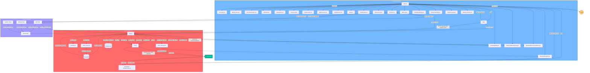

```mermaid
graph TD
  %% Enhanced graph styling for better visibility
  %% Increase font size and add better spacing
  %% Use more vibrant colors for subgraphs
  
  subgraph Frontend["🎨 Frontend Components"]
    App[App.jsx]
    Concepts[Concepts.jsx]
    MicroLesson[MicroLesson.jsx]
    Recommendation[Recommendation.jsx]
    Simulator[Simulator.jsx]
    API[api.js]
    WebSearch[WebSearch.jsx]
    LessonList[LessonList.jsx]
    CareerCoach[CareerCoach.jsx]
    SkillsForecast[SkillsForecast.jsx]
    GlobalSearch[GlobalSearch.jsx]
    Auth[Auth.jsx]
    Certifications[Certifications.jsx]
    VideoLesson[VideoLesson.jsx]
    RunTest[RunTest.jsx]
    IdeaLog[IdeaLog.jsx]
    FeatureRoadmap[FeatureRoadmap.jsx]
    PresentationAgent[PresentationAgent.jsx]
    KnowledgeMap[KnowledgeMap.jsx]
    AdvancedMasteryPanel[AdvancedMasteryPanel.jsx]
    AdvancedRecommendations[AdvancedRecommendations.jsx]
    AdvancedTooltip[AdvancedTooltip.jsx]
    ClusterLegend[ClusterLegend.jsx]
    MasteryTimeline[MasteryTimeline.jsx]
  end
  subgraph Backend["⚙️ Backend Services"]
    AppPy[app.py]
    LLM[llm.py]
    Prompts[prompts.py]
    VectorStore[vector_store.py]
    WebSearchNode[websearch-backend/index.js]
    VoiceCloning[Voice Cloning API]
    DB[(MongoDB)]
    Firebase[(Firebase Auth)]
  end
  subgraph Testing["🧪 Testing Framework"]
    Cypress[Cypress Tests]
    ManualTests[Manual Tests]
    APITests[API Tests]
    TestResults[Test Results]
  end
  OpenAI(🤖 OpenAI API)

  User((👤 User)) -->|Interacts with| App
  App --> Concepts
  App --> MicroLesson
  App --> Recommendation
  App --> Simulator
  App --> WebSearch
  App -->|Calls API functions| API
  App -->|Calls web search API| WebSearchNode
  App --> LessonList
  App --> CareerCoach
  App --> SkillsForecast
  App --> GlobalSearch
  App --> Auth
  App --> Certifications
  App --> VideoLesson
  App --> RunTest
  App --> IdeaLog
  App --> FeatureRoadmap
  App --> PresentationAgent
  App --> KnowledgeMap
  App --> AdvancedMasteryPanel
  App --> AdvancedRecommendations
  App --> AdvancedTooltip
  App --> ClusterLegend
  App --> MasteryTimeline
  Simulator -->|Scenario UI| App
  API -->|HTTP requests with Firebase token| AppPy
  WebSearchNode -->|HTTP requests| OpenAI

  AppPy -->|Uses prompts| Prompts
  AppPy -->|Calls LLM| LLM
  AppPy -->|Vector search| VectorStore
  AppPy -->|Saves user-specific data| DB
  AppPy -->|Career coach| LLM
  AppPy -->|Skills forecast| LLM
  AppPy -->|Certifications| LLM
  AppPy -->|Video lessons| LLM
  AppPy -->|Verifies Firebase token| Firebase
  AppPy -->|Voice cloning training| VoiceCloning
  AppPy -->|Knowledge map data| KnowledgeMap
  AppPy -->|Advanced recommendations| AdvancedRecommendations
  AppPy -->|Mastery analytics| AdvancedMasteryPanel
  LLM -->|Sends prompt, gets response| OpenAI
  VectorStore -->|Future: Embeddings| DB

  OpenAI -- AI response --> LLM
  LLM -- AI result --> AppPy
  AppPy -- JSON response --> API
  API -- Data --> App
  App -- Shows result --> User
  WebSearchNode -- Data --> App
  OpenAI -- AI response --> WebSearchNode
  DB -- User-specific data --> AppPy
  VoiceCloning -- Trained voice model --> PresentationAgent

  %% Testing connections
  RunTest -->|Runs automated tests| Cypress
  RunTest -->|Runs manual verification| ManualTests
  RunTest -->|Tests API endpoints| APITests
  Cypress -->|Generates test results| TestResults
  ManualTests -->|Generates test results| TestResults
  APITests -->|Generates test results| TestResults
  APITests -->|Tests backend endpoints| AppPy
  TestResults -->|Displays results| RunTest

  %% Enhanced styling for better visibility
  classDef backend fill:#ff6b6b,stroke:#d63031,stroke-width:3px,color:#ffffff,font-size:14px;
  classDef frontend fill:#74b9ff,stroke:#0984e3,stroke-width:3px,color:#ffffff,font-size:14px;
  classDef testing fill:#a29bfe,stroke:#6c5ce7,stroke-width:3px,color:#ffffff,font-size:14px;
  classDef external fill:#00b894,stroke:#00a085,stroke-width:3px,color:#ffffff,font-size:14px;
  classDef user fill:#fdcb6e,stroke:#e17055,stroke-width:3px,color:#2d3436,font-size:14px;
  
  class Backend backend;
  class Frontend frontend;
  class Testing testing;
  class OpenAI external;
  class User user;
```

```mermaid
graph TD
  %% Enhanced graph styling for better visibility
  %% Increase font size and add better spacing
  %% Use more vibrant colors for subgraphs
  
  subgraph Frontend["🎨 Frontend Components"]
    App[App.jsx]
    Concepts[Concepts.jsx]
    MicroLesson[MicroLesson.jsx]
    Recommendation[Recommendation.jsx]
    Simulator[Simulator.jsx]
    API[api.js]
    WebSearch[WebSearch.jsx]
    LessonList[LessonList.jsx]
    CareerCoach[CareerCoach.jsx]
    SkillsForecast[SkillsForecast.jsx]
    GlobalSearch[GlobalSearch.jsx]
    Auth[Auth.jsx]
    Certifications[Certifications.jsx]
    VideoLesson[VideoLesson.jsx]
    RunTest[RunTest.jsx]
    IdeaLog[IdeaLog.jsx]
    FeatureRoadmap[FeatureRoadmap.jsx]
    PresentationAgent[PresentationAgent.jsx]
    KnowledgeMap[KnowledgeMap.jsx]
    AdvancedMasteryPanel[AdvancedMasteryPanel.jsx]
    AdvancedRecommendations[AdvancedRecommendations.jsx]
    AdvancedTooltip[AdvancedTooltip.jsx]
    ClusterLegend[ClusterLegend.jsx]
    MasteryTimeline[MasteryTimeline.jsx]
  end
  subgraph Backend["⚙️ Backend Services"]
    AppPy[app.py]
    LLM[llm.py]
    Prompts[prompts.py]
    VectorStore[vector_store.py]
    WebSearchNode[websearch-backend/index.js]
    VoiceCloning[Voice Cloning API]
    DB[(MongoDB)]
    Firebase[(Firebase Auth)]
  end
  subgraph Testing["🧪 Testing Framework"]
    Cypress[Cypress Tests]
    ManualTests[Manual Tests]
    APITests[API Tests]
    TestResults[Test Results]
  end
  OpenAI(🤖 OpenAI API)

  User((👤 User)) -->|Interacts with| App
  App --> Concepts
  App --> MicroLesson
  App --> Recommendation
  App --> Simulator
  App --> WebSearch
  App -->|Calls API functions| API
  App -->|Calls web search API| WebSearchNode
  App --> LessonList
  App --> CareerCoach
  App --> SkillsForecast
  App --> GlobalSearch
  App --> Auth
  App --> Certifications
  App --> VideoLesson
  App --> RunTest
  App --> IdeaLog
  App --> FeatureRoadmap
  App --> PresentationAgent
  App --> KnowledgeMap
  App --> AdvancedMasteryPanel
  App --> AdvancedRecommendations
  App --> AdvancedTooltip
  App --> ClusterLegend
  App --> MasteryTimeline
  Simulator -->|Scenario UI| App
  API -->|HTTP requests with Firebase token| AppPy
  WebSearchNode -->|HTTP requests| OpenAI

  AppPy -->|Uses prompts| Prompts
  AppPy -->|Calls LLM| LLM
  AppPy -->|Vector search| VectorStore
  AppPy -->|Saves user-specific data| DB
  AppPy -->|Career coach| LLM
  AppPy -->|Skills forecast| LLM
  AppPy -->|Certifications| LLM
  AppPy -->|Video lessons| LLM
  AppPy -->|Verifies Firebase token| Firebase
  AppPy -->|Voice cloning training| VoiceCloning
  AppPy -->|Knowledge map data| KnowledgeMap
  AppPy -->|Advanced recommendations| AdvancedRecommendations
  AppPy -->|Mastery analytics| AdvancedMasteryPanel
  LLM -->|Sends prompt, gets response| OpenAI
  VectorStore -->|Future: Embeddings| DB

  OpenAI -- AI response --> LLM
  LLM -- AI result --> AppPy
  AppPy -- JSON response --> API
  API -- Data --> App
  App -- Shows result --> User
  WebSearchNode -- Data --> App
  OpenAI -- AI response --> WebSearchNode
  DB -- User-specific data --> AppPy
  VoiceCloning -- Trained voice model --> PresentationAgent

  %% Testing connections
  RunTest -->|Runs automated tests| Cypress
  RunTest -->|Runs manual verification| ManualTests
  RunTest -->|Tests API endpoints| APITests
  Cypress -->|Generates test results| TestResults
  ManualTests -->|Generates test results| TestResults
  APITests -->|Generates test results| TestResults
  APITests -->|Tests backend endpoints| AppPy
  TestResults -->|Displays results| RunTest

  %% Enhanced styling for better visibility
  classDef backend fill:#ff6b6b,stroke:#d63031,stroke-width:3px,color:#ffffff,font-size:14px;
  classDef frontend fill:#74b9ff,stroke:#0984e3,stroke-width:3px,color:#ffffff,font-size:14px;
  classDef testing fill:#a29bfe,stroke:#6c5ce7,stroke-width:3px,color:#ffffff,font-size:14px;
  classDef external fill:#00b894,stroke:#00a085,stroke-width:3px,color:#ffffff,font-size:14px;
  classDef user fill:#fdcb6e,stroke:#e17055,stroke-width:3px,color:#2d3436,font-size:14px;
  
  class Backend backend;
  class Frontend frontend;
  class Testing testing;
  class OpenAI external;
  class User user;
```
