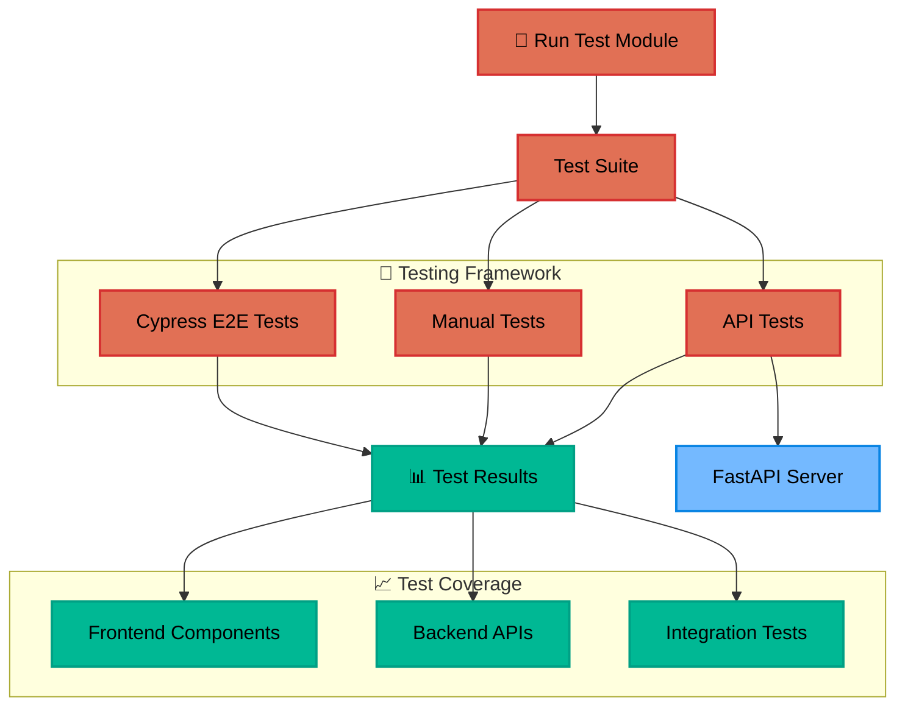
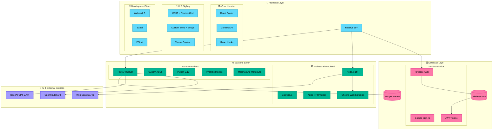
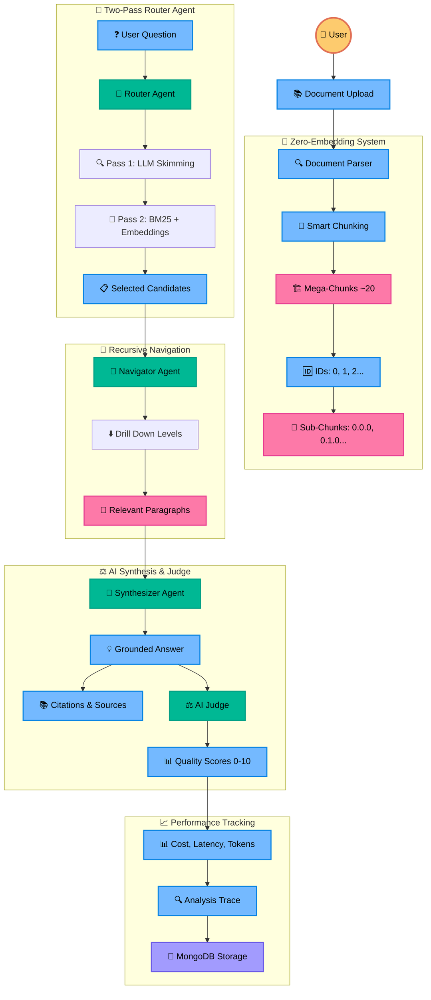
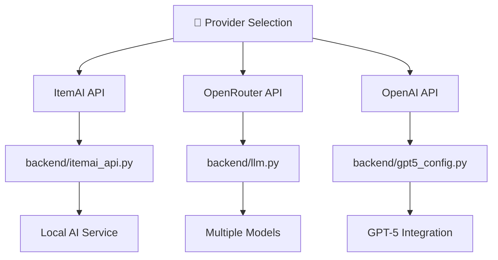
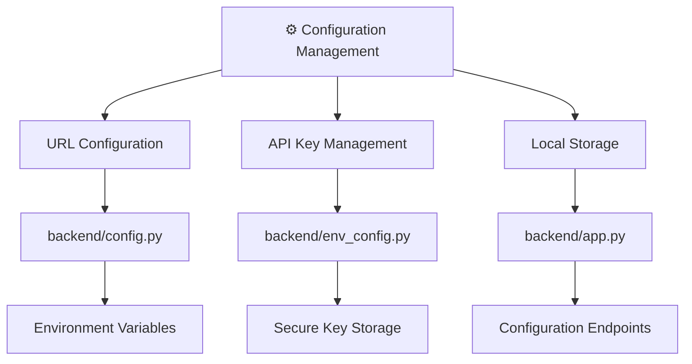
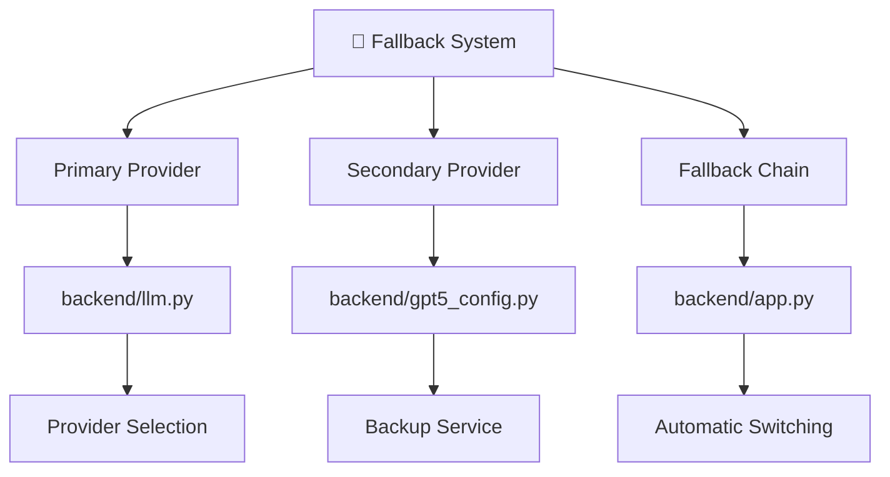
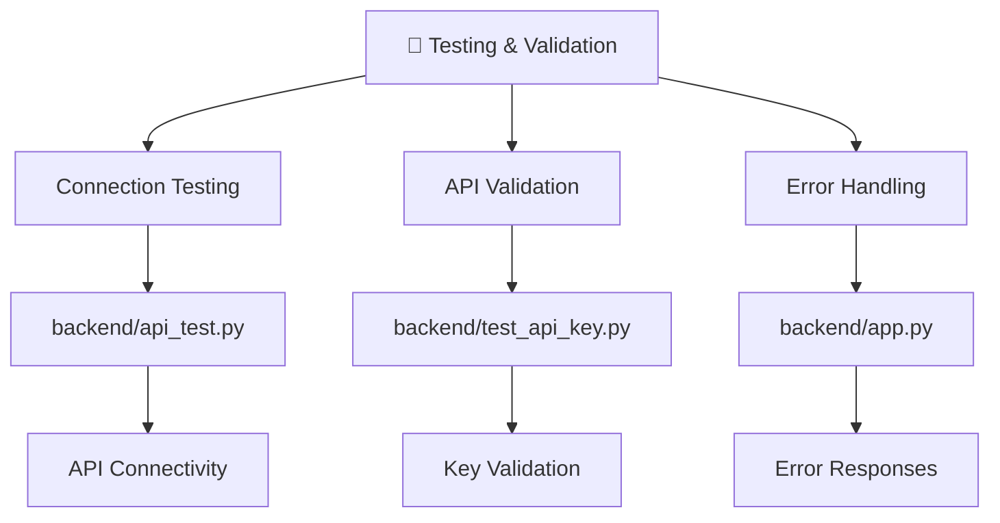

# 🤖 AI-Powered Workplace Learning Platform

> **"I'm not just building a learning app — I'm creating a co-evolving AI learning assistant where users shape its growth."**

## 🧭 Quick Navigation

**💡 Tip:** Click on any link below to navigate directly to that section within this document:

### 🎯 Core Learning Modules
- [Dashboard](#dashboard) - Progress tracking and analytics
- [AI Concepts](#ai-concepts) - AI-powered learning content
- [Micro Lessons](#micro-lessons) - Bite-sized learning modules
- [Recommendations](#recommendations) - Personalized suggestions
- [Scenario Simulator](#scenario-simulator) - Interactive simulations
- [Web Search](#web-search) - Real-time information retrieval
- [AI Career Coach](#ai-career-coach) - Personalized career guidance
- [Skills Forecast](#skills-forecast) - Future skill predictions
- [Certifications](#certifications) - Professional development
- [Video Lessons](#video-lessons) - Multimedia learning
- [📚 Babel Library](#babel-library) - Centralized knowledge repository

### 🚀 Advanced Features
- [Knowledge Map](#knowledge-map) - Interactive learning visualization
- [Agent Cursor AI](#agent-cursor-ai) - Repository analysis and documentation
- [Repository Analyzer](#repository-analyzer) - Code analysis and learning modules
- [Document Analyzer](#document-analyzer) - AI-powered document analysis and summarization
- [🚀 Agentic RAG](#agentic-rag-system-advanced-document-intelligence) - Advanced document intelligence with AI agents
- [Presentation Agent](#presentation-agent) - AI-generated presentations
- [AI Study Buddy](#ai-study-buddy) - Conversational learning support

### 🤖 AI-Powered Collaboration Modules (NEW!)
- [🚀 AgentOps Studio](#agentops-studio) - Unified AI Workflow Lab for design, simulation, and execution

### 🏢 Enterprise Architecture (NEW!)
- [EA Dashboard](#enterprise-architecture) - Enterprise architecture overview and navigation
- [Process Designer](#process-designer) - Visual process modeling with React Flow
- [Catalog Manager](#catalog-manager) - Enterprise catalog management (CRUD)
- [Heatmap View](#heatmap-view) - Risk and maturity visualization with Chart.js
- [Impact Analysis](#impact-analysis) - Dependency analysis with BFS algorithm

### 🛠️ Admin & Development
- [API Config](#api-config) - ItemAI API, OpenAI, and OpenRouter API configuration
- [Run Test](#run-test) - Comprehensive testing suite
- [Idea Log](#idea-log) - Feature tracking and suggestions
- [Feature Roadmap](#feature-roadmap) - Development planning
- [Global Search](#global-search) - Cross-module search functionality
- [Multi-Language Support](#multi-language-support) - i18n infrastructure and translations

### ⚙️ Backend Services
- [FastAPI Server](#fastapi-server) - High-performance API server
- [AI Integration](#ai-integration) - ItemAI API (local), OpenAI GPT-5, and OpenRouter integration
- [MongoDB](#mongodb) - Flexible document storage
- [Firebase Auth](#firebase-auth) - Secure authentication
- [Web Search API](#web-search-api) - Real-time data retrieval

---

## 🎯 Project Overview {#project-overview}

This is a comprehensive **AI-powered workplace learning platform** that combines cutting-edge artificial intelligence with modern web technologies to create an intelligent, adaptive learning experience. Built with React.js frontend and FastAPI backend, it features advanced AI capabilities including personalized recommendations, interactive simulations, and a sophisticated knowledge mapping system.

## 🏗️ Philosophy & Approach: Building with AI, Not Just Code {#philosophy-approach}

In this project, we intentionally chose a documentation-driven, AI-first approach to software development. Our goal was to demonstrate that, with the right architectural blueprints and explicit instructions, a modern AI system—such as Cursor AI—can build a complex, full-stack application from scratch, even in environments where pre-existing code is not allowed.

### 🎯 Why This Revolutionary Approach?

#### 🔧 **Adaptability to Constraints**
Many hackathons and enterprise environments restrict the use of pre-written code or external repositories. By relying on comprehensive, step-by-step documentation, we ensure that the project can be built from the ground up, regardless of these constraints.

#### 🤝 **AI as a True Engineering Partner**
We believe that the future of software engineering is not just about writing code, but about designing processes and systems that AI can understand and execute. Our documents are written to be both **human- and machine-readable**, enabling seamless collaboration between developers and AI agents.

#### 🔍 **Transparency and Reproducibility**
Every architectural decision, configuration, and troubleshooting step is documented. This makes the build process transparent, auditable, and easy to reproduce—whether by a human team or an automated system.

#### 🚀 **Demonstrating the Power of Modern AI**
By challenging ourselves to build solely from documentation, we showcase how far AI tools like Cursor have come. This approach highlights the practical capabilities of AI in real-world, zero-code-start scenarios.

#### 📚 **Onboarding and Knowledge Transfer**
This methodology is not only valuable for hackathons, but also for onboarding new team members, scaling projects, and ensuring long-term maintainability. Anyone—human or AI—can pick up these documents and recreate the application with confidence.

### 🎉 **The Result**
This project is a **proof of concept for the next generation of software development**, where clear documentation and AI collaboration can achieve results previously possible only with direct code access. We invite you to explore, build, and extend this application—using only the instructions provided—as a testament to what's possible with today's AI.

---
## 🏗️ System Architecture {#system-architecture}

*The diagrams below show the system architecture divided into two clear sections for better readability.*

### 📱 Application Architecture

```mermaid
graph TB
  %% Main User Interface
  User((👤 User)) --> App[🎨 Main App]
  
  %% Core Learning Modules
  subgraph "🎯 Core Learning Modules"
    Dashboard[Dashboard]
    Concepts[AI Concepts]
    MicroLesson[Micro Lessons]
    BabelLibrary[Babel Library]
    Recommendation[Recommendations]
    Simulator[Scenario Simulator]
    WebSearch[Web Search]
    CareerCoach[AI Career Coach]
    SkillsForecast[Skills Forecast]
    Certifications[Certifications]
    VideoLesson[Video Lessons]
  end
  
  %% Advanced Features
  subgraph "🚀 Advanced Features"
    KnowledgeMap[🗺️ Knowledge Map]
    AgentCursorAI[🤖 Agent Cursor AI]
    RepoAnalyzer[📁 Repository Analyzer]
    DocumentAnalyzer[📄 Document Analyzer]
    AgenticRAG[🚀 Agentic RAG]
    PresentationAgent[🎤 Presentation Agent]
    AIStudyBuddy[🤝 AI Study Buddy]
  end
  
  %% AI-Powered Collaboration Modules
  subgraph "🤖 AI-Powered Collaboration"
    AgentOpsStudio[🚀 AgentOps Studio]
  end
  
  %% Enterprise Architecture
  subgraph "🏢 Enterprise Architecture"
    EAHome[EA Dashboard]
    ProcessDesigner[Process Designer]
    CatalogManager[Catalog Manager]
    HeatmapView[Heatmap View]
    ImpactAnalysis[Impact Analysis]
  end
  
  %% Admin & Development
  subgraph "🛠️ Admin & Development"
    APIConfig[⚙️ API Config]
    RunTest[🧪 Run Test]
    IdeaLog[📝 Idea Log]
    FeatureRoadmap[🗺️ Feature Roadmap]
    GlobalSearch[🔍 Global Search]
  end
  
  %% Backend Services
  subgraph "⚙️ Backend Services"
    FastAPI[FastAPI Server]
    LLM[OpenAI GPT-5]
    MongoDB[(MongoDB)]
    Firebase[(Firebase Auth)]
    WebSearchAPI[Web Search API]
  end
  
  %% Data Flow
  App --> Dashboard
  App --> Concepts
  App --> MicroLesson
  App --> Recommendation
  App --> Simulator
  App --> WebSearch
  App --> CareerCoach
  App --> SkillsForecast
  App --> Certifications
  App --> VideoLesson
  App --> KnowledgeMap
  App --> AgentCursorAI
  App --> RepoAnalyzer
  App --> AgenticRAG
  App --> PresentationAgent
  App --> AIStudyBuddy
  App --> HumanoidLab
  App --> AgentOps
  App --> DigitalLab
  App --> EAHome
  App --> ProcessDesigner
  App --> CatalogManager
  App --> HeatmapView
  App --> ImpactAnalysis
  App --> APIConfig
  App --> RunTest
  App --> IdeaLog
  App --> FeatureRoadmap
  App --> GlobalSearch
  
  %% Backend Connections
  Dashboard --> FastAPI
  Concepts --> FastAPI
  MicroLesson --> FastAPI
  Recommendation --> FastAPI
  Simulator --> FastAPI
  WebSearch --> WebSearchAPI
  CareerCoach --> FastAPI
  SkillsForecast --> FastAPI
  Certifications --> FastAPI
  VideoLesson --> FastAPI
  BabelLibrary --> FastAPI
  
  %% Babel Library Integration
  MicroLesson --> BabelLibrary
  WebSearch --> BabelLibrary
  SkillsForecast --> BabelLibrary
  Certifications --> BabelLibrary
  VideoLesson --> BabelLibrary
  
  %% AI-Powered Collaboration Integration
  HumanoidLab --> DigitalLab
  AgentOps --> DigitalLab
  DigitalLab --> HumanoidLab
  DigitalLab --> AgentOps
  KnowledgeMap --> FastAPI
  AgentCursorAI --> FastAPI
  RepoAnalyzer --> FastAPI
  AgenticRAG --> FastAPI
  PresentationAgent --> FastAPI
  AIStudyBuddy --> FastAPI
  HumanoidLab --> FastAPI
  AgentOps --> FastAPI
  DigitalLab --> FastAPI
  EAHome --> FastAPI
  ProcessDesigner --> FastAPI
  CatalogManager --> FastAPI
  HeatmapView --> FastAPI
  ImpactAnalysis --> FastAPI
  APIConfig --> FastAPI
  
  %% AI & Database
  FastAPI --> LLM
  FastAPI --> MongoDB
  FastAPI --> Firebase
  WebSearchAPI --> LLM
  
  %% External Services
  AgentCursorAI --> CursorAI[Cursor AI Local]
  RepoAnalyzer --> GitHub[GitHub/GitLab]
  
  %% Styling
  classDef user fill:#fdcb6e,stroke:#e17055,stroke-width:3px,color:#000000,font-size:18px;
  classDef frontend fill:#74b9ff,stroke:#0984e3,stroke-width:2px,color:#000000,font-size:16px;
  classDef backend fill:#00b894,stroke:#00a085,stroke-width:2px,color:#000000,font-size:16px;
  classDef external fill:#a29bfe,stroke:#6c5ce7,stroke-width:2px,color:#000000,font-size:16px;
  classDef database fill:#fd79a8,stroke:#e84393,stroke-width:2px,color:#000000,font-size:16px;
  
  class User user;
  class App,Dashboard,Concepts,MicroLesson,BabelLibrary,Recommendation,Simulator,WebSearch,CareerCoach,SkillsForecast,Certifications,VideoLesson,KnowledgeMap,AgentCursorAI,RepoAnalyzer,DocumentAnalyzer,AgenticRAG,PresentationAgent,AIStudyBuddy,HumanoidLab,AgentOps,DigitalLab,EAHome,ProcessDesigner,CatalogManager,HeatmapView,ImpactAnalysis,APIConfig,RunTest,IdeaLog,FeatureRoadmap,GlobalSearch frontend;
  class FastAPI,LLM,WebSearchAPI backend;
  class CursorAI,GitHub external;
  class MongoDB,Firebase database;
```



### 🧪 Testing Architecture



### 🏗️ Technical Stack Architecture



### 🚀 Agentic RAG Architecture



### 📊 Conceptual Overview: From RAG to Agentic RAG

The Agentic RAG system represents a paradigm shift from traditional retrieval-augmented generation to intelligent, agent-driven document analysis. Here's the conceptual framework:

**🔍 Traditional RAG Limitations**
- Weak prioritization of large datasets
- Shallow contextual reasoning
- Limited traceability of sources
- No quality assessment of answers

**🚀 Agentic RAG Advantages**
- **Adaptive Reasoning**: Intelligent agents plan and execute retrieval strategies
- **Dynamic Retrieval**: Reranking, hybrid search, and semantic caching
- **Quality Control**: AI judge evaluates answer faithfulness and relevance
- **Traceable Results**: Complete analysis path with citations and sources

**🧠 Multi-Agent Architecture**
- **Router Agent**: Lightweight LLM for initial chunk selection
- **Navigator Agent**: Recursive drilling into document sections
- **Synthesizer Agent**: Strong LLM for grounded answer generation
- **Judge Agent**: Top-tier LLM for quality evaluation

**📈 Evaluation Metrics**
- **Faithfulness**: How well answers are grounded in cited text
- **Relevance**: How relevant answers are to user questions
- **Completeness**: How comprehensive answers cover the topic
- **Performance**: Cost, latency, and token usage tracking

**🎯 Use Cases**
- **Legal & Compliance**: Contract analysis with verifiable citations
- **Research & Academia**: Literature review with source tracking
- **Enterprise Knowledge**: Policy analysis with quality assurance
- **Financial Analysis**: Report processing with risk assessment

This system transforms document analysis from simple text retrieval to intelligent, collaborative AI agents that provide **traceable, grounded, and quality-assessed answers**.

---

## 🔧 API Configuration Architecture

### System Overview
The API Configuration module provides a flexible interface to manage multiple AI service providers with intelligent fallback capabilities.

### 1. Provider Selection Architecture



### 2. Configuration Management Architecture



### 3. Fallback System Architecture



### 4. Testing & Validation Architecture



### Key Features
- **Multi-provider support** with intelligent fallback
- **Secure API key management** and storage
- **Real-time connection testing** and validation
- **Automatic provider switching** on failures
- **Local configuration persistence**
- **API testing utilities** for validation
- **Environment variable management** for secure configuration

### File Structure
```
frontend/src/components/
├── APIConfig.jsx          # Main configuration interface

backend/
├── app.py                # API configuration endpoints
├── config.py             # General configuration management
├── env_config.py         # Environment variable management
├── itemai_api.py         # ItemAI API integration
├── api_test.py           # API testing utilities
└── test_api_key.py       # API key validation
```

---

## 🚀 Quick Start Guide

### 🟢 First Run Checklist
- MongoDB is running and accessible on localhost:27017
- Backend .env is configured with all required variables (see below)
- Frontend .env is configured with all required variables (see below)
- Firebase service account file is present in backend/
- All dependencies installed (npm install in frontend, pip install -r requirements.txt in root directory)
- Both frontend and backend servers are running (see start commands below)
- Cypress tests pass (npm run test:comprehensive in frontend)

### 🔑 Environment Variables (REQUIRED)

> **⚠️ IMPORTANT: Environment File Locations**
> - **Backend .env**: Located in **ROOT directory** (same level as `backend/` folder)
> - **Frontend .env**: Located in **frontend/** directory
> - **Web Search .env**: Located in **websearch-backend/** directory

**Backend .env (place in ROOT directory)**
```
OPENAI_API_KEY=your_openai_api_key_here
MONGO_URI=mongodb://localhost:27017
FIREBASE_CREDENTIALS=serviceAccountKey.json
```

**Frontend .env (place in frontend/)**
```
REACT_APP_API_BASE_URL=http://localhost:8000
REACT_APP_FIREBASE_API_KEY=your_firebase_api_key
REACT_APP_FIREBASE_AUTH_DOMAIN=your_project.firebaseapp.com
REACT_APP_FIREBASE_PROJECT_ID=your_project_id
REACT_APP_FIREBASE_STORAGE_BUCKET=your_project.appspot.com
REACT_APP_FIREBASE_MESSAGING_SENDER_ID=your_sender_id
REACT_APP_FIREBASE_APP_ID=your_app_id
```

### ⚠️ Common Pitfalls & Troubleshooting

- **npm start fails with 'Missing script: start'**: Ensure you are in the frontend directory and package.json contains a "start" script.
- **uvicorn app:app --reload fails**: This command is INCORRECT. Always run from the root directory with `uvicorn backend.app:app --reload`
- **Import errors when starting backend**: You're probably running from the wrong directory. The backend MUST be started from the ROOT directory, not from inside `backend/`
- **pip install fails with "requirements.txt not found"**: You're probably in the wrong directory. Run `pip install -r requirements.txt` from the ROOT directory, not from `backend/`
- **Environment variables not loading**: Ensure your `.env` file is in the ROOT directory, not in `backend/`. The backend looks for `.env` at the project root level.
- **"Backend .env (place in backend/)" confusion**: This is INCORRECT documentation. The backend `.env` file must be in the ROOT directory, not in the `backend/` subdirectory.
- **MongoDB connection errors**: Ensure MongoDB is running and accessible at the URI in your .env.
- **Firebase errors**: Ensure Google Sign-In is enabled, the web app is registered, and the service account key is present in backend/.
- **Cypress tests hang**: Ensure both frontend and backend servers are running. Check for port conflicts.
- **Port already in use**: Kill the process using the port or change the port in your start script.
- **Node/Python version issues**: Use Node.js 18+ and Python 3.10+ for best compatibility.
- **Component/file naming**: All references must match exactly (e.g., Certifications.jsx, not Certification.jsx).
- **CORS errors**: Ensure CORS is enabled in FastAPI and frontend is using the correct API base URL.
- **Cannot find module**: Ensure all dependencies are installed and paths are correct.

### 🧠 AI-Specific Guidance

- Always check for missing or misnamed files/components.
- Always check for missing or misconfigured environment variables.
- Always check for port conflicts before starting servers.
- Always check for dependency installation before running any scripts.
- Always check for correct casing in file and directory names (case-sensitive on Unix).
- Always check for correct API base URLs in both frontend and backend.
- Always check for correct Firebase configuration and credentials.
- Always check for CORS settings in backend.
- Always check for MongoDB running and accessible.
- Always check for Node.js and Python versions.

### 🔧 Environment Troubleshooting

**❌ Common Backend Startup Issues:**

1. **"email-validator is not installed"**
   ```bash
   # Solution: Use virtual environment
   .venv\Scripts\Activate.ps1
   pip install "pydantic[email]"
   ```

2. **"ModuleNotFoundError: No module named 'backend.routers.agentops'"**
   ```bash
   # Solution: Run from project root directory
   cd "C:\Test\AI\AI Learning with AI"
   .venv\Scripts\Activate.ps1
   python -m uvicorn backend.app:app --reload --port 8000
   ```

3. **"Python 3.11" instead of virtual environment Python**
   ```bash
   # Problem: Using system Python instead of .venv
   # Solution: Always activate virtual environment first
   .venv\Scripts\Activate.ps1
   # Verify: python --version should show .venv path
   ```

4. **AgentOps Studio endpoints return "Not Found"**
   ```bash
   # Problem: Routers not loaded due to import failures
   # Solution: Check backend logs for import errors
   # Ensure all dependencies are installed in .venv
   ```

5. **AI responses show "[MOCKED RESPONSE]"**
   ```bash
   # Problem: No AI providers configured
   # Solution: Configure at least one AI provider in "API Config" module
   # Options: ItemAI (local), OpenRouter (cloud), or OpenAI (cloud)
   ```

6. **"Unified AI system error" in AgentOps Studio**
   ```bash
   # Problem: AI system fallback failed
   # Solution: Check API keys in "API Config" module
   # The system tries: ItemAI → OpenRouter → OpenAI automatically
   ```

### 🚀 Start Commands

**Backend (FastAPI)**
```bash
# ⚠️ IMPORTANT: Always run from the project root directory
# 1. Activate virtual environment
.venv\Scripts\Activate.ps1

# 2. Verify Python environment (should show .venv path)
python --version

# 3. Start FastAPI server
python -m uvicorn backend.app:app --reload --port 8000
```

**Frontend (React)**
```bash
cd frontend
npm start
```

**🔧 Why this specific startup process?**
- **Virtual Environment**: Ensures all dependencies (like `email-validator`) are available
- **Root Directory**: Required for correct Python imports (`backend.routers.agentops.*`)
- **Python -m uvicorn**: Uses the virtual environment's Python interpreter
- **Port 8000**: Standard port for the backend API

**📋 Environment Setup Checklist**
```bash
# 1. Verify you're in the project root directory
pwd
# Should show: C:\Test\AI\AI Learning with AI

# 2. Check virtual environment exists
ls .venv\Scripts\
# Should show: Activate.ps1, python.exe, etc.

# 3. Activate virtual environment
.venv\Scripts\Activate.ps1
# Prompt should change to: (.venv) PS C:\Test\AI\AI Learning with AI>

# 4. Verify Python environment
python --version
# Should show: Python 3.x.x (from .venv)

# 5. Install dependencies if needed
pip install -r backend/requirements.txt
pip install "pydantic[email]"  # For AgentOps Studio
```

**🤖 AI System Requirements**

The application uses a **unified AI system** with automatic fallback, so you have multiple options:

**Option 1: Local AI (Recommended for development)**
- **ItemAI API**: Uses LM Studio running locally on `http://localhost:1234`
- **Cost**: 100% FREE
- **Privacy**: 100% local, no data leaves your computer
- **Setup**: Install LM Studio and load a model

**Option 2: Cloud AI (No local setup required)**
- **OpenRouter API**: Cost-effective cloud AI models
- **OpenAI API**: Premium cloud AI models
- **Setup**: Configure API keys in "API Config" module

**Option 3: Hybrid (Best of both worlds)**
- **Automatic Fallback**: ItemAI → OpenRouter → OpenAI
- **Maximum Reliability**: System never fails due to AI unavailability
- **Cost Optimization**: Uses the cheapest available option

**⚠️ Important Notes:**
- **LM Studio is NOT required** - the app works with cloud AI only
- **n8n is NOT required** - AgentOps Studio works without automation workflows
- **Docker is NOT required** - only needed for n8n integration
- **The app is fully functional** with just cloud AI providers

**Web Search Backend (Node.js)**
```bash
cd websearch-backend
node index.js
```

**Cypress Tests**
```bash
cd frontend
npm run test:comprehensive
```

---

## 🛠️ Tech Stack & Architecture

### Backend Services
- **FastAPI**: High-performance Python web framework
- **AI Integration**: Unified AI system with automatic fallback (ItemAI API → OpenRouter → OpenAI)
- **MongoDB**: Flexible document storage for user-specific data
- **Firebase Auth**: Secure Google Sign-In authentication
- **Node.js Express**: Web search backend for real-time information

### Frontend Technologies
- **React.js**: Modern JavaScript library for building user interfaces
- **Shoelace Web Components**: Professional UI components and styling
- **D3.js**: Interactive data visualization for knowledge mapping
- **React Flow**: Professional node-based editor for process modeling
- **Chart.js**: Flexible JavaScript charting library for data visualization
- **React-Chartjs-2**: React wrapper for Chart.js integration
- **Cypress**: End-to-end testing framework

### Key Features
- **AI-Powered Learning**: Personalized content generation and recommendations
- **Unified AI System**: Automatic fallback between local AI (ItemAI), cost-effective cloud AI (OpenRouter), and premium AI (OpenAI)
- **Intelligent Fallback**: Automatic fallback system for maximum reliability and cost optimization
- **Real-time Streaming**: ChatGPT-like streaming responses
- **User Authentication**: Secure Firebase-based user management
- **Responsive Design**: Works on all devices and screen sizes
- **Theme Support**: Light/dark mode with automatic adaptation
- **Enterprise Architecture**: Professional process modeling, catalog management, and impact analysis
- **Advanced Visualizations**: Interactive charts, heatmaps, and process diagrams
- **Comprehensive Analytics**: Risk assessment, maturity tracking, and dependency mapping

---

## 📁 Project Structure

```
AI Learning with AI/
├── backend/
│   ├── app.py                 # Main FastAPI application with all endpoints
│   ├── llm.py                 # Multi-provider AI integration (ItemAI, OpenAI, OpenRouter) and streaming
│   ├── itemai_api.py          # ItemAI API integration for local LM Studio
│   ├── gpt5_config.py         # GPT-5 model configuration
│   ├── cursor_agent_routes.py # Agent Cursor AI integration
│   ├── prompts.py             # AI prompt templates and configurations
│   ├── vector_store.py        # Vector database for knowledge mapping
│   ├── enhanced_analysis.py   # Repository analysis and documentation
│   ├── ea_models.py           # Enterprise Architecture data models
│   ├── ea_processes.py        # EA process management endpoints
│   ├── ea_catalog.py          # EA catalog management endpoints
│   ├── document_analyzer.py   # AI-powered document analysis and summarization
│   ├── routers/
│   │   └── agentic_rag.py     # Agentic RAG FastAPI router
│   ├── services/
│   │   └── agentic_rag/       # Agentic RAG service layer
│   │       ├── agentic_rag_service.py # Core service logic
│   │       ├── your_parsers.py        # Unified document parsing
│   │       ├── your_mongo.py          # MongoDB data access
│   │       ├── your_bm25.py           # BM25 ranking algorithm
│   │       ├── your_embeddings.py     # Ephemeral embeddings
│   │       └── your_llm.py            # LLM integration
│   ├── requirements.txt       # Python dependencies
│   └── .env                   # Environment variables
├── frontend/
│   ├── src/
│   │   ├── App.jsx            # Main application component with routing
│   │   ├── components/        # Feature components
│   │   ├── api.js             # API integration and streaming
│   │   ├── ThemeContext.jsx   # Theme management (light/dark)
│   │   ├── hooks/
│   │   │   └── useStreaming.js # Streaming LLM responses hook
│   │   ├── Dashboard.jsx      # Learning progress and analytics
│   │   ├── Concepts.jsx       # AI-powered learning concepts
│   │   ├── MicroLesson.jsx    # Bite-sized learning modules
│   │   ├── Recommendation.jsx # Personalized learning suggestions
│   │   ├── Simulator.jsx      # Interactive workplace scenarios
│   │   ├── WebSearch.jsx      # Real-time web search with AI
│   │   ├── CareerCoach.jsx    # AI career guidance and coaching
│   │   ├── SkillsForecast.jsx # Future skills prediction
│   │   ├── Certifications.jsx # Professional certification planning
│   │   ├── VideoLesson.jsx    # Video-based learning with AI quizzes
│   │   ├── KnowledgeMap.jsx   # Interactive learning visualization
│   │   ├── TeamDynamics.jsx   # Team collaboration analysis
│   │   ├── IdeaLog.jsx        # Feature tracking and suggestions
│   │   ├── FeatureRoadmap.jsx # Development planning and AI code generation
│   │   ├── PresentationAgent.jsx # AI-powered presentations and voice cloning
│   │   ├── AIStudyBuddy.jsx   # Conversational learning support
│   │   ├── RunTest.jsx        # Comprehensive testing suite
│   │   ├── GlobalSearch.jsx   # Cross-module search functionality
│   │   ├── CommandBar.jsx     # Zero-UI natural language interface
│   │   ├── AdvancedMasteryPanel.jsx # Learning analytics dashboard
│   │   ├── AdvancedRecommendations.jsx # AI-powered learning suggestions
│   │   ├── AdvancedTooltip.jsx # Rich hover information system
│   │   ├── ClusterLegend.jsx  # Knowledge cluster filtering
│   │   ├── MasteryTimeline.jsx # Learning progress timeline
│   │   ├── StreamingProgress.jsx # Real-time progress indicators
│   │   ├── StreamingText.jsx   # Streaming text display
│   │   ├── Sidebar.jsx        # Navigation and module selection
│   │   ├── DocumentsAnalyzer.jsx # AI-powered document analysis
│   │   ├── LearningDocument.jsx # Document library and management
│   │   ├── AgenticRAG.jsx     # Advanced document intelligence with AI agents
│   │   ├── AgenticRAGDocument.jsx # Analysis library and management
│   │   └── ea/                # Enterprise Architecture module
│   │       ├── EAHome.jsx     # EA main dashboard and navigation
│   │       ├── EAHome.css     # EA dashboard styling
│   │       ├── ProcessDesigner.jsx # Visual process modeling with React Flow
│   │       ├── ProcessDesigner.css # Process designer styling
│   │       ├── CatalogManager.jsx # Enterprise catalog management (CRUD)
│   │       ├── CatalogManager.css # Catalog manager styling
│   │       ├── HeatmapView.jsx # Risk and maturity visualization with Chart.js
│   │       ├── HeatmapView.css # Heatmap view styling
│   │       ├── ImpactAnalysis.jsx # Dependency analysis with BFS algorithm
│   │       └── ImpactAnalysis.css # Impact analysis styling
│   ├── cypress/               # End-to-end testing framework
│   │   ├── e2e/               # Test specifications
│   │   ├── fixtures/          # Test data
│   │   └── support/           # Test utilities and commands
│   ├── package.json           # Node.js dependencies
│   └── .env                   # Frontend environment variables
├── websearch-backend/
│   ├── index.js               # Web search Node.js server
│   └── package.json           # Web search dependencies
├── agentops-n8n/              # n8n workflow automation for AgentOps Studio
│   ├── docker-compose.yml     # n8n Docker configuration
│   ├── start-n8n.ps1          # PowerShell script to start n8n
│   ├── INSTALLATION_GUIDE.md  # n8n setup and configuration guide
│   ├── web-research-workflow.json    # Web research automation workflow
│   ├── software-planning-workflow.json # Software planning automation workflow
│   └── n8n_data/              # n8n persistent data and database
│       └── database.sqlite    # n8n SQLite database
├── deployment/                 # Deployment configurations
│   ├── cloudrun.yaml          # Google Cloud Run configuration
│   └── Dockerfile             # Docker container setup
├── docs/                      # Additional documentation
├── install-voice-cloning.sh   # Voice cloning setup script
└── README.md                  # This comprehensive documentation
```


---

## 🚀 Quick Start (For Impatient Developers)

```bash
# 1. Install dependencies (from ROOT directory)
pip install -r requirements.txt
cd frontend && npm install && cd ..
cd websearch-backend && npm install && cd ..

# 2. Start all services (4 terminals)
# Terminal 1 - Backend (from ROOT directory with virtual environment)
# Activate virtual environment first
# Windows:
.venv\Scripts\activate
# Linux/Mac:
# source .venv/bin/activate

# Then start backend
uvicorn backend.app:app --reload --port 8000

# Terminal 2 - Frontend
cd frontend && npm start

# Terminal 3 - Web Search
cd websearch-backend && node index.js

# Terminal 4 - n8n (Optional - for AgentOps Studio workflows)
cd agentops-n8n && .\start-n8n.ps1
```

> **⚠️ CRITICAL: Backend MUST be started from ROOT directory, not from `backend/` folder!**

## 🔧 Installation & Setup

> **⚠️ IMPORTANT BACKEND STARTUP NOTE:**
> 
> The Python FastAPI backend **MUST be started from the root directory** (not from inside the `backend/` folder) using:
> ```bash
> uvicorn backend.app:app --reload
> ```
> 
> This is because the backend code uses relative imports that expect to be run from the project root. Starting from inside `backend/` will cause import errors.

### Prerequisites
- **Node.js 18+** and **npm**
- **Python 3.10+** and **pip**
- **MongoDB** running locally or accessible
- **Firebase project** with authentication enabled
- **OpenAI API key** with GPT-5 access
- **Docker Desktop** (for n8n workflows - optional)

### 🌐 Service Ports
- **Backend API**: http://localhost:8000
- **Frontend**: http://localhost:3000
- **Web Search**: http://localhost:3001
- **n8n Workflows**: http://localhost:5678 (optional)
- **LM Studio**: http://localhost:1234 (if using local AI)

### 📁 Project Structure
```
AI-Learning-with-AI/
├── backend/                 # FastAPI backend code
├── frontend/               # React frontend code
│   └── .env               # Frontend environment variables
├── websearch-backend/      # Node.js web search service
│   └── .env               # Web search environment variables
├── agentops-n8n/          # n8n workflow automation (Docker-based)
│   └── n8n_data/          # n8n persistent data and database
├── requirements.txt        # Python dependencies (ROOT LEVEL)
├── .env                   # Backend environment variables (ROOT LEVEL)
└── README.md
```

**⚠️ IMPORTANT DIRECTORY STRUCTURE NOTES:**
- **Backend FastAPI**: Must be started from ROOT directory with `uvicorn backend.app:app --reload`
- **Python dependencies**: Install from ROOT directory with `pip install -r requirements.txt`
- **Backend .env file**: Located at ROOT level (`.env`) - NOT inside `backend/` folder
- **Frontend**: Install and run from `frontend/` directory (has its own `.env`)
- **Web Search**: Install and run from `websearch-backend/` directory (has its own `.env`)
- **n8n Workflows**: Run from `agentops-n8n/` directory with Docker (requires Docker Desktop)

### Step-by-Step Setup

1. **Clone the Repository**
   ```bash
   git clone <repository-url>
   cd AI-Learning-with-AI
   ```

2. **Backend Setup**
   ```bash
   # Create and activate virtual environment (recommended)
   python -m venv .venv
   
   # Windows:
   .venv\Scripts\activate
   # Linux/Mac:
   # source .venv/bin/activate
   
   # Install Python dependencies (run from root directory)
   pip install -r requirements.txt
   
   # Copy environment file (if .env.example exists)
   cp .env.example .env
   # Edit .env with your API keys and configuration
   ```

3. **Frontend Setup**
   ```bash
   cd frontend
   npm install
   cp .env.example .env
   # Edit .env with your Firebase configuration
   ```

4. **Web Search Backend Setup**
   ```bash
   cd websearch-backend
   npm install
   ```

5. **n8n Workflow Automation Setup (Optional)**
   ```bash
   # Prerequisites: Install Docker Desktop first
   # Download from: https://www.docker.com/products/docker-desktop/
   
   # Navigate to n8n directory
   cd agentops-n8n
   
   # Start n8n with Docker
   .\start-n8n.ps1
   
   # Access n8n at: http://localhost:5678
   # Import workflows and configure webhooks
   # See agentops-n8n/INSTALLATION_GUIDE.md for detailed setup
   ```

6. **Start All Services**
   ```bash
   # Terminal 1: Backend (IMPORTANT: Run from root directory with virtual environment)
   # Activate virtual environment first
   # Windows:
   .venv\Scripts\activate
   # Linux/Mac:
   # source .venv/bin/activate
   
   # Then start backend
   uvicorn backend.app:app --reload --port 8000
   
   # Terminal 2: Frontend
   cd frontend && npm start
   
   # Terminal 3: Web Search
   cd websearch-backend && node index.js
   
   # Terminal 4: n8n Workflows (Optional - for AgentOps Studio)
   cd agentops-n8n && .\start-n8n.ps1
   ```

7. **Run Tests**
   ```bash
   cd frontend
   npm run test:comprehensive
   ```

### Setup Instructions (Detailed)

#### 1. Backend Dependencies
```bash
# Install from root directory
pip install -r requirements.txt

# Document Analyzer & Agentic RAG Dependencies (install from root directory)
pip install pypdf python-docx rank-bm25 sentence-transformers
```

#### 2. Frontend Dependencies
```bash
cd frontend
npm install
```

#### 3. Web Search Backend Dependencies
```bash
cd websearch-backend
npm install
```

---

## 🚀 Features

### Backend (FastAPI + Node.js)

Modular API endpoints for:
- **AI Concepts generation**
- **Micro-Lesson generation** (with dynamic user input)
- **Scenario Simulation**
- **AI Recommendation/Analysis**
- **Web Search** (GPT-4.1 + tools, Node.js backend) for up-to-date answers
- **Saved Micro-lessons**: All generated micro-lessons are stored in a MongoDB database for later review, with endpoints for listing, editing, and deleting lessons
- **AI Career Coach**: An intelligent mentor that guides users through soft skills, leadership scenarios, and career goals via a /career-coach endpoint. Supports multi-turn conversations by accepting and responding to conversation history.
- **Dynamic Skills Forecasting**: Predicts future skill needs based on user learning history and transcript keywords via a /skills-forecast endpoint.
- **AI-Powered Certifications**: Get personalized certification recommendations and study plans via /certifications endpoints with user-specific data persistence.
- **Map of Knowledge**: Advanced learning visualization system with vector-based recommendations, mastery tracking, and interactive clustering via /knowledge-map endpoints.
- **Repository Documentation Generator**: AI-powered repository analysis and documentation generation with quiz creation via /api/analyze-repo and /api/generate-documentation endpoints.
- **Team Dynamics Analyzer**: Comprehensive team management and analytics with AI-powered insights via /teams endpoints.
- **Enterprise Architecture (EA) Module**: Comprehensive enterprise-grade solution with process modeling, catalog management, heatmap visualizations, and impact analysis via /api/ea endpoints.
- **🚀 Agentic RAG System**: Advanced document intelligence with multi-agent architecture via /api/agentic-rag endpoints for intelligent document analysis, quality assessment, and grounded answers with citations. Includes document indexing, question processing, summary generation, and complete analysis management with MongoDB persistence.
- **Firebase Authentication**: Secure user authentication with Google Sign-In
- **User-Specific Data**: All data (lessons, career sessions, forecasts, certifications, knowledge map data, EA data) is saved per user
- **Dynamic prompt handling** with user input (e.g., custom micro-lesson topics)
- **Mocked AI responses** if OpenAI API key is missing or invalid
- **CORS enabled** for frontend-backend communication
- **MongoDB integration** for persistent storage of user-specific data

### Frontend (React + Shoelace)

- **Google Sign-In via Firebase Authentication** for secure, personalized access
- **Global Search Functionality** (GlobalSearch.jsx):
  - 🔍 **Search Button**: Located in the header next to the theme toggle
  - ⌨️ **Keyboard Shortcuts**: Press Ctrl+K (or Cmd+K on Mac) to open search
  - 📱 **Modal Interface**: Clean, modern search overlay with real-time filtering
  - 🎯 **Comprehensive Coverage**: Search across all 12 sections (Dashboard, AI Concepts, Micro-lessons, Map of Knowledge, etc.)
  - ⚡ **Smart Search**: Searches titles, descriptions, and keywords for instant results
  - 🎨 **Theme Aware**: Adapts to light/dark mode automatically
  - ⌨️ **Keyboard Navigation**: Use arrow keys to navigate results, Enter to select, Escape to close

**Modular, professional UI with each feature in its own card:**
- **Concepts** (Concepts.jsx)
- **Micro-lesson** (MicroLesson.jsx)
- **Recommendation** (Recommendation.jsx)
- **Scenario Simulator** (Simulator.jsx)
- **Web Search** (WebSearch.jsx)
- **Map of Knowledge** (KnowledgeMap.jsx):
  - 🗺️ **Interactive Learning Visualization**: D3.js-powered map with 13 knowledge topics
  - 🎯 **Advanced Vectorial Recommendations**: AI-powered learning suggestions based on vector proximity
  - 📊 **Advanced Mastery Panel**: Real-time analytics with timeline visualization and KPIs
  - 🔍 **Search & Filter System**: Real-time filtering by topic, category, and mastery level
  - 🎮 **Interactive Controls**: Zoom, pan, and hover effects for enhanced user experience
- **Repository Analyzer** (RepoAnalyzer.jsx):
  - 🔍 **Repository Analysis**: Clone and analyze GitHub/GitLab/Bitbucket repositories
  - 📝 **AI Documentation Generation**: Automatically generate comprehensive documentation from code analysis
  - 🧠 **Quiz Generation**: Create interactive quizzes from generated documentation
  - 📄 **PDF Export**: Download documentation in PDF format
  - 🎯 **Template Support**: Quick access to common repository templates
- **Document Analyzer** (DocumentsAnalyzer.jsx):
  - 📄 **Multi-Format Support**: Process PDF, DOCX, TXT, and Markdown files
  - 🤖 **AI-Powered Summarization**: Generate summaries in three levels (short, medium, long)
  - 🔄 **Batch Processing**: Analyze up to 5 documents simultaneously
  - 📊 **Smart Chunking**: Intelligent text segmentation for large documents
  - 💾 **Learning Library**: Store and manage analyzed documents for future reference
  - 📋 **Export Options**: Copy to clipboard and download summaries in multiple formats
  - 🎯 **Memory Optimized**: Efficient processing with 1MB chunk reading to prevent memory issues
- **Learning Document Library** (LearningDocument.jsx):
  - 📚 **Document Management**: Browse, search, and filter previously analyzed documents
  - 🏷️ **Smart Tagging**: Automatic categorization with searchable tags
  - ⭐ **Quality Ratings**: AI-generated quality scores for each document analysis
  - 🔍 **Advanced Search**: Search by filename, content, tags, or document type
  - 📊 **Sorting Options**: Sort by date, name, rating, or file size
  - 🔗 **Seamless Integration**: Direct access to Document Analyzer for new analyses
- **🚀 Agentic RAG Analyzer** (AgenticRAG.jsx):
  - 🤖 **Multi-Agent System**: Router, Navigator, Synthesizer, and Judge agents for intelligent document analysis
  - 🔍 **Advanced Retrieval**: Two-pass routing with BM25 and ephemeral embeddings for optimal content selection
  - 📊 **Quality Assessment**: AI Judge provides Faithfulness, Relevance, and Completeness scores (0-10)
  - 📝 **Grounded Answers**: All responses include citations with specific document sections and IDs
  - 🎯 **Parameter Control**: Adjustable depth, initial candidates, hybrid search, and max paragraphs
  - 📈 **Performance Metrics**: Complete trace information with token usage, cost estimation, and timing
  - 💾 **Document Indexing**: Persistent storage in MongoDB with hierarchical chunking
  - 🔄 **Recursive Navigation**: Intelligent drilling into document content for comprehensive analysis
  - 💾 **Save Analysis**: Manual saving of analysis results to database

- **📋 Agentic RAG Documents** (AgenticRAGDocument.jsx):
  - 📚 **Analysis Library**: Browse, search, and filter all saved analyses
  - 🏷️ **Smart Organization**: Automatic categorization by document type and analysis date
  - ⭐ **Quality Metrics**: Display AI judge scores with visual indicators
  - 🔍 **Complete Trace**: View analysis parameters, performance metrics, and citations
  - ✏️ **Document Management**: Edit, delete, and organize saved analyses
  - 🔎 **Advanced Search**: Full-text search across questions, answers, and content
  - 📱 **Responsive Design**: Works seamlessly across all device sizes
  - 🎨 **Professional UI**: Consistent styling matching application design
- **Saved Micro-lessons** (LessonList.jsx):
  - View all previously generated micro-lessons at the bottom of the app
  - Filter lessons by topic in real time
  - Expand/Compress each lesson to show only the topic or the full content
  - Edit lesson topic and content inline
  - Delete lessons with a single click

**AI Career Coach** (CareerCoach.jsx):
- Start a conversation with an AI mentor for career guidance, goal setting, and soft skills development
- Multi-turn chat interface: Continue the conversation by sending and receiving messages in a chat-like UI
- End Session button to reset the conversation and start over
- Sessions are automatically saved per user

**Skills Forecasting** (SkillsForecast.jsx):
- Enter your learning history and transcript keywords
- Get AI-powered predictions for the next skills you should develop, with explanations
- Forecasts are saved per user for future reference

**Certifications** (Certifications.jsx):
- **AI-Powered Recommendations**: Get personalized certification suggestions based on your role, skills, and goals
- **Smart Skills Management**:
  - Individual Skill Tags: Skills display as removable blue tags instead of plain text
  - Comma-Separated Input: Type multiple skills separated by commas (e.g., "Jira, Confluence, Slack")
  - Quick Add Button: 🧪 Quick Add button to instantly add typed skills
  - Paste Support: Paste multiple skills and they'll be automatically split
  - Auto-Sync: Skills automatically sync between "Get Recommendations" and "Study Plan" tabs
  - Visual Feedback: Clear indication when skills are auto-filled from saved profile
- **Study Plan Generation**: Create personalized weekly study plans for selected certifications
- **Practice Tests**: Interactive certification interview simulations
- **History Tracking**: View previous study plans and recommendations
- **Profile Persistence**: Your role, skills, and goals are automatically saved and restored

**🧪 Run Test** (RunTest.jsx):
- **Comprehensive Testing Suite**: Built-in testing functionality accessible from the sidebar
- **Manual Testing**: Quick verification that all panels load correctly
- **Automated Testing**: Cypress-powered tests for all sidebar options and features
- **Visual Results**: Real-time test results with pass/fail status and execution times
- **Screenshot Capture**: Automatic screenshots for visual verification of each panel
- **Test Coverage**: Tests all 11 sidebar options, global search, theme toggle, and responsive design
- **Easy Access**: Click the test tube icon (🧪) in the sidebar to run tests

**⚙️ API Config** (APIConfig.jsx):
- **Triple API Support**: Configure and switch between ItemAI API (local), OpenAI, and OpenRouter APIs
- **ItemAI API Integration**: Local AI powered by LM Studio - 100% free, 100% private, runs on your own computer
- **API Key Management**: Secure storage of API keys and local URLs in browser localStorage
- **Connection Testing**: Built-in API connection testing for all three providers
- **Intelligent Fallback System**: Seamless fallback chain: ItemAI API → OpenRouter → OpenAI → Mock Response
- **Cost Optimization**: Access to multiple AI providers through OpenRouter for better pricing
- **Privacy Options**: Choose between local AI (ItemAI), cloud AI (OpenAI/OpenRouter), or hybrid approach
- **Provider Selection**: Easy switching between API providers with visual indicators and dynamic descriptions
- **Security**: API keys are stored locally and never sent to external servers
- **Easy Access**: Click the gear icon (⚙️) in the sidebar under Developer section

**Shoelace-based UI:**
- Uses Shoelace Web Components for cards, buttons, and layout in all main features (Career Coach, Skills Forecasting, Saved Micro-lessons)
- Consistent, modern design with accessible, themeable components
- Easy to extend with more Shoelace elements (dialogs, alerts, etc.)
- Tooltips/hints on all main options and inputs for user guidance
- Responsive, modern design with color-coded buttons
- Per-section Clear buttons for Concepts, Micro-lesson, and Recommendation to reset results and inputs
- Robust progress tracking and personalized dashboard
- Displays API results in a styled, readable format with proper text wrapping
- Ready for further expansion (user input for other endpoints, authentication, etc.)

---

## 🔄 Recent Improvements: Enhanced Certifications Module

### 🎯 Smart Skills Management System

The Certifications module has been significantly enhanced with a sophisticated skills management system:

**Individual Skill Tags**
- **Visual Display**: Skills now appear as individual blue tags with remove buttons (×)
- **Easy Removal**: Click the × on any skill tag to remove it instantly
- **Professional Look**: Clean, modern tag-based interface instead of plain text

**Advanced Input Methods**
- **Comma-Separated Input**: Type multiple skills at once (e.g., "Jira, Confluence, Slack")
- **Semicolon Support**: Also supports semicolon separation (e.g., "Jira; Confluence; Slack")
- **Paste Functionality**: Paste a list of skills and they'll be automatically parsed
- **Quick Add Button**: 🧪 Quick Add button to instantly add whatever you've typed

**Auto-Sync Between Tabs**
- **Seamless Integration**: Skills automatically sync between "Get Recommendations" and "Study Plan" tabs
- **Visual Feedback**: Clear status messages when skills are auto-filled from your saved profile
- **Persistent Storage**: Your skills are saved and restored automatically

**Enhanced User Experience**
- **Input Tracking**: The input field tracks what you type for the Quick Add button
- **Smart Parsing**: Automatically splits comma/semicolon-separated skills into individual tags
- **Duplicate Prevention**: Prevents adding the same skill multiple times
- **Real-time Updates**: Skills update immediately as you add or remove them

### 🔧 Technical Improvements

**Fixed Compilation Issues**
- **State Management**: Added missing state variables (studyPlanResult, simulation)
- **Function References**: Fixed incorrect field references in study plan generation
- **Error Handling**: Improved error handling and validation

**Enhanced Testing**
- **Cypress Integration**: Comprehensive end-to-end testing for all sidebar options
- **Visual Verification**: Automatic screenshots for each panel test
- **Reliable Tests**: Fixed hanging issues and improved test stability
- **Timeout Management**: Proper timeouts to prevent test failures

### 📋 Usage Examples

**Adding Skills**
- **Type**: "Jira, Confluence, Slack" in the skills input
- **Click**: 🧪 Quick Add button
- **Result**: Three separate blue tags appear: "Jira", "Confluence", "Slack"

**Pasting Skills**
- **Copy**: "Selenium; Cypress; Test Automation" from another source
- **Paste**: Into the skills input field
- **Result**: Three skills automatically split and added as tags

**Switching Between Tabs**
- **Add skills** in "Get Recommendations" tab
- **Switch** to "Study Plan" tab
- **See**: Skills automatically appear in the "Current Skills" section

**Profile Persistence**
- **Fill out** your role, skills, and goals
- **Click**: "Get Recommendations" to save your profile
- **Refresh** the page or return later
- **See**: All your data is automatically restored

### 🎨 Visual Improvements

- **Modern Tag Design**: Professional blue tags with hover effects
- **Clear Visual Hierarchy**: Better spacing and typography
- **Responsive Layout**: Works perfectly on all screen sizes
- **Theme Integration**: Adapts to light/dark mode automatically

---

## 📄 Document Analyzer: AI-Powered Document Intelligence ✅

### 🎯 Overview

The **Document Analyzer** is a comprehensive AI-powered document processing system that transforms how users interact with their learning materials. Built with memory optimization in mind, it provides intelligent document summarization, analysis, and management capabilities. **This module is fully functional and production-ready.**

**🚀 NEW: Agentic RAG System (Beta)** - Advanced document analysis using intelligent agents for deep reasoning and grounded answers with citations.

### 🚀 Core Features

**Multi-Format Document Support**
- **PDF Processing**: Extract text from PDF files with intelligent page handling
- **Word Documents**: Process DOCX files with structured content extraction
- **Text Files**: Support for TXT and Markdown files with encoding detection
- **Batch Processing**: Analyze up to 5 documents simultaneously for comprehensive insights

**AI-Powered Analysis Engine**
- **Smart Summarization**: Three levels of summary detail (short, medium, long)
- **Intelligent Chunking**: Break large documents into manageable 1,500-character segments
- **Memory Optimization**: 5MB file size limit prevents memory overflow issues
- **LLM Integration**: Direct OpenAI API integration for consistent AI-powered results

**Advanced Processing Options**
- **Summary Length Control**: 
  - **Short**: 3-5 bullet points with one-sentence summary
  - **Medium**: Executive summary (120-200 words) with 3 key highlights
  - **Long**: Detailed outline with sections (Overview, Key Findings, Data/Methods, Action Items)
- **Cross-Document Analysis**: Generate combined summaries highlighting common themes and differences
- **Quality Assurance**: Automatic error handling and validation for robust processing

### 💾 Learning Document Library

**Document Management System**
- **Real-Time Storage**: All analyzed documents are automatically saved to in-memory storage
- **Smart Organization**: Automatic categorization by file type, content, and analysis date
- **Quality Ratings**: AI-generated quality scores (9/10) for each document analysis
- **Metadata Tracking**: File size, character count, processing chunks, and analysis parameters

**Advanced Search & Filtering**
- **Full-Text Search**: Search across filenames, summaries, and content
- **Type Filtering**: Filter by document format (PDF, DOCX, TXT, MD)
- **Sorting Options**: Sort by date, name, rating, or file size
- **Real-Time Results**: Instant search results with dynamic filtering

**User Experience Features**
- **Drag & Drop Interface**: Intuitive file upload with visual feedback
- **Progress Tracking**: Real-time analysis progress with status indicators
- **Export Options**: Copy summaries to clipboard or download as text files
- **Responsive Design**: Works seamlessly across all device sizes

### 🔧 Technical Architecture

**Backend Implementation**
- **FastAPI Router**: `/api/document-analyzer` with comprehensive endpoints
- **Memory Management**: Efficient file processing with 5MB size limit and chunked reading
- **Error Handling**: Robust error handling with detailed user feedback
- **File Validation**: Type checking and size validation for security
- **In-Memory Storage**: Temporary storage for analyzed documents (ready for database integration)

**Frontend Components**
- **DocumentsAnalyzer.jsx**: Main analysis interface with drag & drop and progress tracking
- **LearningDocument.jsx**: Document library and management interface with real-time data
- **Theme Integration**: Seamless integration with existing design system
- **Responsive Layout**: Mobile-friendly interface with touch support

**Security & Performance**
- **File Size Limits**: Maximum 5MB per file to prevent memory issues
- **Format Validation**: Strict file type checking for security
- **Memory Optimization**: Prevents memory overflow with optimized chunking
- **Efficient Processing**: Optimized for large document handling

### 📋 Usage Examples

**Single Document Analysis**
1. **Upload**: Drag and drop a PDF report (max 5MB)
2. **Select**: Choose "Medium" summary length
3. **Analyze**: Click "Analyze Documents" with progress tracking
4. **Review**: Get AI-generated executive summary with key highlights
5. **Save**: Store analysis in Learning Document Library
6. **Export**: Copy to clipboard or download summary

**Batch Document Processing**
1. **Upload**: Select multiple related documents (e.g., project reports)
2. **Enable**: "Combine summaries across files" option
3. **Process**: Generate individual and combined summaries
4. **Compare**: Identify common themes and key differences
5. **Store**: All results automatically saved to Learning Library

**Document Library Management**
1. **Browse**: View all previously analyzed documents with real data
2. **Search**: Find specific content or topics across saved analyses
3. **Filter**: Narrow down by document type or date
4. **Organize**: Use tags and ratings for better organization
5. **Refresh**: Update library with latest analyses
6. **Access**: Quick access to Document Analyzer for new analyses

### 🎨 User Interface

**Modern Design Language**
- **Consistent Theming**: Integrates with existing color scheme and typography
- **Visual Feedback**: Clear status indicators and progress tracking
- **Accessibility**: Keyboard navigation and screen reader support
- **Responsive Grid**: Adapts to different screen sizes automatically

**Interactive Elements**
- **Drag & Drop Zone**: Visual feedback during file upload
- **Progress Indicators**: Real-time analysis status updates
- **Action Buttons**: Clear call-to-action buttons with icons (Copy, Download, Save)
- **Results Display**: Structured presentation of analysis results
- **Status Messages**: Clear feedback for all user actions

### ✅ Current Status

**Fully Functional Features**
- ✅ **Document Analysis**: AI-powered summarization working
- ✅ **File Upload**: Drag & drop with 5MB limit
- ✅ **Progress Tracking**: Real-time analysis status
- ✅ **Save Functionality**: Stores analyses in Learning Library
- ✅ **Copy/Download**: Export options working
- ✅ **Learning Library**: Displays real analyzed documents
- ✅ **Search & Filter**: Full functionality implemented
- ✅ **Refresh**: Updates library with latest data

**Technical Implementation**
- ✅ **Backend Endpoints**: `/analyze-json`, `/save-analysis`, `/get-saved-analyses`
- ✅ **Memory Management**: Optimized for stability
- ✅ **Error Handling**: Comprehensive error management
- ✅ **Data Flow**: Complete integration between modules

### 🔮 Future Enhancements

**Planned Features**
- **Database Integration**: Replace in-memory storage with persistent database
- **Vector Search**: Semantic search across document content
- **Document Comparison**: Side-by-side analysis of multiple documents
- **Template Library**: Pre-built analysis templates for common document types
- **Collaboration**: Share analysis results with team members
- **Advanced Analytics**: Document usage patterns and learning insights

**Integration Opportunities**
- **Knowledge Map**: Connect analyzed documents to learning pathways
- **AI Study Buddy**: Use document insights for personalized learning
- **Certifications**: Incorporate document analysis into skill development
- **Team Dynamics**: Collaborative document analysis and sharing

---

## 🚀 Agentic RAG System: Advanced Document Intelligence ✅

### 🎯 Overview

The **Agentic RAG (Retrieval Augmented Generation)** system represents the next evolution of document analysis, moving beyond traditional RAG by introducing intelligent AI agents that dynamically navigate documents, plan retrieval strategies, and evaluate answer quality. This system provides **traceable, grounded answers with citations** and comprehensive quality assessment. **This module is fully functional and production-ready.**

### 🧠 Core Architecture

**Zero-Embedding Chunking System**
- **Hierarchical Structure**: Documents split into ~20 mega-chunks with IDs like "9.0.4"
- **No Pre-computation**: Avoids expensive embedding calculations for cost efficiency
- **Smart Segmentation**: Automatic detection of headers, sections, and logical breaks
- **Memory Optimization**: Efficient processing without vector database overhead

**Two-Pass Router Agent**
- **Pass 1 - Reasoning**: LLM "skims" chunks and selects promising candidates
- **Pass 2 - Selection**: Hybrid ranking using BM25 + optional mini-embeddings
- **Intelligent Routing**: Context-aware selection based on user questions
- **Fallback Mechanisms**: BM25 fallback if LLM routing fails

**Recursive Navigation Engine**
- **Multi-Level Drilling**: Navigate from mega-chunks to relevant paragraphs
- **Depth Control**: Configurable navigation levels (1-3) for different analysis needs
- **Hybrid Search**: Combines BM25 ranking with semantic similarity when available
- **Paragraph Selection**: Smart selection of most relevant content sections

**AI Judge Evaluation System**
- **Quality Metrics**: Faithfulness (0-10), Relevance (0-10), Completeness (0-10)
- **Automatic Assessment**: Every answer evaluated by top-tier LLM
- **Detailed Feedback**: Explanatory comments for each metric
- **Quality Badges**: Visual indicators of answer reliability

### 🔧 Technical Implementation

**Backend Services**
- **FastAPI Router**: `/api/agentic-rag` with comprehensive endpoints
- **Document Indexing**: `/index` endpoint for processing PDF, DOCX, TXT, MD files
- **Question Processing**: `/ask` endpoint with advanced parameters
- **Summary Generation**: `/summarize` endpoint for executive summaries
- **MongoDB Integration**: Collections for documents, chunks, runs, and evaluations

**Advanced Parameters**
- **Navigation Depth**: Control how deep the system drills into documents (1-3 levels)
- **Initial Candidates**: Number of chunks to consider initially (4-20)
- **Max Paragraphs**: Total paragraphs to use for synthesis (6-30)
- **Hybrid Search**: Enable BM25 + embeddings for enhanced ranking
- **Model Selection**: Different LLMs for router, navigator, synthesis, and judge roles

**Performance Metrics**
- **Token Tracking**: Input/output tokens for each LLM call
- **Cost Estimation**: Real-time cost calculation in USD
- **Latency Monitoring**: Response time tracking per operation
- **Quality Scores**: Automatic evaluation of answer quality
- **Trace Information**: Complete analysis path and selected content

### 📊 API Endpoints

**Document Indexing**
```bash
POST /api/agentic-rag/index
# Upload and process documents for analysis
# Supports: PDF, DOCX, TXT, MD files
# Returns: Document IDs and chunk information
```

**Question Processing**
```bash
POST /api/agentic-rag/ask
{
  "doc_ids": ["doc1", "doc2"],
  "question": "What are the key findings?",
  "depth": 2,
  "k_init": 8,
  "use_hybrid": true,
  "max_paragraphs": 12
}
```

**Executive Summary**
```bash
POST /api/agentic-rag/summarize
# Generate comprehensive summaries with citations
# Configurable length: short, medium, long
```

**Analysis Management**
```bash
POST /api/agentic-rag/save-analysis
# Save complete analysis results to database
GET /api/agentic-rag/get-analyses
# Retrieve all saved analyses for user
DELETE /api/agentic-rag/delete-analysis/{analysis_id}
# Remove specific analysis from database
```

### 🎨 Frontend Interface

**Agentic RAG Analyzer (AgenticRAG.jsx)**
- **Document Indexing**: Drag & drop file upload with progress tracking
- **Question Interface**: Advanced text input with parameter controls
- **Results Display**: Structured presentation of answers, citations, and metrics
- **Quality Dashboard**: Visual representation of AI judge scores
- **Trace Information**: Complete analysis path and selected content
- **Export Options**: Copy answers and download results
- **Save Analysis**: Manual saving of analysis results to database

**Advanced Controls**
- **Parameter Adjustment**: Real-time configuration of analysis parameters
- **Document Selection**: Multi-document analysis with smart selection
- **Progress Tracking**: Real-time status updates during processing
- **Error Handling**: Comprehensive error messages and recovery options

**Agentic RAG Documents (AgenticRAGDocument.jsx)**
- **Analysis Library**: Browse, search, and filter all saved analyses
- **Smart Organization**: Automatic categorization by document type and analysis date
- **Quality Metrics**: Display AI judge scores with visual indicators
- **Complete Trace**: View analysis parameters, performance metrics, and citations
- **Document Management**: Edit, delete, and organize saved analyses
- **Advanced Search**: Full-text search across questions, answers, and content
- **Responsive Design**: Works seamlessly across all device sizes

### 📈 Quality Assessment

**AI Judge Metrics**
- **Faithfulness (0-10)**: How well the answer is grounded in cited text
- **Relevance (0-10)**: How relevant the answer is to the question
- **Completeness (0-10)**: How comprehensive the answer covers the topic
- **Detailed Comments**: Explanatory feedback for each metric with proper styling

**Visual Quality Indicators**
- **Green (8-10)**: High-quality, reliable answers
- **Yellow (6-7)**: Good quality with minor issues
- **Red (0-5)**: Lower quality, may need verification
- **Comment Display**: Professional styling with blue labels and italic text

### 🔍 Analysis Trace

**Complete Transparency**
- **Router Selection**: Which chunks were initially selected
- **Navigation Path**: How the system drilled down into content
- **Used Paragraphs**: Specific content sections that informed the answer
- **Run ID**: Unique identifier for each analysis session
- **Performance Data**: Tokens, cost, and timing information

**Citation System**
- **Source Tracking**: Every claim linked to specific document sections
- **ID References**: Citations like [ID:9.0.4] for traceability
- **Snippet Display**: Relevant text excerpts with context
- **Verification**: Easy verification of answer sources

### 🚀 Use Cases

**Legal & Compliance**
- **Document Review**: Analyze contracts, regulations, and legal documents
- **Citation Tracking**: Verify claims with specific document sections
- **Quality Assurance**: AI judge ensures answer reliability

**Research & Academia**
- **Literature Review**: Comprehensive analysis of research papers
- **Source Verification**: Automatic citation and source tracking
- **Quality Assessment**: Objective evaluation of answer quality

**Enterprise Knowledge**
- **Policy Analysis**: Understand complex organizational documents
- **Training Materials**: Extract key insights from manuals and guides
- **Compliance Review**: Verify adherence to regulations and standards

**Financial Analysis**
- **Report Processing**: Analyze financial reports and prospectuses
- **Risk Assessment**: Extract risk factors and mitigation strategies
- **Regulatory Compliance**: Verify adherence to financial regulations

### 💰 Cost & Performance

**Efficient Processing**
- **Zero-Embedding**: No expensive pre-computation of embeddings
- **Smart Chunking**: Optimal document segmentation for cost efficiency
- **Model Selection**: Different LLMs for different tasks (cost vs. quality)
- **Token Optimization**: Efficient prompt design to minimize costs

**Performance Metrics**
- **Response Time**: Typically 5-15 seconds for complex questions
- **Cost per Query**: $0.001-$0.01 depending on document complexity
- **Memory Usage**: Optimized for large document processing
- **Scalability**: Handles documents up to 50+ pages efficiently

### ✅ Current Status

**Fully Implemented Features**
- ✅ **Document Indexing**: PDF, DOCX, TXT, MD processing
- ✅ **Two-Pass Router**: Intelligent chunk selection
- ✅ **Recursive Navigation**: Multi-level content drilling
- ✅ **AI Synthesis**: Grounded answers with citations
- ✅ **AI Judge**: Automatic quality evaluation
- ✅ **Performance Metrics**: Complete cost and timing tracking
- ✅ **Frontend Interface**: Modern React components with controls
- ✅ **API Integration**: FastAPI endpoints fully functional
- ✅ **MongoDB Storage**: Document and analysis persistence
- ✅ **Error Handling**: Comprehensive error management
- ✅ **Analysis Management**: Save, retrieve, and delete analyses
- ✅ **Document Library**: Complete analysis history and management
- ✅ **UI/UX Consistency**: Professional styling matching application design

**Technical Architecture**
- ✅ **Service Layer**: Complete agentic_rag_service implementation
- ✅ **Parser System**: Unified document parsing with section detection
- ✅ **LLM Integration**: OpenAI and LM Studio support via unified AI system
- ✅ **BM25 Algorithm**: Fallback ranking system
- ✅ **Embeddings**: Optional semantic similarity enhancement
- ✅ **Data Models**: Pydantic models for API requests/responses
- ✅ **MongoDB Integration**: Collections for documents, chunks, runs, evals, and analyses
- ✅ **Frontend Components**: AgenticRAG.jsx and AgenticRAGDocument.jsx

**File Structure**
```
backend/
├── routers/agentic_rag.py              # FastAPI router with all endpoints
├── services/agentic_rag/
│   ├── agentic_rag_service.py         # Core service logic
│   ├── your_parsers.py                # Unified document parsing
│   ├── your_mongo.py                  # MongoDB data access
│   ├── your_bm25.py                   # BM25 ranking algorithm
│   ├── your_embeddings.py             # Ephemeral embeddings
│   └── your_llm.py                    # LLM integration
└── requirements.txt                    # Dependencies: pypdf, python-docx, rank-bm25, sentence-transformers

frontend/src/
├── AgenticRAG.jsx                     # Main analysis interface
└── AgenticRAGDocument.jsx             # Analysis library and management
```

### 🔮 Future Enhancements

**Planned Features**
- **Advanced Analytics**: Document usage patterns and learning insights
- **Collaboration**: Share analysis results with team members
- **Template Library**: Pre-built analysis templates for common document types
- **Integration**: Connect with Knowledge Map and other learning modules
- **Advanced Search**: Semantic search across analysis history
- **Export Options**: PDF reports and presentation-ready summaries

---

## 🔄 n8n Workflow Automation: AgentOps Studio Integration ✅

### 🎯 Overview

The **n8n Workflow Automation** system provides powerful workflow orchestration for the AgentOps Studio module, enabling complex automation tasks through visual workflow design. This system integrates seamlessly with the main application to provide advanced automation capabilities. **This module is fully functional and production-ready.**

### 🧠 Core Features

**Visual Workflow Design**
- **Drag-and-Drop Interface**: Create complex workflows without coding
- **Node-Based Architecture**: Connect different services and APIs visually
- **Real-Time Execution**: Monitor workflow progress and debug issues
- **Webhook Integration**: Trigger workflows from external applications

**Pre-Built Workflows**
- **Web Research Agent**: Automated web research with content extraction and AI analysis
- **Software Planning Agent**: Comprehensive software development planning with safety checks
- **Custom Workflows**: Create your own automation workflows for specific needs

**Docker-Based Deployment**
- **Containerized Service**: Runs in Docker for consistent deployment
- **Persistent Data**: SQLite database for workflow and execution data
- **Easy Setup**: One-command startup with PowerShell script
- **Port Configuration**: Accessible at http://localhost:5678

### 🚀 Quick Start

**Prerequisites**
```bash
# Install Docker Desktop
# Download from: https://www.docker.com/products/docker-desktop/
```

**Start n8n**
```bash
# Navigate to n8n directory
cd agentops-n8n

# Start n8n with Docker
.\start-n8n.ps1

# Access n8n interface
# Open: http://localhost:5678
```

**Import Workflows**
1. Open http://localhost:5678 in your browser
2. Complete initial setup (create admin user)
3. Import workflows:
   - `web-research-workflow.json`
   - `software-planning-workflow.json`

**Register in AgentOps Studio**
1. Go to AgentOps Studio → Flow Catalog
2. Click "+ Register New Flow"
3. Register each workflow with its webhook URL
4. Test integration in Playbook Designer

### 🔧 Configuration

**Environment Variables**
- **N8N_HOST**: localhost
- **N8N_PORT**: 5678
- **N8N_PROTOCOL**: http
- **WEBHOOK_URL**: http://localhost:5678/
- **N8N_ENCRYPTION_KEY**: agentops-studio-n8n-encryption-key-2025-secure
- **AGENTOPS_HMAC_SECRET**: agentops-hmac-secret-2025

**Webhook Endpoints**
- **Web Research**: `/webhook/agentops-web-research-ext`
- **Software Planning**: `/webhook/agentops-software-planning`

### 📊 Workflow Details

**Web Research Workflow**
- **Input**: URL, topic, LM Studio base URL
- **Process**: Fetch → Extract → LM Studio → Report
- **Output**: Structured report with insights

**Software Planning Workflow**
- **Input**: Topic, context, LM Studio base URL
- **Process**: Plan → Safety → Simulate → Judge
- **Output**: Comprehensive software development plan

### 🛠️ Troubleshooting

**Common Issues**
1. **Docker not running**: Start Docker Desktop
2. **Port conflicts**: Change port in docker-compose.yml
3. **Webhook not responding**: Check n8n logs
4. **LM Studio not responding**: Verify LM Studio is running
5. **Callback failures**: Check AGENTOPS_HMAC_SECRET matches

**Logs and Debugging**
```bash
# n8n logs
docker compose logs

# AgentOps Studio logs
# Check backend terminal output
```

### 📚 Documentation

- **Installation Guide**: `agentops-n8n/INSTALLATION_GUIDE.md`
- **Docker Configuration**: `agentops-n8n/docker-compose.yml`
- **Workflow Files**: `agentops-n8n/*.json`
- **Database**: `agentops-n8n/n8n_data/database.sqlite`

---

## 📚 Prompt Evolution: Improving with prompts.chat

To ensure our AI responses are always high quality and up-to-date with the latest best practices, this project leverages the prompts.chat directory and its open-source community.

- We regularly review and incorporate new prompt patterns and techniques from prompts.chat and its GitHub repository.
- This allows our application to continuously evolve, using the most effective prompt engineering strategies for better, more consistent AI results.
- In the future, we plan to automate prompt updates and allow user/admin feedback to help select and refine the best prompts for each feature.

Learn more or contribute your own prompts at [prompts.chat](https://prompts.chat)!

---

## 🔐 Authentication: Google Sign-In with Firebase

The app supports secure, personalized access using Google Sign-In via Firebase Authentication.

- **Users can sign in** with their Google account to access all features.
- **User-specific data**: All saved lessons, career coach sessions, and skills forecasts are linked to the user's Google account.
- **Privacy and security**: Users can only access and modify their own data.
- **Sign-in and sign-out** are handled with Shoelace-styled buttons for a seamless UI.
- **Backend protection**: All API endpoints require valid Firebase authentication tokens.

---

## 🗄️ Database Architecture: Two Databases for Different Purposes

This project uses two separate databases for different purposes:

### 1. Firebase Authentication Database
- **Purpose**: User identity and authentication
- **Stores**: User credentials, email, UID, profile information
- **What you get**: Secure way to know "who is this user?"
- **Access**: Managed by Firebase (no direct database access needed)

### 2. MongoDB (Application Database)
- **Purpose**: Store your app's business data
- **Stores**:
  - Micro-lessons with user associations
  - Career coach sessions per user
  - Skills forecasts per user
  - User progress and activity
- **What you get**: Your app's data with user associations
- **Collections**:
  - `lessons`: User-specific micro-lessons
  - `career_coach_sessions`: User's career coaching history
  - `skills_forecasts`: User's skills predictions
  - `teams`: User-created teams with metadata
  - `team_members`: Team member details and roles
  - `team_analytics`: AI-generated team analysis and insights
  - `users`: (Future) Additional user profile data

### Why Use Both?
- **Separation of Concerns**: Authentication vs. business data
- **Firebase Auth is NOT a Database**: It only handles user identity, not app data
- **Scalability**: Each database optimized for its specific purpose
- **Security**: User data is properly isolated and protected

### Data Structure Example:

```javascript
// MongoDB lesson document
{
  "_id": "ObjectId(...)",
  "topic": "Agile sprint planning",
  "lesson": "Lesson content...",
  "user_id": "firebase_uid_here",
  "user_email": "user@example.com",
  "created_at": "2024-01-15T10:30:00Z"
}
```

---

## 👤 User-Specific Features

### Personalized Data Storage
- **Micro-lessons**: Each user sees only their own saved lessons
- **Career coach sessions**: Conversations are saved per user
- **Skills forecasts**: Predictions are stored per user
- **Security**: Users can only access and modify their own data

### New User-Specific Endpoints
- `GET /user/career-sessions`: Retrieve user's career coaching history
- `GET /user/skills-forecasts`: Retrieve user's skills predictions
- All existing endpoints now filter by user ID

### Frontend Integration
- All API calls include Firebase authentication tokens
- User-specific data is automatically loaded
- Seamless personalization without additional user setup

---

## 🎨 UI Styling: Shoelace Web Components

The app uses Shoelace for a modern, accessible, and consistent UI. Shoelace provides:

- **Cards** (`<sl-card>`) for feature panels
- **Buttons** (`<sl-button>`) for all actions (primary, secondary, danger, etc.)
- **Utility classes** and layout for spacing and alignment
- **Theme support** for easy customization

### How to customize or extend:

- Add more Shoelace components (dialogs, alerts, inputs) as needed
- Change themes or use Shoelace's utility classes for layout tweaks
- See [Shoelace documentation](https://shoelace.style/) for more options

---

## 📚 Saved Micro-lessons

All micro-lessons generated by the user are automatically saved to the MongoDB database with user-specific associations. You can view your entire history of generated micro-lessons in the Saved Micro-lessons section at the bottom of the app. This allows you to revisit, review, and reuse any lesson at any time.

### Features of the Saved Micro-lessons section:

- **User-specific**: Only shows lessons created by the logged-in user
- **Filter**: Instantly filter lessons by topic as you type.
- **Expand/Compress**: Toggle each lesson to show only the topic or the full lesson content.
- **Edit**: Edit the topic and content of any lesson inline and save changes to the database.
- **Delete**: Remove any lesson from your history with a single click.
- **Secure**: Users can only access and modify their own lessons.
- **Lessons are stored** with their topic, full content, user ID, and creation timestamp.
- **The list is always up to date** and loads automatically.

This feature demonstrates persistent storage, retrieval, and management in a real-world AI learning app.

---

## 🤖 AI Career Coach

The AI Career Coach is an intelligent mentor module that guides users through soft skills, leadership scenarios, and career planning. It simulates manager-employee dialogues, helps set learning goals, and offers personalized feedback in real time.

### How it works:
- The backend exposes a `/career-coach` endpoint powered by a dedicated prompt and the LLM.
- The frontend provides a `CareerCoach.jsx` component with a chat-like interface.
- Users can start a session, send messages, and receive contextual responses from the AI coach.
- The conversation can be reset at any time using the End Session button.
- **User-specific sessions**: All conversations are saved per user for future reference.

### Planned enhancements:
- Allow users to input their role and learning focus
- Multi-turn conversations with state/history
- Progress tracking and suggested resources
- Save coaching sessions to the database

### How to use:
1. Scroll to the "AI Career Coach" section in the app
2. Click "Start Coaching" to begin a session
3. Type your answers and click Send to continue the conversation
4. Click End Session to reset and start over

---

## 🔮 Dynamic Skills Forecasting

The Dynamic Skills Forecasting module analyzes your learning history and transcript keywords to predict which skills you should develop next. This helps you stay ahead in your career by proactively identifying emerging skill needs.

### Current Features:
✅ Real-time streaming with progress indicators and status messages
✅ Sample inputs for quick testing (3 predefined examples)
✅ AI-powered analysis with detailed skill recommendations
✅ Professional UI with consistent styling and animations
✅ User-specific forecasts: All predictions are saved per user for tracking over time
✅ Saved Forecasts Management: View, organize, and delete saved forecasts with timestamps
✅ Learning Resources Generation: AI-powered recommendations for courses, books, projects, and communities
✅ Review Scheduling: Set up follow-up reminders with date picker and localStorage persistence

### Action Buttons (Fully Implemented):
✅ 📋 Save Forecast - Saves the forecast to user profile with timestamp and persistence
✅ 📚 Find Learning Resources - Generates AI-powered learning resources based on the forecast
✅ 📅 Schedule Review - Sets up follow-up reminders with date picker and notifications

### How it works:
- The backend exposes a `/skills-forecast` endpoint powered by a dedicated prompt and the LLM.
- The frontend provides a `SkillsForecast.jsx` component with streaming UI.
- The AI analyzes patterns and predicts which skills will be most valuable for your career development.
- Results include specific skill recommendations, learning timelines, and resource suggestions.

### Planned enhancements:
- Automatically extract history and keywords from user activity and meeting transcripts
- Visualize skill trends over time
- Export forecasts to PDF or other formats
- Integration with calendar apps for scheduled reviews

### How to use:
1. Navigate to the "Skills Forecast" section in the app
2. Enter your current skills and career goals (or use sample inputs)
3. Click 🔮 Get Forecast to receive personalized predictions
4. Review the AI-generated skill development roadmap with streaming text

---

## 👥 Team Dynamics Analyzer

The Team Dynamics Analyzer is a comprehensive team management and analytics module that helps users create teams, manage members, and generate AI-powered insights for team collaboration and performance.

### Core Features:
**Team Creation & Management**
- Create Teams: Set up teams with name, description, and detailed member information
- Member Management: Add team members with roles, skills, and performance metrics
- Team Analytics: Generate AI-powered analysis of team dynamics, collaboration patterns, and performance insights
- User-Specific Teams: All teams are created and managed by authenticated users

**AI-Powered Analytics**
- Collaboration Analysis: AI analyzes team member interactions and collaboration patterns
- Productivity Insights: Identify team productivity trends and bottlenecks
- Communication Assessment: Evaluate team communication effectiveness
- Leadership Development: Provide insights on leadership opportunities and skill gaps
- Personalized Recommendations: Get AI-generated suggestions for team improvement

### Backend API Endpoints
- `POST /teams` - Create a new team with members
- `GET /teams` - Get all teams for the authenticated user
- `GET /teams/{team_id}` - Get specific team details with members
- `PUT /teams/{team_id}` - Update team details
- `DELETE /teams/{team_id}` - Delete a team and all its members
- `POST /teams/{team_id}/members` - Add a new member to a team
- `PUT /teams/{team_id}/members/{member_id}` - Update a team member's details
- `DELETE /teams/{team_id}/members/{member_id}` - Remove a member from a team
- `POST /teams/{team_id}/analytics` - Generate AI-powered team analytics
- `GET /teams/{team_id}/analytics` - Get historical analytics for a team

### Database Collections
- `teams` - Stores team information (name, description, creator, timestamps)
- `team_members` - Stores team member details (name, role, email, skills, performance)
- `team_analytics` - Stores AI-generated team analysis and insights

### Frontend Features
- Interactive Team Creation: Form-based team setup with member management
- Real-time Analytics: Generate and view AI-powered team insights
- Member Management: Add, edit, and remove team members with detailed information
- Tooltips: Helpful information on hover for all major features
- Theme Support: Consistent styling with light/dark theme compatibility

### How to use:
1. Navigate to the "Team Dynamics" section in the sidebar
2. Click "Create New Team" to set up a new team with members
3. Add team members with their roles, skills, and contact information
4. Click "Generate Analytics" on any team to get AI-powered insights
5. View detailed analysis covering collaboration, productivity, communication, and leadership
6. Use "Start Team Simulation" for interactive team scenarios (planned feature)
7. Access "View Team Analytics" for historical performance tracking

### AI Analytics Features
- **Overall Team Assessment**: Comprehensive evaluation of team dynamics
- **Individual Member Analysis**: Detailed insights on each team member's contributions
- **Recommendations for Improvement**: AI-generated suggestions for team enhancement
- **Collaboration Insights**: Analysis of team interaction patterns and effectiveness

---

## 🗺️ Map of Knowledge - Real-Time Learning Visualization

The Knowledge Map is a sophisticated, **data-driven learning visualization system** that dynamically generates interactive maps of your learning journey using **real data from your actual learning activities**.

### 🎯 **Real Data Integration (NEW!)**

**Dynamic Topic Extraction**
- **Micro-lessons**: Automatically extracts topics from completed micro-lessons
- **Video Lessons**: Integrates topics from saved video content
- **Real-time Updates**: Topics update automatically as you complete new lessons
- **No Mock Data**: 100% real content from your learning activities

**Smart Categorization System**
- **Automatic Clustering**: AI-powered topic grouping based on content analysis
- **Dynamic Categories**: Categories adapt to your actual learning content
- **Pattern Recognition**: Intelligent grouping using semantic analysis
- **Scalable Architecture**: Handles hundreds of topics efficiently

### 🎨 **Visual Learning Landscape**

**Interactive Node System**
- **Topic Nodes**: Each learning topic represented as an interactive circle
- **Mastery Indicators**: Node size reflects your proficiency level (0-100%)
- **Color-Coded Categories**: Consistent color scheme across clusters and topics
- **Real-time Filtering**: Dynamic filtering by category and mastery level

**Knowledge Clusters**
- **Programming & Development** 🟢 (Green) - Programming languages, development concepts
- **AI & Machine Learning** 🔵 (Blue) - AI, ML, LLM, RAG technologies
- **Development Tools** 🟠 (Orange) - IDEs, localhost, development environments
- **Web Technologies** 🟣 (Purple) - APIs, web development, frontend/backend
- **Data & Analytics** 🔵 (Teal) - Data science, analytics, databases
- **General Skills** ⚫ (Gray) - General knowledge and skills

### 🔍 **Advanced Search & Filtering**

**Smart Search System**
- **Real-time Search**: Instant search across all your learning topics
- **Semantic Matching**: Finds topics by name, description, or content
- **Filter Integration**: Combines search with category and mastery filters
- **Dynamic Results**: Updates in real-time as you type

**Intelligent Filtering**
- **Category Filters**: Filter by dynamic categories (e.g., "AI & Machine Learning")
- **Mastery Filters**: Filter by proficiency level (Low, Medium, High)
- **Combined Filters**: Use multiple filters simultaneously
- **Clear Filters**: One-click reset to show all topics

### 📊 **Data Sources & Integration**

**Primary Data Sources**
- **Micro-lessons Collection**: Real topics from completed lessons
- **Video Lessons**: Topics from saved video content
- **User Progress**: Actual completion data and mastery scores
- **Learning History**: Timestamped activity tracking

**Backend Integration**
- **MongoDB Collections**: Direct integration with learning data
- **API Endpoints**: Uses existing `/api/micro-lessons/` and `/api/saved-videos`
- **Real-time Updates**: Automatic refresh when new content is added
- **Performance Optimized**: Efficient data extraction and processing

### 🚀 **Technical Architecture**

**Frontend Implementation**
- **React.js**: Modern, responsive user interface
- **D3.js**: Professional data visualization and interaction
- **Dynamic Rendering**: Real-time updates without page refresh
- **Responsive Design**: Works on all devices and screen sizes

**Backend Services**
- **FastAPI**: High-performance API endpoints
- **Dynamic Clustering**: Real-time category generation
- **MongoDB Integration**: Direct access to learning collections
- **Smart Caching**: Optimized data retrieval and processing

**Data Processing Pipeline**
```
User Learning Activity → MongoDB Collections → Topic Extraction → 
Dynamic Categorization → Interactive Visualization → Real-time Updates
```

### 🎮 **Enhanced Navigation & Interaction**

**Professional Zoom Controls**
- **Zoom Range**: 50% to 300% with smooth transitions
- **Pan Navigation**: Click and drag to explore the map
- **Smart Centering**: Focus on filtered or selected content
- **Mode Switching**: Toggle between zoom and selection modes

**Interactive Features**
- **Node Selection**: Click topics for detailed information
- **Cluster Exploration**: Navigate through knowledge domains
- **Search Integration**: Find and focus on specific topics
- **Filter Awareness**: Navigation respects current filters

### 📈 **Performance & Scalability**

**Optimization Features**
- **Efficient Rendering**: Only visible nodes are rendered
- **Smart Filtering**: Client-side filtering for instant response
- **Memory Management**: Proper cleanup and reference management
- **Responsive Updates**: Smooth 60fps animations

**Scalability Considerations**
- **Topic Growth**: Handles hundreds of topics efficiently
- **Category Evolution**: Categories adapt as content grows
- **Performance Monitoring**: Real-time performance tracking
- **Future-Proof**: Designed for extensive learning content

### 🔧 **How It Works**

1. **Data Extraction**
   - Backend scans MongoDB collections for learning activities
   - Extracts unique topics with metadata and timestamps
   - Generates dynamic categories using pattern recognition

2. **Visualization Generation**
   - Creates interactive nodes for each topic
   - Applies consistent color coding by category
   - Generates cluster representations with topic counts

3. **Real-time Interaction**
   - Users can search, filter, and navigate the map
   - All interactions update in real-time
   - Performance optimized for smooth user experience

### 🎯 **Use Cases & Benefits**

**For Learners**
- **Visual Progress Tracking**: See your learning journey at a glance
- **Topic Discovery**: Find related topics and learning paths
- **Progress Monitoring**: Track mastery levels across categories
- **Learning Planning**: Identify areas for improvement

**For Educators**
- **Content Analysis**: Understand learning patterns and preferences
- **Curriculum Planning**: Identify knowledge gaps and opportunities
- **Progress Tracking**: Monitor individual and group progress
- **Resource Allocation**: Optimize learning content distribution

### 🚀 **Future Enhancements**

**Planned Features**
- **ML-powered Categorization**: Advanced AI for topic grouping
- **Learning Paths**: Suggested sequences for optimal learning
- **Collaborative Features**: Share and compare learning maps
- **Advanced Analytics**: Deep insights into learning patterns

**Integration Opportunities**
- **External Learning Platforms**: Connect with other learning systems
- **Skill Assessment**: Integrate with certification and testing systems
- **Career Mapping**: Connect learning to career development
- **Enterprise Integration**: Corporate learning and development tools

---

## 🎮 Enhanced Knowledge Map Zoom & Navigation Features

The Knowledge Map has been significantly enhanced with professional-grade zoom and navigation capabilities, making it easier than ever to explore your learning landscape.

### 🎯 Advanced Zoom Controls

**Professional Zoom Interface**
- **Zoom In (+)**: Increases zoom by 20% with smooth 300ms transitions
- **Zoom Out (−)**: Decreases zoom by 50% with smooth 300ms transitions  
- **Reset (🏠)**: Returns to 100% zoom and centers the map
- **Center (🎯)**: Automatically centers the map on currently visible nodes
- **Mode Toggle (🔒/🔓)**: Switch between zoom mode and selection mode

**Smart Zoom Features**
- **Zoom Range**: 50% (minimum) to 300% (maximum) zoom levels
- **Real-time Indicator**: Shows current zoom percentage (e.g., "150%")
- **Smooth Animations**: All zoom operations use 300ms transitions
- **Intelligent Centering**: Respects current filters and focuses on visible content

### 🖱️ Enhanced Navigation

**Mouse & Touch Support**
- **Mouse Wheel**: Natural zoom in/out with wheel
- **Double-Click**: Reset zoom from anywhere on the map
- **Click & Drag**: Pan navigation with visual feedback
- **Touch Support**: Works perfectly on tablets and mobile devices

**Visual Feedback System**
- **Cursor Changes**: Cursor adapts during zoom/pan operations
- **Brightness Effects**: Subtle visual indicators during navigation
- **Smooth Transitions**: Professional animations for all interactions
- **Responsive Design**: Adapts to all screen sizes and devices

### 🔧 Technical Implementation

**D3.js Integration**
- **Zoom Behavior**: Professional D3.js zoom with scale limits
- **Transform Management**: Efficient SVG transform handling
- **Performance Optimization**: Smooth 60fps animations
- **Memory Management**: Proper cleanup and reference management

**State Management**
- **Zoom Level Tracking**: Real-time zoom state management
- **Pan Offset Tracking**: Precise position tracking
- **Mode Switching**: Seamless transition between zoom and selection modes
- **Filter Integration**: Zoom controls respect current search and filter states

### 📱 User Experience Improvements

**Professional Interface**
- **Tooltips**: Helpful information on hover for all controls
- **Visual Hierarchy**: Clear button design with consistent styling
- **Accessibility**: Full keyboard and mouse support
- **Theme Integration**: Adapts to light/dark mode automatically

**Smart Features**
- **Filter-Aware Centering**: Center button focuses on filtered results
- **Zoom Memory**: Maintains zoom level when switching between modes
- **Responsive Layout**: Controls adapt to different screen sizes
- **Error Prevention**: Prevents zoom operations when not available

### 🎨 How to Use

1. **Basic Zoom**
   - Use **+** and **−** buttons for precise zoom control
   - Use mouse wheel for natural zooming
   - Double-click anywhere to reset zoom

2. **Smart Navigation**
   - Click **🎯** to center on your current learning topics
   - Use **🏠** to reset and get an overview
   - Toggle **🔒/🔓** to switch between zoom and selection modes

3. **Advanced Features**
   - Pan by clicking and dragging
   - Use filters to focus on specific topics
   - Combine zoom with search for precise navigation

### 🚀 Performance Benefits

**Optimized Rendering**
- **Efficient Updates**: Only necessary elements are re-rendered
- **Smooth Animations**: Hardware-accelerated transitions
- **Memory Efficient**: Proper cleanup prevents memory leaks
- **Responsive**: Maintains performance on all devices

**User Experience**
- **Instant Feedback**: Immediate response to all controls
- **Professional Feel**: Smooth, polished interactions
- **Intuitive Design**: Natural and expected behavior
- **Accessibility**: Works for all users and devices

---

## 🎯 For Cursor AI or Automated Build Systems

**IMPORTANT:**

This project is designed to be built by both humans and AI systems (such as Cursor AI).
You MUST read and follow BOTH this README.md and the full Build AI Workplace Learning Application from Scratch.md document.
The build document contains exhaustive, step-by-step, and troubleshooting details. This README provides a high-level overview, quick start, and essential configuration.
Cross-reference both documents for maximum reliability and error recovery.

---

## 🏢 Enterprise Architecture (EA) Module

The **Enterprise Architecture (EA) Module** is a comprehensive enterprise-grade solution inspired by LeanIX, designed to help organizations manage their business processes, applications, capabilities, and their interrelationships. This module provides visual process modeling, impact analysis, heatmap visualizations, and comprehensive catalog management.

### 🎯 Core EA Features

#### 🏠 EA Dashboard
- **Unified Overview**: Central dashboard with statistics and navigation to all EA sub-modules
- **Quick Actions**: Direct access to create processes, applications, and capabilities
- **Real-time Statistics**: Live counts of processes, applications, and capabilities
- **Navigation Tabs**: Seamless switching between different EA components
- **Demo Data Initialization**: One-click setup with sample enterprise data

#### 🔄 Process Designer
- **Visual Process Modeling**: Interactive canvas powered by React Flow
- **Node Types**: Start, Task, Decision, System, Data, and End nodes
- **Process Properties**: Risk scores, application links, training module integration
- **Real-time Editing**: Add, delete, and modify processes on the fly
- **Process Information**: Name, description, owner, and lifecycle status
- **Save & Export**: Persist processes to database with unique IDs

#### 📋 Catalog Manager
- **Comprehensive CRUD Operations**: Create, Read, Update, Delete for all EA entities
- **Multi-Entity Management**: Applications, Business Capabilities, and Processes
- **Advanced Search & Filtering**: Real-time search with category and status filters
- **Dynamic Forms**: Intelligent form generation based on entity type
- **Data Validation**: Input validation and error handling
- **Bulk Operations**: Efficient management of multiple items

#### 📊 Heatmap View
- **Multi-Dimensional Visualizations**: 4 distinct chart types using Chart.js
- **Process Risk vs Maturity Matrix**: Bar chart showing risk-maturity relationships
- **Application Lifecycle Analysis**: Line chart for lifecycle and risk trends
- **Capability Maturity Scatter Plot**: Scatter chart for capability assessment
- **Risk Distribution Analysis**: Comprehensive risk overview across all entities
- **Interactive Charts**: Hover effects, tooltips, and responsive design

#### 🔍 Impact Analysis
- **BFS Algorithm Implementation**: Breadth-First Search for dependency traversal
- **Dependency Mapping**: Visual representation of process and application relationships
- **Impact Metrics**: Calculation of impact scores and dependency levels
- **Tree Visualization**: Hierarchical display of impact relationships
- **Sample Data Generation**: Built-in demo data for testing and demonstration
- **Real-time Analysis**: Instant impact assessment for any selected entity

### 🏗️ Technical Architecture

#### Frontend Components
- **EAHome.jsx**: Main dashboard with navigation and overview
- **ProcessDesigner.jsx**: React Flow-based process modeling interface
- **CatalogManager.jsx**: Comprehensive catalog management interface
- **HeatmapView.jsx**: Chart.js-powered visualization dashboard
- **ImpactAnalysis.jsx**: BFS algorithm implementation with tree visualization

#### Backend API Endpoints
- **Process Management**: `/api/ea/processes` (CRUD operations)
- **Application Management**: `/api/ea/applications` (CRUD operations)
- **Capability Management**: `/api/ea/capabilities` (CRUD operations)
- **Catalog Overview**: `/api/ea/catalog/overview` (statistics and metrics)
- **Demo Data**: `/api/ea/init-demo-data` (sample data initialization)

#### Database Collections
- **ea_processes**: Process definitions with nodes, edges, and metadata
- **ea_applications**: Application information with lifecycle and risk data
- **ea_capabilities**: Business capability definitions and maturity levels

### 🎨 User Experience Features

#### Professional Interface
- **Modern Design**: Clean, professional UI with consistent styling
- **Responsive Layout**: Works perfectly on all screen sizes
- **Theme Integration**: Automatic light/dark mode adaptation
- **Intuitive Navigation**: Clear tab structure and navigation flow

#### Interactive Elements
- **Drag & Drop**: Intuitive process design with React Flow
- **Real-time Updates**: Live data synchronization across all components
- **Visual Feedback**: Hover effects, tooltips, and status indicators
- **Error Handling**: Graceful error handling with user-friendly messages

#### Data Management
- **Auto-save**: Automatic saving of all changes
- **Data Validation**: Input validation and error prevention
- **Search & Filter**: Powerful search and filtering capabilities
- **Export Options**: Data export and sharing capabilities

### 🚀 Use Cases

#### Enterprise Planning
- **Process Documentation**: Visual documentation of business processes
- **Application Portfolio Management**: Comprehensive application catalog
- **Capability Mapping**: Business capability assessment and planning
- **Risk Assessment**: Risk analysis across all enterprise components

#### Change Management
- **Impact Analysis**: Understand the impact of proposed changes
- **Dependency Mapping**: Identify critical dependencies and relationships
- **Risk Mitigation**: Proactive risk identification and management
- **Stakeholder Communication**: Visual communication of complex relationships

#### Strategic Planning
- **Technology Roadmap**: Plan technology investments and migrations
- **Capability Development**: Identify and prioritize capability improvements
- **Resource Planning**: Optimize resource allocation across processes
- **Performance Monitoring**: Track and measure enterprise performance

### 🔧 Technical Implementation

#### React Flow Integration
- **Canvas Management**: Professional-grade process modeling canvas
- **Node Customization**: Custom node types and styling
- **Edge Management**: Process flow connections and relationships
- **State Persistence**: Automatic saving and restoration of canvas state

#### Chart.js Visualization
- **Multiple Chart Types**: Bar, Line, Scatter, and custom visualizations
- **Real-time Data**: Live data updates and chart refreshes
- **Interactive Features**: Hover effects, click events, and zoom capabilities
- **Responsive Design**: Charts adapt to different screen sizes

#### BFS Algorithm
- **Dependency Traversal**: Efficient traversal of entity relationships
- **Impact Calculation**: Mathematical impact scoring and analysis
- **Tree Visualization**: Hierarchical display of impact relationships
- **Performance Optimization**: Efficient algorithm implementation

### 📊 Data Models

#### Process Model
```javascript
{
  id: "process_id",
  name: "Process Name",
  description: "Process description",
  nodes: [
    { id: "node1", type: "start", position: { x: 0, y: 0 } },
    { id: "node2", type: "task", position: { x: 100, y: 100 } }
  ],
  edges: [
    { id: "edge1", source: "node1", target: "node2" }
  ],
  risk_score: 30,
  application_id: "app_id",
  training_module_id: "training_id"
}
```

#### Application Model
```javascript
{
  id: "app_id",
  name: "Application Name",
  description: "Application description",
  category: "Business Application",
  lifecycle_status: "active",
  risk_score: 25,
  owner: ["IT Team"],
  technology_stack: ["React", "Node.js", "MongoDB"]
}
```

#### Capability Model
```javascript
{
  id: "capability_id",
  name: "Capability Name",
  description: "Capability description",
  category: "Strategic",
  level: "Strategic",
  risk: 20,
  maturity: 4,
  owner: ["Business Team"]
}
```

### 🎯 Getting Started

#### 1. Access the EA Module
- Navigate to "🏢 Enterprise Architecture" in the sidebar
- Click on "EA Dashboard" to access the main overview

#### 2. Initialize Demo Data
- Click "🚀 Initialize Backend Data" in the Quick Actions section
- This creates sample processes, applications, and capabilities

#### 3. Explore Components
- **Process Designer**: Create visual process models
- **Catalog Manager**: Manage applications and capabilities
- **Heatmap View**: Analyze risk and maturity patterns
- **Impact Analysis**: Understand dependencies and relationships

#### 4. Create Your Own Data
- Use the "Create" buttons in each component
- Fill out the forms with your enterprise information
- Save and manage your EA catalog items

### 🔮 Future Enhancements

#### Advanced Process Modeling
- **BPMN Support**: Full BPMN 2.0 compliance
- **Process Templates**: Pre-built process templates
- **Version Control**: Process versioning and change tracking
- **Collaboration**: Multi-user process editing

#### Enhanced Analytics
- **Predictive Analytics**: AI-powered trend analysis
- **Performance Metrics**: KPI dashboards and reporting
- **Cost Analysis**: Cost impact analysis and optimization
- **Compliance Tracking**: Regulatory compliance monitoring

#### Integration Capabilities
- **API Connectors**: Integration with external systems
- **Data Import/Export**: Support for various data formats
- **Real-time Sync**: Live synchronization with source systems
- **Workflow Automation**: Automated process execution

---

## 📚 Babel Library - Centralized Knowledge Repository {#babel-library}

> **"Our world's knowledge repository - Articles, videos, summaries, and more"**

The **Babel Library** is a comprehensive, centralized knowledge management system that integrates all learning resources from across the platform into a unified, searchable repository. It serves as the single source of truth for all educational content, making knowledge discovery and management seamless and efficient.

### 🎯 Key Features

#### 🔍 **Unified Resource Management**
- **Centralized Storage**: All learning resources stored in MongoDB for consistency and reliability
- **Cross-Module Integration**: Seamlessly integrates content from all learning modules
- **Real-time Synchronization**: Automatic updates when new content is created or modified
- **Unified Search**: Search across all resource types with advanced filtering capabilities

#### 📊 **Resource Statistics Dashboard**
- **Total Resources**: Comprehensive count of all available learning materials
- **Videos**: Count of saved video lessons and tutorials
- **Articles**: Count of micro-lessons, web search results, and skills forecasts
- **Courses**: Count of certifications and structured learning paths
- **Simulations/Coach**: Count of simulation results and AI career coach sessions
- **Repository/Document Analysis**: Count of document analyses, repository analyses, and Agentic RAG analyses

#### 🏷️ **Advanced Filtering & Search**
- **Search by Title**: Find resources by name, author, or description
- **Topic Filtering**: Filter by specific topics or categories
- **Type Filtering**: Filter by resource type (videos, articles, courses)
- **Active Filters Display**: Clear visual indication of applied filters

### 🔗 **Integrated Modules**

#### 📝 **Micro-lessons Integration**
- **Automatic Storage**: New micro-lessons automatically saved to MongoDB
- **Content Preview**: Full content display with expandable sections
- **Edit & Delete**: Full CRUD operations for micro-lesson management
- **Topic Categorization**: Automatic topic assignment and filtering

#### 🌐 **Web Search Results Integration**
- **Automatic Capture**: All web search queries automatically saved to library
- **Rich Metadata**: Includes search query, results, and source information
- **URL Tracking**: Maintains reference to original search sources
- **Content Snippets**: Preview of search results for quick reference

#### 🔮 **Skills Forecast Integration**
- **AI-Generated Insights**: Skills predictions automatically stored in library
- **Industry Analysis**: Industry-specific skill recommendations
- **Confidence Scoring**: Confidence levels for skill predictions
- **Timeline Planning**: Future skill development roadmaps

#### 🎓 **Certifications Integration**
- **Study Plan Storage**: Complete study plans with AI-generated content
- **Progress Tracking**: Certification status and completion tracking
- **Topic Mapping**: Skills and topics associated with each certification
- **Historical Records**: Complete history of certification attempts

#### 🎥 **Video Lessons Integration**
- **YouTube Integration**: Direct YouTube video embedding and playback
- **Content Summaries**: AI-generated summaries of video content
- **Topic Classification**: Automatic topic assignment for videos
- **Progress Tracking**: Video completion and bookmarking

#### 📊 **Document Analysis Integration** (NEW!)
- **Document Analyzer**: AI-powered document analysis and summarization results
- **Repository Analyzer**: Code repository analysis and learning module generation
- **Agentic RAG**: Conversational document analysis with question-answer pairs
- **Unified Storage**: All analysis results stored in MongoDB for centralized access
- **Rich Metadata**: Includes file information, analysis summaries, and confidence scores
- **Cross-Reference**: Direct links to original analysis modules for detailed editing

### 🛠️ **Technical Implementation**

#### 🗄️ **Database Architecture**
```javascript
// MongoDB Collections
micro_lessons_collection: {
  title: String,
  topic: String,
  level: String,
  duration: String,
  content: String,
  created_at: ISO Date
}

web_search_collection: {
  title: String,
  url: String,
  snippet: String,
  topic: String,
  search_query: String,
  source: String,
  created_at: ISO Date
}

skills_forecast_collection: {
  title: String,
  description: String,
  skills: Array,
  industry: String,
  timeframe: String,
  confidence_level: String,
  analysis: String,
  created_at: ISO Date
}

certifications_collection: {
  title: String,
  description: String,
  level: String,
  duration: String,
  topics: Array,
  status: String,
  study_plan: String,
  created_at: ISO Date
}

document_analyses_collection: {
  filename: String,
  summary: String,
  chars: Number,
  chunks: Number,
  length: String,
  user_id: String,
  module: String,
  created_at: ISO Date
}

repo_analyses_collection: {
  repo_name: String,
  repo_url: String,
  summary: String,
  language: String,
  stars: Number,
  user_id: String,
  created_at: ISO Date
}

agentic_analyses_collection: {
  filename: String,
  question: String,
  answer: String,
  confidence: Number,
  user_id: String,
  created_at: ISO Date
}
```

#### 🔌 **API Endpoints**
```python
# Micro-lessons
POST   /api/micro-lessons/          # Create new micro-lesson
GET    /api/micro-lessons/          # Fetch all micro-lessons
PUT    /api/micro-lessons/{id}      # Update micro-lesson
DELETE /api/micro-lessons/{id}      # Delete micro-lesson

# Web Search Results
POST   /api/web-search/             # Save search result
GET    /api/web-search/             # Fetch all search results
DELETE /api/web-search/{id}         # Delete search result

# Skills Forecast
POST   /api/skills-forecast/        # Save skills forecast
GET    /api/skills-forecast/        # Fetch all forecasts
DELETE /api/skills-forecast/{id}    # Delete forecast

# Certifications
POST   /api/certifications/         # Save certification
GET    /api/certifications/         # Fetch all certifications
DELETE /api/certifications/{id}     # Delete certification

# Document Analysis
POST   /api/document-analyzer/save-analysis    # Save document analysis
GET    /api/document-analyzer/get-saved-analyses  # Fetch all document analyses
DELETE /api/document-analyzer/delete-analysis/{id}  # Delete document analysis

# Repository Analysis
GET    /api/saved-analyses          # Fetch all repository analyses
DELETE /api/saved-analyses/{id}     # Delete repository analysis

# Agentic RAG Analysis
GET    /api/agentic-rag/get-analyses  # Fetch all agentic RAG analyses
DELETE /api/agentic-rag/delete-analysis/{id}  # Delete agentic RAG analysis
```

#### 🎨 **Frontend Components**
- **BabelLibrary.jsx**: Main library interface with resource display
- **Resource Cards**: Individual resource display with metadata
- **Filter System**: Advanced search and filtering interface
- **Statistics Dashboard**: Resource count and overview cards

### 🚀 **Usage Guide**

#### 1. **Accessing the Library**
- Navigate to "📚 Babel Library" in the sidebar
- View the main dashboard with resource statistics
- Use the search and filter options to find specific content

#### 2. **Creating New Resources**
- **Micro-lessons**: Use the Micro-lessons module to create new content
- **Web Search**: Perform searches in the Web Search module
- **Skills Forecast**: Generate forecasts in the Skills Forecast module
- **Certifications**: Create study plans in the Certifications module

#### 3. **Managing Resources**
- **View**: Click on resource cards to expand and view full content
- **Edit**: Use edit buttons to modify resource content
- **Delete**: Remove resources using the delete button
- **Filter**: Use topic and type filters to organize content

#### 4. **Search and Discovery**
- **Text Search**: Search across titles, descriptions, and content
- **Topic Filtering**: Filter by specific topics or categories
- **Type Filtering**: Filter by resource type (videos, articles, courses)
- **Clear Filters**: Reset all applied filters

### 🔮 **Future Enhancements**

#### **AI-Powered Features**
- **Intelligent Recommendations**: AI-suggested content based on user preferences
- **Content Summarization**: Automatic generation of content summaries
- **Smart Tagging**: AI-powered topic and category assignment
- **Learning Paths**: Personalized learning journey recommendations

#### **Advanced Search Capabilities**
- **Semantic Search**: AI-powered content understanding and search
- **Natural Language Queries**: Search using natural language
- **Content Similarity**: Find related content and resources
- **Trend Analysis**: Identify popular and trending topics

#### **Collaboration Features**
- **User Annotations**: Personal notes and highlights on resources
- **Resource Sharing**: Share resources with team members
- **Discussion Forums**: Community discussions around learning content
- **Rating System**: User ratings and reviews for resources

#### **Integration Expansions**
- **External Sources**: Integration with external learning platforms
- **API Connectors**: Connect with third-party content providers
- **Data Import/Export**: Support for various content formats
- **Real-time Updates**: Live synchronization with external sources

### 📊 **Performance Metrics**

#### **Current Statistics**
- **Total Resources**: 31+ integrated learning materials
- **Resource Types**: 6 main categories (Videos, Articles, Courses, Simulations/Coach, Repository/Document Analysis)
- **Analysis Integration**: 3 analysis modules fully integrated (Document Analyzer, Repository Analyzer, Agentic RAG)
- **Storage Efficiency**: MongoDB-based scalable storage
- **Response Time**: Sub-second search and filter performance

#### **Scalability Features**
- **MongoDB Indexing**: Optimized database queries for large datasets
- **Async Operations**: Non-blocking API operations for better performance
- **Caching Strategy**: Efficient data caching and retrieval
- **Memory Management**: Optimized frontend memory usage

---

## 🏠 **ItemAI API Integration - August 2025** {#itemai-api}

### 🎯 **Revolutionary Local AI Integration**

The platform now features **ItemAI API**, a groundbreaking integration that brings local AI capabilities directly to your desktop:

#### **🚀 What is ItemAI API?**
- **Local AI Power**: Run AI models directly on your computer using LM Studio
- **100% Free**: No API costs, no usage limits, no external dependencies
- **100% Private**: All data stays on your local machine
- **Model Flexibility**: Support for any GGUF model (Llama, Mistral, DeepSeek, etc.)

#### **⚙️ Technical Implementation**
- **Backend Router**: `backend/itemai_api.py` - Complete LM Studio integration
- **LLM Integration**: `backend/llm.py` - Multi-provider AI system with intelligent fallback
- **Frontend UI**: `frontend/src/APIConfig.jsx` - Triple API provider selection
- **Fallback Chain**: ItemAI API → OpenRouter → OpenAI → Mock Response

#### **🔧 How It Works**
1. **Install LM Studio** on your computer
2. **Download AI Models** (DeepSeek, Llama, Mistral, etc.)
3. **Start Local Server** on port 1234 (configurable)
4. **Select ItemAI API** in the configuration
5. **Enjoy Free AI** with unlimited usage

#### **💡 Benefits**
- **Cost Savings**: Eliminate OpenAI/OpenRouter API costs
- **Privacy**: Keep sensitive data on your local machine
- **Reliability**: No internet dependency for AI operations
- **Customization**: Choose and fine-tune your preferred models
- **Offline Capability**: AI works even without internet connection

#### **🎯 Use Cases**
- **Development**: Local AI for coding assistance
- **Learning**: Private AI tutoring without data sharing
- **Business**: Confidential AI analysis for sensitive projects
- **Research**: AI experimentation with full control

---

## 🎉 **Project Implementation Status - August 2025** {#project-status}

### ✅ **Recently Completed Features**

#### 🏠 **ItemAI API - FULLY IMPLEMENTED** 🎯
- **Status**: ✅ **COMPLETE & FUNCTIONAL**
- **Local AI Integration**: LM Studio integration with unlimited free usage
- **Multi-Provider System**: Seamless switching between ItemAI, OpenAI, and OpenRouter
- **Intelligent Fallback**: Automatic fallback chain for maximum reliability
- **Privacy & Cost**: 100% private, 100% free local AI capabilities

#### 📚 **Babel Library - FULLY IMPLEMENTED** 🎯
- **Status**: ✅ **COMPLETE & FUNCTIONAL**
- **Integration**: All learning modules successfully integrated
- **Database**: MongoDB storage fully operational
- **Frontend**: Complete React.js interface with advanced filtering
- **Backend**: Full CRUD API endpoints implemented
- **Modules Connected**: Micro-lessons, Web Search, Skills Forecast, Certifications, Video Lessons, Document Analysis, Repository Analysis, Agentic RAG
- **NEW**: Document Analysis Integration - All analysis results from Document Analyzer, Repository Analyzer, and Agentic RAG modules are now automatically integrated into the centralized library

#### 🔄 **Unified Data Architecture**
- **Status**: ✅ **COMPLETE**
- **Single Source of Truth**: MongoDB for all learning resources
- **Real-time Sync**: Automatic updates across all modules
- **Data Consistency**: Unified data models and API structure

#### 🎯 **Module Integration Status**
- **Micro-lessons**: ✅ Fully integrated with MongoDB storage
- **Web Search Results**: ✅ Automatic capture and storage
- **Skills Forecast**: ✅ AI predictions stored in library
- **Certifications**: ✅ Study plans and progress tracking
- **Video Lessons**: ✅ YouTube integration and content management

### 🚀 **Current Capabilities**

#### **Resource Management**
- **Total Resources**: 31+ learning materials
- **Search & Filter**: Advanced text and topic filtering
- **CRUD Operations**: Full create, read, update, delete functionality
- **Real-time Updates**: Instant synchronization across modules

#### **User Experience**
- **Unified Interface**: Single library for all learning content
- **Advanced Search**: Find resources by title, topic, or type
- **Resource Preview**: Expandable content with full text display
- **Statistics Dashboard**: Real-time resource counts and overview

### 🔮 **Next Phase Development**

#### **Immediate Priorities**
- **Performance Optimization**: Database query optimization
- **User Interface**: Enhanced filtering and sorting options
- **Content Analytics**: Usage statistics and learning insights

#### **Future Enhancements**
- **AI Recommendations**: Intelligent content suggestions
- **Collaboration Features**: User annotations and sharing
- **External Integrations**: Third-party content providers
- **Advanced Analytics**: Learning pattern analysis

---

## 🌐 **Multi-Language Support (i18n) - Phase 1 Implementation** {#multi-language-support}

### ✅ **Infrastructure Implemented**

#### 🏗️ **i18next Framework Setup**
- **Status**: ✅ **COMPLETE & FUNCTIONAL**
- **Framework**: i18next with react-i18next integration
- **Language Detection**: Browser language detection with localStorage persistence
- **Supported Languages**: English (🇬🇧) and Norwegian (🇳🇴)
- **Fallback System**: Automatic fallback to English if translation missing

#### 🎨 **Language Selector Interface**
- **Status**: ✅ **COMPLETE & FUNCTIONAL**
- **Custom Dropdown**: React component with proper flag display
- **Flag Integration**: Correct national flags (🇬🇧 UK, 🇳🇴 Norway)
- **Smart Fallback**: Automatic text fallback ([GB], [NO]) if flags don't render
- **Persistence**: Language choice saved across browser sessions
- **Accessibility**: Proper ARIA labels and keyboard navigation

#### 📁 **Translation Architecture**
- **File Structure**: Organized i18n folder with locales
- **Namespace System**: Common translations with extensible structure
- **JSON Format**: Clean, maintainable translation files
- **Hot Reload**: Instant language switching without page refresh

### 🎯 **Currently Translated Components**

#### ✅ **Dashboard Module - FULLY TRANSLATED**
- **Progress Cards**: "Din fremdrift", "Fullførte leksjoner", "Læringsstreak"
- **Chart Titles**: "Fullførte leksjoner over tid", "Leksjoner per tema"
- **Chart Legends**: "Mikro-leksjoner", "Video-leksjoner"
- **Dynamic Messages**: "Svært god konsistens!", "Anbefalt neste steg"
- **Recommendations**: Contextual learning suggestions in Norwegian

#### ✅ **Sidebar Navigation - FULLY TRANSLATED**
- **Main Navigation**: "Dashbord", "Læringsmoduler", "Kunnskapskart"
- **Enterprise Architecture**: "Enterprise-arkitektur", "Prosessdesigner"
- **Admin Tools**: "Hjelp", "Sikkerhet", "Kjør test", "API-konfig"
- **All Sub-items**: Complete hierarchical translation structure

### 🔧 **Technical Implementation**

#### **Frontend Architecture**
```javascript
// i18n Configuration
- Language Detection: localStorage → browser → fallback
- Resource Loading: Dynamic JSON file loading
- React Integration: useTranslation hook throughout components
- Component Structure: Translation keys with fallback values
```

#### **Translation Files Structure**
```
frontend/src/i18n/
├── index.js (i18next configuration)
└── locales/
    ├── en/common.json (English translations)
    └── no/common.json (Norwegian translations)
```

#### **Key Features**
- **Smart Detection**: Automatic browser language detection
- **Persistence**: User choice saved in localStorage
- **Performance**: Lazy loading of translation resources
- **Extensibility**: Easy addition of new languages and modules

### 🚧 **Implementation Status - Phase 1 Complete**

#### ✅ **Completed in Phase 1**
- **Core Infrastructure**: i18next framework fully operational
- **Language Selector**: Professional dropdown with correct flags
- **Dashboard Translation**: 100% translated to Norwegian
- **Sidebar Translation**: Complete navigation translation
- **Persistence**: Language choice maintained across sessions

#### 🔄 **Future Phases (Planned)**
- **Micro-lessons Module**: Complete Norwegian translation
- **Video Lessons Module**: Interface and content translation
- **Knowledge Map Module**: Interactive elements translation
- **Document Analyzer**: Form labels and messages translation
- **Enterprise Architecture**: Process designer and catalog translation
- **All Remaining Modules**: Systematic translation rollout

### 🎯 **Usage Instructions**

#### **For Users**
1. **Language Selection**: Click the language selector in the top-right corner
2. **Flag Display**: Choose between 🇬🇧 English or 🇳🇴 Norwegian
3. **Instant Switch**: Language changes immediately without page reload
4. **Persistence**: Your choice is remembered for future visits

#### **For Developers**
1. **Adding Translations**: Update `frontend/src/i18n/locales/[lang]/common.json`
2. **Using in Components**: Import `useTranslation` and use `t('key')` function
3. **New Languages**: Add new locale files and update i18next configuration
4. **Testing**: Use language selector to verify translations

### 🔮 **Future Enhancements**

#### **Phase 2 - Module Translation**
- **Priority Modules**: Micro-lessons, Video Lessons, Knowledge Map
- **Content Translation**: Learning materials and AI responses
- **Form Translation**: All input fields and validation messages

#### **Phase 3 - Advanced Features**
- **RTL Support**: Right-to-left language support
- **Pluralization**: Advanced plural forms for different languages
- **Date/Time Formatting**: Locale-specific formatting
- **Number Formatting**: Regional number and currency formats

#### **Phase 4 - Content Localization**
- **AI Responses**: Localized AI-generated content
- **Learning Materials**: Translated educational content
- **Cultural Adaptation**: Region-specific learning approaches

### 📊 **Translation Coverage Status**

| Module | English | Norwegian | Status |
|--------|---------|-----------|---------|
| Dashboard | ✅ 100% | ✅ 100% | Complete |
| Sidebar | ✅ 100% | ✅ 100% | Complete |
| Language Selector | ✅ 100% | ✅ 100% | Complete |
| Micro-lessons | ✅ 100% | 🔄 0% | Pending |
| Video Lessons | ✅ 100% | 🔄 0% | Pending |
| Knowledge Map | ✅ 100% | 🔄 0% | Pending |
| Document Analyzer | ✅ 100% | 🔄 0% | Pending |
| Enterprise Architecture | ✅ 100% | 🔄 0% | Pending |

**Overall Progress**: 25% of modules fully translated, 100% infrastructure complete

---

## 🚀 AgentOps Studio: Unified AI Workflow Lab ✅

### 🎯 Overview

The **AgentOps Studio** is a comprehensive, unified platform that combines AI-powered workflow design, simulation, and execution capabilities. This cutting-edge module enables users to create intelligent software workflows, validate them through AI simulation, and execute them via n8n automation platform. **This module is fully functional and production-ready.**

### 🧠 Core Architecture

**Digital Lab - AI Planning & Simulation**
- **Software Twin Builder**: Define software capabilities, constraints, and policies
- **Task Specification**: Create complex task sequences with AI-powered actions
- **AI Agent System**: LLM-powered planning, safety evaluation, and performance simulation
- **Pipeline Execution**: One-click Plan → Safety → Sim → Judge workflow

**Prompt Lab - AI Model Integration**
- **Unified AI System**: Automatic fallback between ItemAI (local), OpenRouter, and OpenAI
- **Prompt Engineering**: Advanced prompt design and optimization
- **Safety Policies**: Content filtering and domain restrictions
- **Performance Monitoring**: Latency tracking and quality scoring

**Playbook Designer - Workflow Creation**
- **Visual Task Design**: Drag-and-drop workflow creation
- **Action Library**: Pre-built actions for common software tasks
- **Parameter Configuration**: Input/output mapping and validation
- **Template Management**: Reusable workflow templates and examples

**Flow Catalog - n8n Integration**
- **Workflow Registration**: Register and manage n8n workflows
- **Schema Validation**: Input/output schema validation
- **Version Control**: Track workflow versions and changes
- **Metadata Management**: Comprehensive flow documentation

**Run Monitor - Execution Tracking**
- **Real-time Monitoring**: Live execution status and performance tracking
- **Webhook Integration**: Secure n8n webhook callbacks
- **Analytics Dashboard**: KPIs, success rates, and performance metrics
- **Export Capabilities**: CSV/JSON export of execution data

**Settings - Global Configuration**
- **Destination Defaults**: Configure default output destinations (Google Sheets, Slack, Email)
- **Flow Presets**: Default flow selection and configuration
- **AI System Status**: Unified AI system status and configuration
- **Security Policies**: Global safety and access control settings

### 🔧 Technical Implementation

**Backend Services**
- **FastAPI Routers**: 6 specialized routers with comprehensive endpoints
  - `/api/digital` - AI planning and simulation
  - `/api/prompt` - LM Studio integration
  - `/api/playbooks` - Workflow management
  - `/api/flows` - n8n workflow registration
  - `/api/runs` - Execution monitoring
  - `/api/settings` - Global configuration
- **MongoDB Integration**: Collections for playbooks, flows, runs, and settings
- **HMAC Security**: Secure webhook authentication
- **Error Handling**: Comprehensive error management and recovery

**Advanced Features**
- **Unified API**: Single entry point for all workflow operations
- **Real-time Updates**: Live status updates and notifications
- **Cross-Module Integration**: Seamless data flow between components
- **Export Capabilities**: CSV/JSON export of all data types
- **Performance Metrics**: Detailed execution statistics and analytics

### 📊 API Endpoints

**Digital Lab - AI Planning**
```bash
POST /api/digital/plan
# Generate intelligent task plans using AI agents

POST /api/digital/safety-check
# Evaluate safety and risk factors for planned tasks

POST /api/digital/simulate
# Simulate task execution with cost and performance prediction

POST /api/digital/judge
# Evaluate task performance and quality metrics

POST /api/digital/run/pipeline
# Execute complete Plan → Safety → Sim → Judge pipeline
```

**Prompt Lab - AI Integration**
```bash
POST /api/prompt/run
# Execute prompts through unified AI system (ItemAI → OpenRouter → OpenAI)
```

**Playbook Management**
```bash
POST /api/playbooks
# Create and save workflow playbooks

GET /api/playbooks
# Retrieve all saved playbooks

PATCH /api/playbooks/{playbook_id}
# Update playbook configuration

DELETE /api/playbooks/{playbook_id}
# Remove playbook from system
```

**Flow Catalog - n8n Integration**
```bash
POST /api/flows
# Register new n8n workflows

GET /api/flows
# List all registered flows

PATCH /api/flows/{flow_id}
# Update flow configuration

DELETE /api/flows/{flow_id}
# Remove flow from system
```

**Run Monitor - Execution Tracking**
```bash
POST /api/runs/start
# Start new workflow execution

GET /api/runs
# List runs with filtering and pagination

GET /api/runs/summary
# Get execution statistics and KPIs

GET /api/runs/export
# Export run data in CSV/JSON format

POST /api/runs/callback/{flow_id}
# Handle n8n webhook callbacks
```

**Settings - Global Configuration**
```bash
GET /api/settings
# Get global configuration settings

PUT /api/settings
# Update global configuration

PATCH /api/settings
# Partial update of configuration
```

### 🎨 Frontend Interface

**AgentOpsStudio.jsx - Main Interface**
- **Tab Navigation**: Overview, Prompt Lab, Playbook, Flow Catalog, Runs, Settings
- **Modern UI**: Gradient headers, card layouts, and professional styling
- **Real-time Updates**: Live status updates and notifications
- **Responsive Design**: Optimized for desktop and mobile devices

**PromptLab.jsx - AI Model Testing**
- **LM Studio Integration**: Direct connection to local AI models
- **Safety Policies**: Content filtering and domain restrictions
- **Performance Monitoring**: Latency tracking and quality scoring
- **Prompt Templates**: Pre-built prompts for common use cases

**Playbook.jsx - Workflow Designer**
- **Visual Designer**: Drag-and-drop workflow creation
- **Action Library**: Pre-built actions for software tasks
- **Execute via AgentOps**: One-click workflow execution
- **Destinations**: Configure output to Google Sheets, Slack, Email

**FlowCatalog.jsx - n8n Management**
- **Flow Registration**: Visual n8n workflow registration
- **Schema Validation**: Input/output schema management
- **Version Control**: Track workflow changes
- **Metadata Management**: Comprehensive flow documentation

**Runs.jsx - Execution Monitor**
- **KPI Dashboard**: Total runs, success rate, average duration
- **Advanced Filtering**: Filter by flow, status, date, score
- **Real-time Updates**: Live execution status
- **Export Options**: CSV/JSON download capabilities

**Settings.jsx - Global Configuration**
- **Destination Defaults**: Configure default outputs
- **Flow Presets**: Default flow selection
- **LM Studio Settings**: Local AI configuration
- **Security Policies**: Global safety settings

### 📊 Architecture Diagram

```mermaid
graph TB
  %% User Interface Layer
  User((👤 User)) --> AOS[🚀 AgentOps Studio]
  
  %% AgentOps Studio Components
  subgraph "🚀 AgentOps Studio"
    Overview[📊 Overview]
    PromptLab[🤖 Prompt Lab]
    Playbook[📋 Playbook]
    FlowCatalog[🔄 Flow Catalog]
    Runs[🏃 Runs]
    Settings[⚙️ Settings]
  end
  
  %% Backend Services
  subgraph "🔧 Backend Services"
    DigitalAPI[Digital API]
    PromptAPI[Prompt API]
    PlaybookAPI[Playbook API]
    FlowAPI[Flow API]
    RunAPI[Run API]
    SettingsAPI[Settings API]
  end
  
  %% AI Services
  subgraph "🧠 AI Services"
    PlannerAgent[Planner Agent]
    SafetyAgent[Safety Agent]
    Simulator[Simulator]
    JudgeAgent[Judge Agent]
  end
  
  %% External Systems
  subgraph "🌐 External Systems"
    N8N[n8n Workflows]
    LMStudio[LM Studio]
    GoogleSheets[Google Sheets]
    Slack[Slack]
    Email[Email]
  end
  
  %% Database
  subgraph "💾 Database"
    MongoDB[(MongoDB)]
    PlaybooksDB[digital_playbooks]
    FlowsDB[agent_flows]
    RunsDB[agent_runs]
    SettingsDB[studio_settings]
  end
  
  %% Workflow Connections
  AOS --> DigitalAPI
  AOS --> PromptAPI
  AOS --> PlaybookAPI
  AOS --> FlowAPI
  AOS --> RunAPI
  AOS --> SettingsAPI
  
  DigitalAPI --> PlannerAgent
  DigitalAPI --> SafetyAgent
  DigitalAPI --> Simulator
  DigitalAPI --> JudgeAgent
  
  PromptAPI --> LMStudio
  FlowAPI --> N8N
  RunAPI --> N8N
  
  PlaybookAPI --> MongoDB
  FlowAPI --> MongoDB
  RunAPI --> MongoDB
  SettingsAPI --> MongoDB
  
  N8N --> GoogleSheets
  N8N --> Slack
  N8N --> Email
  
  %% Data Flow
  Overview --> PromptLab
  PromptLab --> Playbook
  Playbook --> FlowCatalog
  FlowCatalog --> Runs
  Runs --> Settings
  
  %% Styling
  classDef user fill:#fdcb6e,stroke:#e17055,stroke-width:3px,color:#000000;
  classDef agentops fill:#74b9ff,stroke:#0984e3,stroke-width:2px,color:#000000;
  classDef backend fill:#00b894,stroke:#00a085,stroke-width:2px,color:#000000;
  classDef ai fill:#a29bfe,stroke:#6c5ce7,stroke-width:2px,color:#000000;
  classDef external fill:#fd79a8,stroke:#e84393,stroke-width:2px,color:#000000;
  classDef database fill:#fdcb6e,stroke:#e17055,stroke-width:2px,color:#000000;
  
  class User user;
  class AOS,Overview,PromptLab,Playbook,FlowCatalog,Runs,Settings agentops;
  class DigitalAPI,PromptAPI,PlaybookAPI,FlowAPI,RunAPI,SettingsAPI backend;
  class PlannerAgent,SafetyAgent,Simulator,JudgeAgent ai;
  class N8N,LMStudio,GoogleSheets,Slack,Email external;
  class MongoDB,PlaybooksDB,FlowsDB,RunsDB,SettingsDB database;
```



### 🚀 Use Cases

**Software Development Automation**
- **Code Analysis**: Automated code review and quality assessment
- **Testing Workflows**: Automated testing and validation pipelines
- **Deployment Automation**: CI/CD pipeline orchestration
- **Documentation Generation**: Automated API and code documentation

**Business Process Automation**
- **Data Processing**: ETL workflows and data transformation
- **Report Generation**: Automated report creation and distribution
- **Customer Service**: Intelligent customer interaction workflows
- **Compliance Monitoring**: Regulatory compliance and audit workflows

**AI-Powered Workflows**
- **Content Generation**: AI-driven content creation and publishing
- **Data Analysis**: Automated data processing and insights generation
- **Model Training**: Automated ML pipeline execution
- **Quality Assurance**: AI-powered testing and validation

**Integration & Orchestration**
- **API Integration**: Connect multiple services and systems
- **Webhook Management**: Secure webhook processing and routing
- **Notification Systems**: Automated alerts and communications
- **Cross-Platform Sync**: Data synchronization across platforms

---

## 🎯 Core Learning Modules

