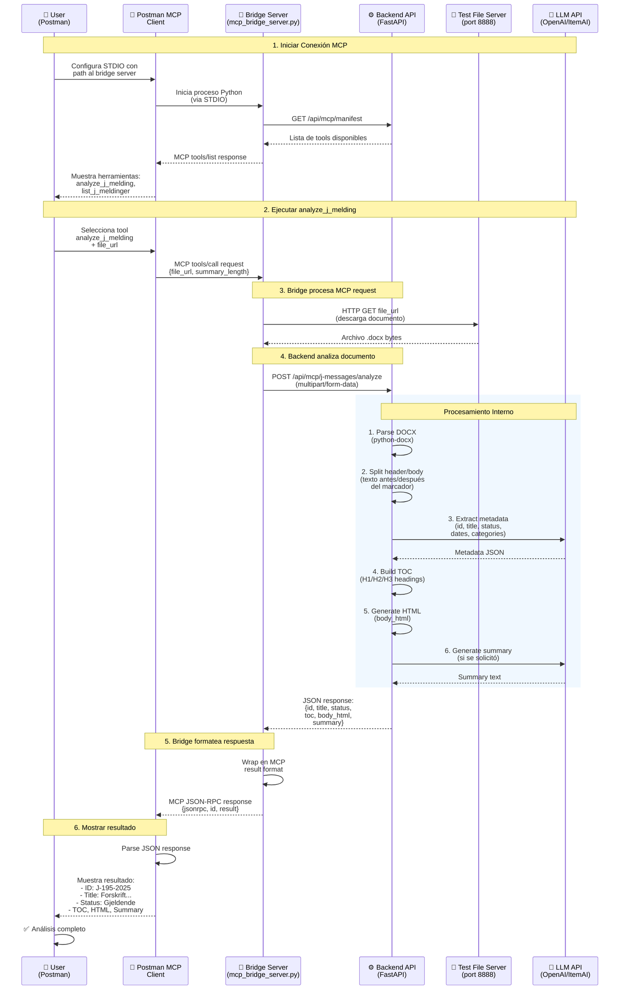

# Postman MCP Testing Guide - WLWAI MCP Server

This guide explains how to use Postman's MCP testing capabilities to test the WLWAI MCP Server (J-messages Analyzer).

## Overview

Postman has built-in support for Model Context Protocol (MCP) servers, allowing you to:
- ✅ Test MCP servers directly via STDIO
- ✅ View available tools, prompts, and resources
- ✅ Send requests and view responses in a familiar interface
- ✅ Create test collections for automated testing
- ✅ Debug MCP protocol messages

## Architecture: Document Analysis Flow

The following diagram shows the complete flow of a J-melding document analysis from Postman MCP to the final result:



### Flow Explanation

1. **Connection Setup** (Lines 1-10):
   - Postman starts the bridge server via STDIO
   - Bridge fetches available tools from backend
   - Tools are displayed in Postman UI

2. **Tool Invocation** (Lines 12-15):
   - User selects `analyze_j_melding` and provides `file_url`
   - Postman sends MCP `tools/call` request to bridge

3. **File Download** (Lines 17-19):
   - Bridge downloads the document from the provided URL
   - Test file server (port 8888) serves local files

4. **Document Analysis** (Lines 21-35):
   - Backend parses DOCX with python-docx
   - Splits header (metadata) from body (regulation text)
   - LLM extracts structured metadata (id, title, dates, etc.)
   - Backend builds Table of Contents from headings
   - Generates HTML body with anchors
   - LLM generates summary (if requested)

5. **Response Formatting** (Lines 37-40):
   - Bridge wraps result in MCP JSON-RPC format
   - Returns to Postman via STDIO

6. **Result Display** (Lines 42-48):
   - Postman parses and displays the result
   - User sees complete analysis with all fields

### Key Components

- **Bridge Server**: Translates MCP protocol (STDIO) to HTTP REST
- **Backend API**: Performs document analysis and LLM orchestration
- **Test File Server**: Serves local files for testing
- **LLM API**: Extracts metadata and generates summaries

## Prerequisites

1. **Postman Desktop** (latest version with MCP support)
2. **WLWAI backend running** on `http://localhost:8000`
3. **Python 3.8+** (for bridge server)
4. **httpx library**: `pip install httpx`

## Quick Start

### Step 1: Verify Bridge Server

Ensure the bridge server is ready:
```bash
# Test bridge server manually
echo '{"jsonrpc":"2.0","id":1,"method":"tools/list"}' | python backend/mcp_bridge_server.py
```

You should see a JSON-RPC response with available tools.

### Step 2: Create MCP Request in Postman

1. **Open Postman Desktop**
2. **Create a new collection** (optional, but recommended):
   - Click "Collections" in the left sidebar
   - Click "New" → "Collection"
   - Name it: `WLWAI MCP Server Tests`

3. **Create a new MCP request**:
   - Click "New" → "Request"
   - Or right-click your collection → "Add Request"
   - Name it: `Test WLWAI J-messages MCP`

4. **Configure as MCP request**:
   - In the request type dropdown, select **"MCP"** (or look for "MCP Generator" option)
   - You should see options for "STDIO" connection

### Step 2.5: Save the Request

After configuring and connecting, you'll need to save the request:

1. **Click "Save"** button (top right, or use Ctrl+S)
2. **In the "SAVE REQUEST" modal**:
   - **Request name**: Already filled with "Test WLWAI J-messages MCP" (you can change it)
   - **Select a collection**: 
     - **Option A**: Select existing collection "WLWAI MCP Server Tests" (if you created it)
     - **Option B**: Select "MCP Generator Postman" (if you want to keep it with other MCP examples)
     - **Option C**: Click "New Collection" to create a new one
   - **Add description** (optional): Click "Add description" to add notes
3. **Click "Save"** (orange button, bottom right)

**Recommendation**: Save it in the "WLWAI MCP Server Tests" collection to keep all your WLWAI tests organized together.

### Step 3: Configure STDIO Connection

In the MCP request configuration, you'll see a field labeled **"Enter command or paste JSON config"**.

**Option 1: Simple Command Format (Recommended)**

Enter the command directly in the format: `command path/to/script.py`

**Windows Example:**
```
python C:/Test/AI/AI Learning with AI/backend/mcp_bridge_server.py
```

**macOS/Linux Example:**
```
python3 /absolute/path/to/your/project/backend/mcp_bridge_server.py
```

**Important Notes:**
- Use **forward slashes** `/` even on Windows, or escape backslashes `\\`
- Use **absolute paths** (full path from root)
- If Python is not in PATH, use full path: `C:/Python39/python.exe C:/Test/AI/AI Learning with AI/backend/mcp_bridge_server.py`

**Option 2: JSON Config Format (Alternative)**

If Postman requires JSON format, use:
```json
{
  "command": "python",
  "args": [
    "C:/Test/AI/AI Learning with AI/backend/mcp_bridge_server.py"
  ],
  "env": {}
}
```

**For Windows with full Python path:**
```json
{
  "command": "C:/Python39/python.exe",
  "args": [
    "C:/Test/AI/AI Learning with AI/backend/mcp_bridge_server.py"
  ],
  "env": {}
}
```

**For macOS/Linux:**
```json
{
  "command": "python3",
  "args": [
    "/absolute/path/to/your/project/backend/mcp_bridge_server.py"
  ],
  "env": {}
}
```

### Step 4: Connect to MCP Server

1. Click the **"Run"** button (or "Connect" if available)
2. Postman will start the bridge server process and connect via STDIO
3. You should see a **"Connected"** status with a green indicator

### Step 5: Explore Available Tools

Once connected, Postman should display:

- **Tools Tab**: Lists all available MCP tools
  - `analyze_j_melding` - Analyze a J-melding document
  - `list_j_meldinger` - List all analyzed J-meldinger

- **Prompts Tab**: (if your server supports prompts)
- **Resources Tab**: (if your server supports resources)

## Testing Tools

### Test 1: List Available Tools

1. In the **"Tools"** tab, you should see:
   - `analyze_j_melding`
   - `list_j_meldinger`

2. Click on a tool to see its:
   - Description
   - Input schema (parameters)
   - Example usage

### Test 2: Call `analyze_j_melding` (Step-by-Step)

**Prerequisites**: Before testing, ensure:
1. **Backend is running** on `http://localhost:8000`
2. **Test file server is running** (serves files for testing)

**Step 1: Start Test File Server** (if not already running)

Open a new terminal/PowerShell window and run:
```bash
python backend/test_mcp_server.py
```

You should see:
```
✅ Test file server running on http://localhost:8888
📁 Serving files from: C:/Test/AI/AI Learning with AI
```

**Keep this terminal open** - the server needs to keep running.

**Step 2: Prepare a Test File**

You need a J-melding file (.docx or .pdf) to test. Options:

- **Option A**: Use an existing file in your `docs/` folder
- **Option B**: Place a test file in your project root or `docs/` folder
- **Option C**: Use a publicly accessible URL (if you have one)

**Step 3: Fill in the Tool Parameters in Postman**

1. **In Postman**, you should see the `analyze_j_melding` tool selected (with blue dot)

2. **Fill `file_url` field**:
   - Click in the "Enter string" field (highlighted with blue border)
   - Enter one of these URLs:
   
   **If you have a file in `docs/` folder:**
   ```
   http://localhost:8888/docs/j-melding-test.docx
   ```
   
   **Or if you have a file in project root:**
   ```
   http://localhost:8888/j-melding-test.docx
   ```
   
   **Or use any file path relative to project root:**
   ```
   http://localhost:8888/path/to/your/file.docx
   ```

3. **Select `summary_length` (optional)**:
   - Click the dropdown next to "summary_length"
   - Choose one: `none`, `short`, `medium`, or `long`
   - **Recommendation**: Start with `medium` for a good test

4. **Verify the JSON** (right side):
   - You should see the JSON update automatically:
   ```json
   {
     "method": "tools/call",
     "params": {
       "name": "analyze_j_melding",
       "arguments": {
         "file_url": "http://localhost:8888/docs/j-melding-test.docx",
         "summary_length": "medium"
       }
     }
   }
   ```

**Step 4: Execute the Tool Call**

1. **Click the "Run" button** (top right, next to "Share")
   - Or look for a "Send" or "Execute" button
   - The button might be near the tool configuration

2. **Wait for response**:
   - Postman will send the MCP request
   - The bridge server will download the file
   - The backend will analyze it
   - Response will appear in the "Response" tab (bottom)

**Step 5: View the Response**

1. **Check the "Response" tab** (bottom panel)
2. **You should see**:
   - A JSON-RPC response structure
   - The actual analysis result inside `result.content[0].text`
   - Parsed JSON with: `id`, `title`, `status`, `valid_from`, `valid_to`, `categories`, `toc`, `body_html`, `summary`

**Example Response Structure:**
```json
{
  "jsonrpc": "2.0",
  "id": 1,
  "result": {
    "content": [
      {
        "type": "text",
        "text": "{\"id\": \"J-195-2025\", \"title\": \"...\", \"status\": \"Gjeldende\", ...}"
      }
    ]
  }
}
```

**Troubleshooting:**

- **"Connection failed"**: Check that backend is running (`curl http://localhost:8000/api/mcp/manifest`)
- **"Failed to download file"**: Check that test file server is running on port 8888
- **"File not found"**: Verify the file path in the URL matches where the file actually is
- **Empty response**: Check backend logs for errors

### Test 3: Call `list_j_meldinger`

1. Select the **`list_j_meldinger`** tool
2. Configure parameters (all optional):
   ```json
   {
     "status": "Gjeldende",
     "category": "Pelagisk fisk",
     "search": "sild"
   }
   ```
3. Click **"Send"** or **"Run"**
4. View the response in the **"Response"** tab

**Expected Response:**
```json
{
  "jsonrpc": "2.0",
  "id": 1,
  "result": {
    "content": [
      {
        "type": "text",
        "text": "{\"success\": true, \"items\": [...], \"total\": 5}"
      }
    ]
  }
}
```

### Test 3: Call `analyze_j_melding`

1. **Start the test file server** (if not already running):
   ```bash
   python backend/test_mcp_server.py
   ```
   This serves files on `http://localhost:8888`

2. **Select the `analyze_j_melding` tool**

3. **Configure parameters**:
   ```json
   {
     "file_url": "http://localhost:8888/docs/j-melding-test.docx",
     "summary_length": "medium"
   }
   ```

4. **Click "Send"**

5. **View the response** - should contain:
   - `id`: J-melding ID
   - `title`: Full title
   - `status`: Status (e.g., "Gjeldende")
   - `valid_from`, `valid_to`: Date ranges
   - `categories`: Array of categories
   - `toc`: Table of contents
   - `body_html`: HTML body content
   - `summary`: AI-generated summary (if requested)

**Expected Response:**
```json
{
  "jsonrpc": "2.0",
  "id": 2,
  "result": {
    "content": [
      {
        "type": "text",
        "text": "{\"id\": \"J-195-2025\", \"title\": \"...\", \"status\": \"Gjeldende\", ...}"
      }
    ]
  }
}
```

## Creating Test Collections

### Collection Structure

Create a collection with multiple test requests:

```
WLWAI MCP Server Tests
├── 1. Initialize Connection
├── 2. List Tools
├── 3. List J-meldinger (All)
├── 4. List J-meldinger (Filtered)
├── 5. Analyze J-melding (DOCX)
├── 6. Analyze J-melding (PDF)
└── 7. Analyze J-melding (With Summary)
```

### Test Scripts (Postman Tests)

You can add test scripts to validate responses:

**Example Test Script** (for `analyze_j_melding`):
```javascript
// Parse the response
const response = pm.response.json();

// Check JSON-RPC structure
pm.test("Response is valid JSON-RPC", function () {
    pm.expect(response).to.have.property('jsonrpc', '2.0');
    pm.expect(response).to.have.property('id');
    pm.expect(response).to.have.property('result');
});

// Check result content
if (response.result && response.result.content) {
    const content = JSON.parse(response.result.content[0].text);
    
    pm.test("J-melding has ID", function () {
        pm.expect(content).to.have.property('id');
    });
    
    pm.test("J-melding has title", function () {
        pm.expect(content).to.have.property('title');
    });
    
    pm.test("J-melding has TOC", function () {
        pm.expect(content).to.have.property('toc');
        pm.expect(content.toc).to.be.an('array');
    });
}
```

## Troubleshooting

### "Connection Failed" or "Process Not Found"

1. **Check Python path**:
   - Use full path to Python: `C:/Python39/python.exe`
   - Or ensure Python is in system PATH

2. **Check bridge server path**:
   - Use absolute path
   - Use forward slashes `/` on Windows
   - Verify file exists

3. **Check backend is running**:
   ```bash
   curl http://localhost:8000/api/mcp/manifest
   ```

### "No Tools Available"

1. **Check bridge server logs** (if available in Postman console)
2. **Test bridge server manually**:
   ```bash
   echo '{"jsonrpc":"2.0","id":1,"method":"tools/list"}' | python backend/mcp_bridge_server.py
   ```
3. **Verify backend manifest endpoint**:
   ```bash
   curl http://localhost:8000/api/mcp/manifest
   ```

### "Timeout" Errors

1. **Increase timeout** in Postman request settings
2. **Check backend is responsive**:
   ```bash
   curl http://localhost:8000/api/mcp/manifest
   ```
3. **Check file server** (for `analyze_j_melding`):
   ```bash
   curl http://localhost:8888/docs/j-melding-test.docx
   ```

### Tools Not Appearing

1. **Restart Postman** after configuring MCP request
2. **Check connection status** - should show "Connected"
3. **Verify bridge server starts correctly** - check for Python errors

## Advantages of Using Postman for MCP Testing

### 1. **Visual Interface**
- See all available tools in one place
- Easy parameter configuration
- Clear response visualization

### 2. **Test Automation**
- Create test collections
- Run automated test suites
- Validate responses with test scripts

### 3. **Debugging**
- View raw MCP protocol messages
- Inspect request/response flow
- Identify issues quickly

### 4. **Documentation**
- Document API usage
- Share test collections with team
- Create examples for integration

### 5. **Integration Testing**
- Test before deploying to production
- Validate changes don't break existing functionality
- Compare responses across versions

## Example Test Scenarios

### Scenario 1: Complete Analysis Workflow

1. **List all J-meldinger** → Verify library is accessible
2. **Filter by status** → Test filtering functionality
3. **Analyze new document** → Test analysis endpoint
4. **List again** → Verify new document appears

### Scenario 2: Error Handling

1. **Invalid file URL** → Should return error
2. **Missing required parameter** → Should return validation error
3. **Non-existent file** → Should handle gracefully

### Scenario 3: Performance Testing

1. **Large document analysis** → Measure response time
2. **Multiple concurrent requests** → Test server stability
3. **Long-running operations** → Verify timeout handling

## Best Practices

1. **Organize Tests**: Create separate collections for different test scenarios
2. **Use Variables**: Store common values (base URL, file paths) in environment variables
3. **Add Assertions**: Write test scripts to validate responses automatically
4. **Document Tests**: Add descriptions to explain what each test does
5. **Version Control**: Export collections and commit to Git

## Next Steps

Once you've set up Postman testing:

1. ✅ Create comprehensive test collections
2. ✅ Add automated test scripts
3. ✅ Integrate into CI/CD pipeline (if using Postman CLI)
4. ✅ Share collections with team
5. ✅ Use for regression testing before releases

---

## Comparison: Postman vs Other Testing Methods

| Method | Pros | Cons |
|--------|------|------|
| **Postman** | Visual interface, test automation, easy debugging | Requires Postman Desktop |
| **cURL** | Simple, scriptable, no dependencies | Command-line only, manual testing |
| **Claude Desktop** | Real-world usage, natural language testing | Less structured, harder to automate |
| **Python Scripts** | Full control, easy automation | Requires coding, less visual |

**Recommendation**: Use **Postman** for development and testing, **Claude Desktop** for real-world usage validation.

