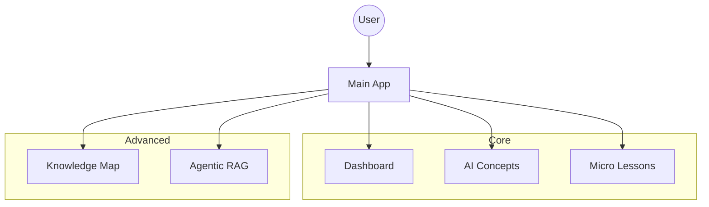
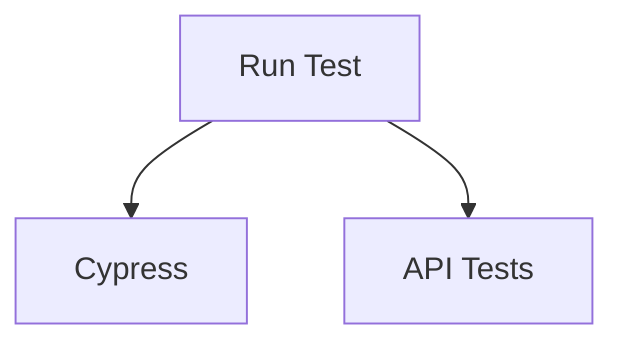

# Arquitectura

## Arquitectura de la aplicación

## Arquitectura de pruebas

## Puente de agentes (Agent Bridge)
- Configuración centralizada (`backend/config.py`) con `BACKEND_BASE_URL`, `CALLBACK_URL_DEFAULT`.
- Alternativa a `N8N_*_WEBHOOK` cuando `OUTSYSTEMS_*` no está configurado.
