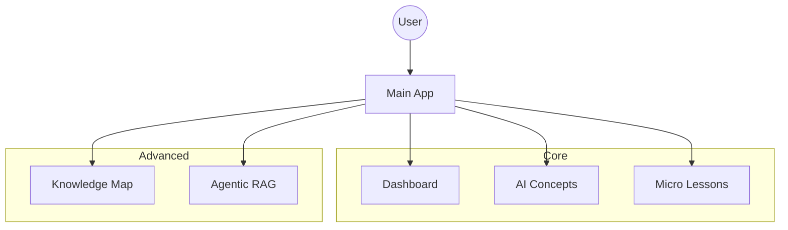
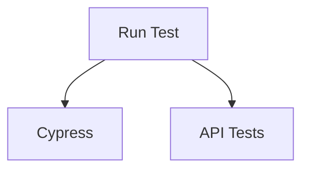

# Architecture

## Application Architecture

## Testing Architecture

## Agent Bridge
- Centralized config (`backend/config.py`) with `BACKEND_BASE_URL`, `CALLBACK_URL_DEFAULT`.
- Fallback to `N8N_*_WEBHOOK` when `OUTSYSTEMS_*` is unset.
