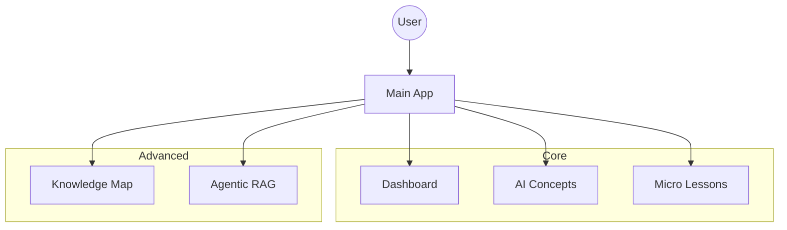
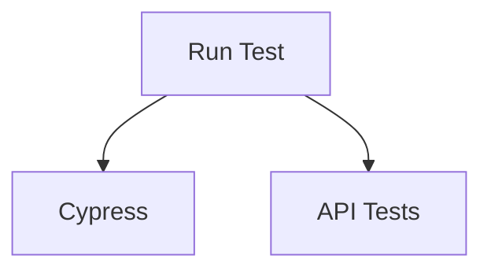

# Arkitektur

## Applikasjonsarkitektur

## Testarkitektur

## Agent-bro (Agent Bridge)
- Sentralisert konfigurasjon (`backend/config.py`) med `BACKEND_BASE_URL`, `CALLBACK_URL_DEFAULT`.
- Reserveløsning til `N8N_*_WEBHOOK` når `OUTSYSTEMS_*` ikke er satt.
